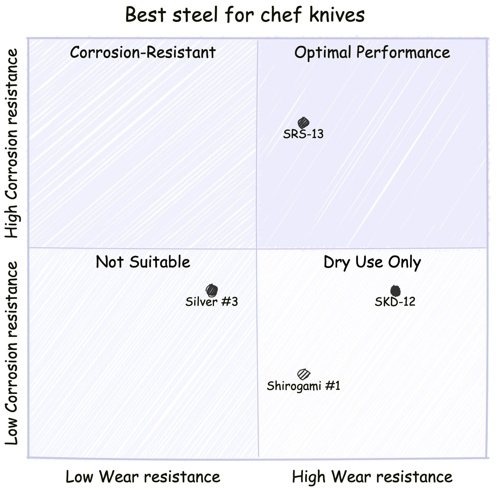
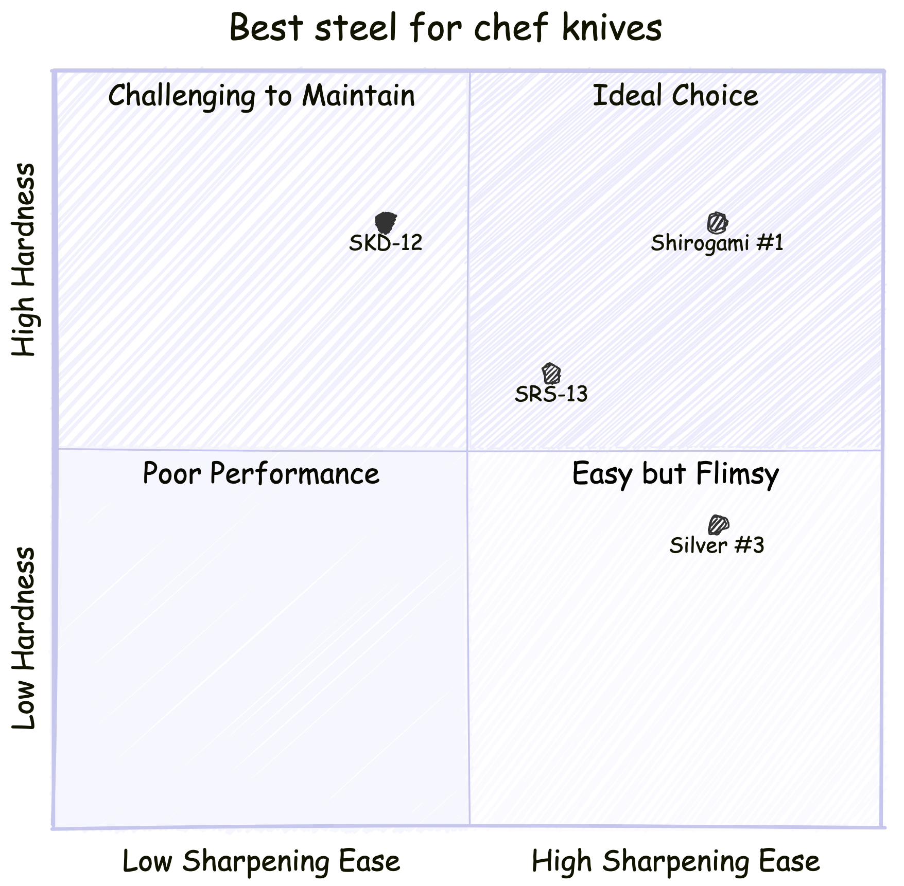

## 1. 강재의 특성(상대적)
|         강재         |  내식성  |   연마 용이성   |  내마모성  |  경도 |
|---------------------|--------|--------------|----------|------|
| SRS-13              | 4      | 3            | 3        | 3    |
| Silver #3(은삼강)     | 2      | 4            | 2        | 2    |
| SKD-12              | 2      | 2            | 4        | 4    |
| Shirogami #1(백강)   | 1      | 4            | 3        | 4    |

## 2. 강재별 성분
|       강재      | 탄소         | 크롬         | 망간       | 몰리브덴      | 텅스텐 | 바나듐       | 실리콘         | 인    | 황     |
|----------------|-------------|-------------|-----------|------------|-------|------------|--------------|-------|-------|
| SRS-13         | 1.3         | 13          | 0.3       | 2.75       | 1.25  | 1.5        | 0.3          |       |       |
| Silver #3      | 0.95 ~ 1.1  | 13 ~ 14.5   | 0.6 ~ 1   | 2          |       |            |              |       |       |
| SKD-12         | 0.95 ~ 1.05 | 4.75 ~ 5.5  | 0.4 ~ 1   | 0.9 ~ 1.4  |       | 0.15 ~ 0.5 |              |       |       |
| Shirogami #1   | 1.2 ~ 1.4   |             | 0.2 ~ 0.3 |            |       |            | 0.1 ~ 0.2    | 0.025 | 0.004 |

## 3. 성분별 특성
|   성분   |  기호   |                     특성                    |
|---------|--------|-------------------------------------------|
| 탄소     | C      | **경도**, 인장강도, 내마모성 향상, 칼날 유지력 향상  |
| 크롬     | Cr     | 내마모성, 인장강도, 경도 향상, **내부식성 향상**     |
| 망간     | Mn     | 내마모성, 인장강도, 경도 향상                    |
| 몰리브덴  | Mo     | 강도, 내부식성 향상, 가공성 향상                  |
| 바나듐   | V      | 강도 향상, 내마모성 향상                         |
| 텅스텐   | W      | 강도, 내마모성 향상                             |
| 코발트   | Co     | 경도, 인장강도 향상, 타성분의 성질 향상의 촉매 역할    |
| 니켈    | Ni     | 강도 향상, 내마모성 향상                         |
| 실리콘   | Si     | 강도 향상, 내마모성 향상                         |
| 인      | P      | 경도, 인장강도 향상                             |
| 황      | S      | 강도 저하, 철 형성의 촉매 역할                    |

## 1. Corrosion resistance(내부식성)
> 내부식성 : 부식 방지


type: 'bar',
data: {
  labels: ['SRS-13', 'Silver #3', 'SKD-12', 'Shirogami #1'],
  datasets: [{
    label: '# of corrosion resistance',
    data: [4, 2, 2, 1],
  }]
}


  

- 부식에 가장 강한 강재는 **SRS-13**  
- 부식에 가장 취약한 강재는 **Shirogami #1**  

## 2. Ease of polishing(가공성)
> 가공성 : 연마 용이성  


type: 'bar',
data: {
  labels: ['SRS-13', 'Silver #3', 'SKD-12', 'Shirogami #1'],
  datasets: [{
    label: '# of ease of polishing',
    data: [3, 4, 2, 4],
  }]
}


  

- 가공이 가장 쉬운 강재는 **Silver #3**, **Shirogami #1**  
- 가공이 가장 어려운 강재는 **SKD-12**  

## 3. Wear resistance(내마모성)
> 내마모성 : 칼날 유지력  


type: 'bar',
data: {
  labels: ['SRS-13', 'Silver #3', 'SKD-12', 'Shirogami #1'],
  datasets: [{
    label: '# of wear resistance',
    data: [3, 2, 4, 3],
  }]
}


  

## 4. Hardness(경도)
> 경도 : 칼날의 단단한 정도


type: 'bar',
data: {
  labels: ['SRS-13', 'Silver #3', 'SKD-12', 'Shirogami #1'],
  datasets: [{
    label: '# of hardness',
    data: [3, 2, 4, 4],
  }]
}


## 5. Total


type: 'bar',
data: {
  labels: ['SRS-13', 'Silver #3', 'SKD-12', 'Shirogami #1'],
  datasets: [{
    label: '# of total',
    data: [9, 7, 9, 9]
  }]
}


## 6. Correlation

