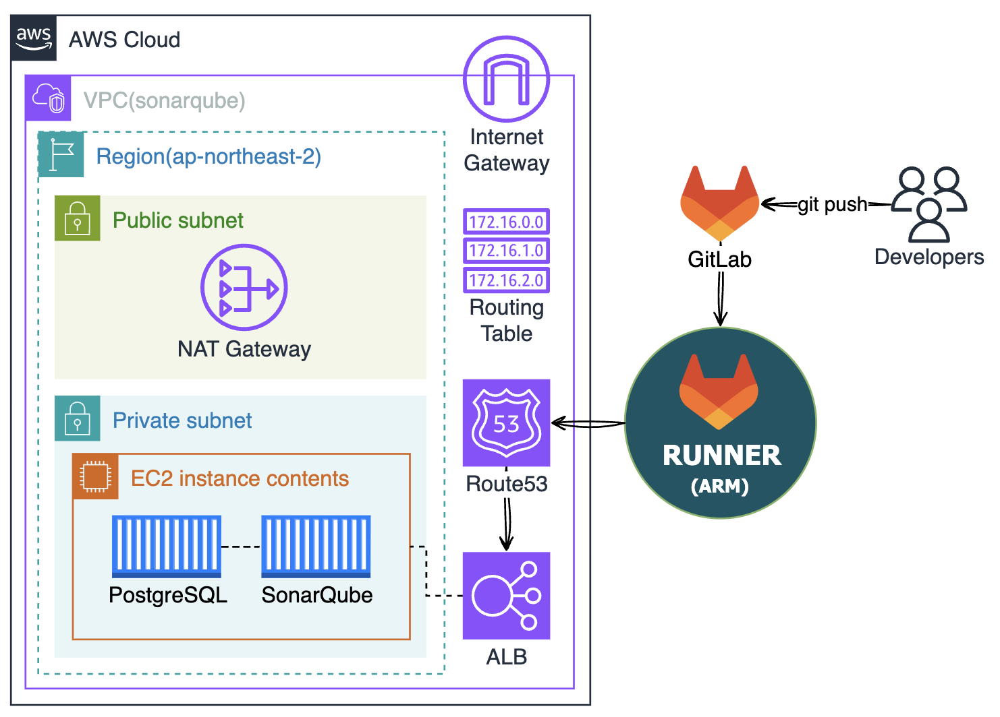
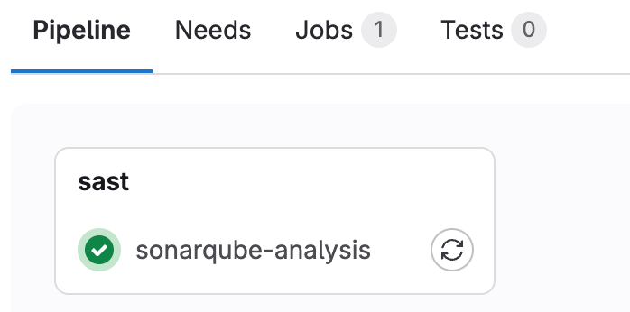
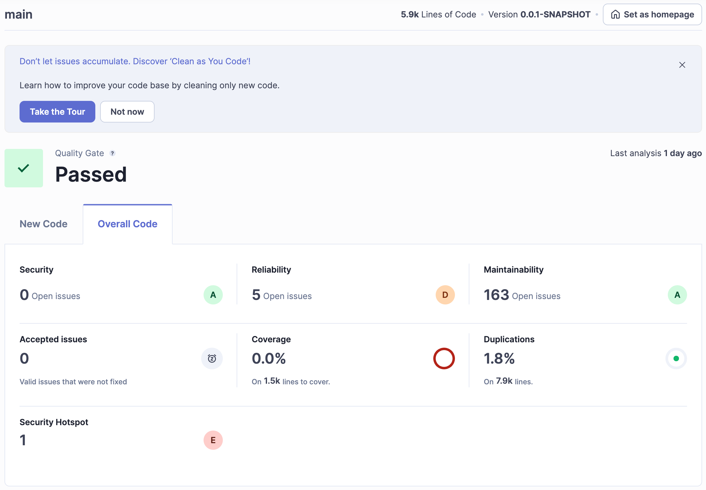

## What is SonarQube?
소나큐브는 소스코드 정적 분석(SAST)을 통해 코드품질을 측정하고 개선하는 데 필요한 다양한 지표를 제공합니다.
이를 통해 개발자는 코드의 복잡성, 중복성, 유지보수성 등을 분석해 코드 품질 향상과 기술부채 관리 및 코드리뷰 프로세스 개선을 기대할 수 있습니다.
  
### 도입 포인트
- **코드 품질 향상** : Code Smell(잘못된 코드 패턴, 비효율적인 구현 등)을 식별하여 개발자가 빠르게 판단하고 개선할 수 있게 도와줍니다.
- **기술 부채 관리** : 부채를 시각화하고 관리하는데 도움을 줍니다. 기술 부채는 시간이 지나면서 코드 품질 저하를 초래할 수 있으며, 이를 정기적으로 측정하고 해결하는 것이 중요합니다.
- **코드 리뷰 프로세스 개선** : 코드리뷰 하기 힘든 대표적인 이유는 바로 "리뷰할 시간이 없다." 인데, 남의 코드를 보고 분석하고 복기하는 것을 대신 분석하고 판단해줌으로써 투명한 리뷰문화 도입을 촉진합니다.
- **책임감 및 협업 촉진** : 모든 팀원에게 동일한 기준과 목표를 제공합니다. 그리고 코드 품질에 대한 공통의 이해를 바탕으로 팀원 간의 협력이 원활하게 이루어질 수 있습니다. 또한, 품질 기준에 따라 개발을 진행함으로써 팀원 각자가 자신의 코드에 책임감을 느끼게 됩니다.
- **리포팅 및 대시보드** : 직관적인 대시보드와 상태뱃지를 제공해 코드 품질 현황, 기술 부채, 보안 이슈 등을 실시간으로 모니터링 할 수 있습니다. 이를 통해 관리자는 팀의 코드 품질을 쉽게 파악하고 필요한 조치를 취할 수 있습니다.

> 결과적으로, 소나큐브는 생산성과 코드 품질을 동시에 향상시키기 위해 사용합니다.

## 아키텍쳐


## 사전 조건
- Linux
- Docker(Docker Compose)
- GitLab Runner(arm) : 비용 절약을 위해 `t4g(arm)` 인스턴스를 사용했습니다.  

## SonarQube 설치

### 1. DB 구축 (PostgreSQL, Docker)
소나큐브의 기능을 제한없이 사용하기 위해서는 별도의 DB 연결이 필요합니다.  
지원하는 DB 종류로는 MSSQL, Oracle, PostgreSQL 이 있습니다.  
(이 글은 PostgreSQL 15 버전 기준으로 작성되었습니다. 현재시점 기준 11~15 버전을 지원하고 있습니다.)

먼저, 호스트에 데이터가 저장될 디렉토리를 생성합니다.  
이렇게 하면 컨테이너가 종료되더라도 데이터가 소실되는것을 방지할 수 있습니다.
```bash
mkdir ./db_data
```

도커로 PostgreSQL DB 컨테이너를 생성합니다. PostgreSQL 의 기본포트는 `5432` 입니다.  
```bash
docker run -dit \
  --name sonarqube_postgres \
  -e POSTGRES_PASSWORD=mypassword \
  -e TZ=Asia/Seoul \
  -p 5432:5432 \
  -v ./db_data:/var/lib/postgresql/data \
  postgres:15
```

아래 명령어로 postgres 컨테이너에 접속하고 SQL콘솔에 접속합니다.
```bash
docker exec -it sonarqube_postgres bash
psql -U postgres
```

아래 SQL문으로 데이터베이스와 유저를 생성합니다.
```bash
postgres=# create user sonarqube with password 'mypassword';
CREATE ROLE
postgres=# create database sonarqube owner sonarqube;
CREATE DATABASE
postgres=# alter role sonarqube with createdb;
ALTER ROLE
postgres=# grant all privileges on database sonarqube to sonarqube;
GRANT
postgres=# alter user sonarqube set search_path to sonarqube;
ALTER ROLE
```

아래 명령어로 제대로 설정되었는지 확인합니다.
```bash
postgres=# \du
                                   List of roles
 Role name |                         Attributes                         | Member of
-----------+------------------------------------------------------------+-----------
 postgres  | Superuser, Create role, Create DB, Replication, Bypass RLS | {}
 sonarqube | Create DB                                                  | {}

postgres=# \l
                                                  List of databases
   Name    |   Owner   | Encoding |  Collate   |   Ctype    | ICU Locale | Locale Provider |    Access privileges
-----------+-----------+----------+------------+------------+------------+-----------------+-------------------------
 postgres  | postgres  | UTF8     | en_US.utf8 | en_US.utf8 |            | libc            |
 sonarqube | sonarqube | UTF8     | en_US.utf8 | en_US.utf8 |            | libc            | =Tc/sonarqube          +
           |           |          |            |            |            |                 | sonarqube=CTc/sonarqube
 template0 | postgres  | UTF8     | en_US.utf8 | en_US.utf8 |            | libc            | =c/postgres            +
           |           |          |            |            |            |                 | postgres=CTc/postgres
 template1 | postgres  | UTF8     | en_US.utf8 | en_US.utf8 |            | libc            | =c/postgres            +
           |           |          |            |            |            |                 | postgres=CTc/postgres
(4 rows)
```

### 2. SonarQube 구축 (Docker)
먼저, 호스트에 데이터가 저장될 디렉토리를 생성합니다.  
```bash
mkdir -p sonar_data/conf
mkdir -p sonar_data/data
mkdir -p sonar_data/temp
```

디렉토리 권한을 부여합니다. (편의상 전체 권한을 부여합니다.)  
적절한 권한을 부여하지 않으면 `Unable to create shared memory
Cleaning or creating temp directory /opt/sonarqube/temp` 라는 에러가 발생하여 컨테이너 생성에 실패합니다.
```bash
sudo chmod -R 777 sonar_data
```

PostgreSQL 과 연결하기 위한 설정파일을 작성합니다.
```bash
vi ./sonar_data/conf/sonar.properties
```

```
sonar.jdbc.username=sonarqube
sonar.jdbc.password=mypassword
sonar.jdbc.url=jdbc:postgresql://<ip>:5432/sonarqube
sonar.path.data=/opt/sonarqube/data
sonar.path.temp=/opt/sonarqube/temp
```

아래 명령어로 소나큐브 컨테이너를 생성합니다.
```bash
docker run -dit --name sonarqube \
  -p 9000:9000 \
  -v ./sonar_data/conf:/opt/sonarqube/conf \
  -v ./sonar_data/data:/opt/sonarqube/data \
  -v ./sonar_data/temp:/opt/sonarqube/temp \
  sonarqube
```

### 3. 프로젝트 연결 및 토큰 발급
(내용추가 필요)


### 4. Docker Compose
전체 과정을 요약하면 아래와 같습니다.  
#### 4-1. 디렉토리 구조
```bash
.
├── docker-compose.yml
├── db_data
└── sonar_data
    ├── conf
    │   └── sonar.properties
    ├── data
    └── temp
```
#### 4-2. docker-compose.yml
```yaml
services:
  sonarqube:
    image: sonarqube:latest
    container_name: sonarqube
    ports:
      - 9000:9000
    volumes:
      - ./sonar_data/conf:/opt/sonarqube/conf
      - ./sonar_data/data:/opt/sonarqube/data
      - ./sonar_data/temp:/opt/sonarqube/temp
    restart: always
    tty: true

  postgres:
    image: postgres:15
    container_name: sonarqube_postgres
    environment:
      POSTGRES_PASSWORD: thishama123
      TZ: Asia/Seoul
    ports:
      - 5432:5432
    volumes:
      - ./db_data:/var/lib/postgresql/data
    restart: always
    privileged: true
    tty: true
```
#### 4-3. sonar.properties
```
sonar.jdbc.username=sonarqube
sonar.jdbc.password=mypassword
sonar.jdbc.url=jdbc:postgresql://sonarqube_postgres:5432/sonarqube
sonar.path.data=/opt/sonarqube/data
sonar.path.temp=/opt/sonarqube/temp
```
  

## GitLab CI 구성
### 1. GitLab CI/CD Variables 추가
- `SONAR_HOST_URL` : ex) `http://ec2-public-ip:9000` or `https://domain.com`
- `SONAR_TOKEN` : ex) `sqa_bfa98a...`

### 2. build.gradle 수정
아래 구문을 추가합니다.
```gradle
plugins {
    ...
    id 'org.sonarqube' version '5.1.0.4882'
}

sonar {
  properties {
    property 'sonar.projectKey', '소나큐브에서 프로젝트 키'
    property 'sonar.projectName', '소나큐브에서 프로젝트 이름'
    property 'sonar.qualitygate.wait', true
    property "sonar.java.binaries", "$buildDir/classes/java/main"
  }
}
```

### 3. gitlab-ci.yml 작성
```yaml
workflow:
  name: 'SonarQube 평가'
  auto_cancel:
    on_new_commit: interruptible

default:
  interruptible: true
  tags:
    - sonar

stages:
  - sast

sonarqube-analysis:
  stage: sast
  image: arm64v8/gradle:8.6-jdk17
  variables:
    SONAR_USER_HOME: "${CI_PROJECT_DIR}/.sonar"
    GIT_DEPTH: "0"
  script:
    - gradle assemble
    - gradle sonar
  allow_failure: true
  rules:
    - if: $CI_PIPELINE_SOURCE == 'merge_request_event'
    - if: $CI_COMMIT_BRANCH == 'feature'
```

## 결과

