## What is SonarQube?
SonarQube는 소스코드 정적 분석(SAST)을 통해 코드품질을 측정하고 개선하는 데 필요한 다양한 지표를 제공합니다.
이를 통해 개발자는 코드의 복잡성, 중복성, 유지보수성 등을 분석해 코드 품질 향상과 기술부채 관리 및 코드리뷰 프로세스 개선을 기대할 수 있습니다.
  
### 도입 포인트
- **코드 품질 향상** : Code Smell(잘못된 코드 패턴, 비효율적인 구현 등)을 식별하여 개발자가 빠르게 판단하고 개선할 수 있게 도와줍니다.
- **기술 부채 관리** : 부채를 시각화하고 관리하는데 도움을 줍니다. 기술 부채는 시간이 지나면서 코드 품질 저하를 초래할 수 있으며, 이를 정기적으로 측정하고 해결하는 것이 중요합니다.
- **코드 리뷰 프로세스 개선** : 코드리뷰 하기 힘든 대표적인 이유는 바로 "리뷰할 시간이 없다." 인데, 남의 코드를 보고 분석하고 복기하는 것을 대신 분석하고 판단해줌으로써 투명한 리뷰문화 도입을 촉진합니다.
- **책임감 및 협업 촉진** : 모든 팀원에게 동일한 기준과 목표를 제공합니다. 그리고 코드 품질에 대한 공통의 이해를 바탕으로 팀원 간의 협력이 원활하게 이루어질 수 있습니다. 또한, 품질 기준에 따라 개발을 진행함으로써 팀원 각자가 자신의 코드에 책임감을 느끼게 됩니다.
- **리포팅 및 대시보드** : 직관적인 대시보드와 상태뱃지를 제공해 코드 품질 현황, 기술 부채, 보안 이슈 등을 실시간으로 모니터링 할 수 있습니다. 이를 통해 관리자는 팀의 코드 품질을 쉽게 파악하고 필요한 조치를 취할 수 있습니다.


요약하면, SonarQube는 생산성과 코드 품질을 동시에 향상시키기 위해 사용합니다.


## 아키텍쳐
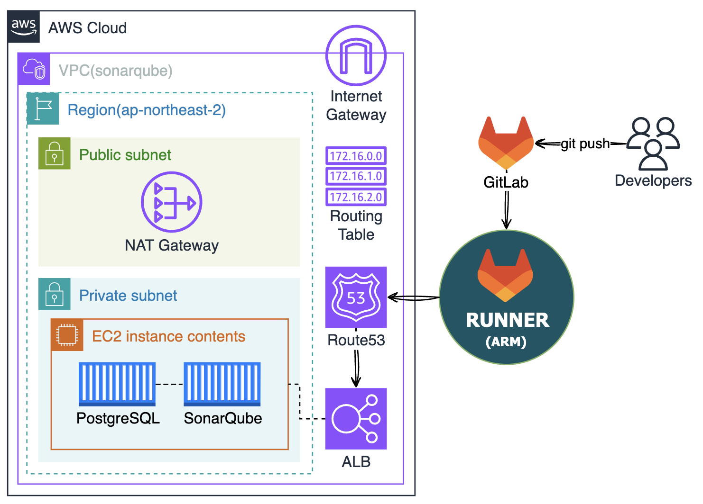

## 사전 조건
- **Linux** : 비용 절약을 위해 `t4g(arm)` 인스턴스를 사용했습니다.
- **Docker(Docker Compose)** : SonarQube 를 구동할 서버에 설치되어있어야 합니다.
- **GitLab Runner** : GitLab 프로젝트와 연결되어 있어야 합니다.

## SonarQube 구성
### 1. 데이터베이스 선택
SonarQube는 기본 내장 데이터베이스로 H2 데이터베이스를 사용합니다.  
H2 데이터베이스는 테스트 및 개발 환경에 적합합니다.  
프로덕션 환경에서는 보다 견고하고 확장 가능한 데이터베이스를 사용하는것이 권장됩니다.  
지원하는 DB 종류로는 MSSQL, Oracle, PostgreSQL 이 있습니다.  
(이 글은 PostgreSQL 15 버전 기준으로 작성되었습니다.)  
- [🔗 데이터베이스 지원 버전](https://docs.sonarsource.com/sonarqube/latest/setup-and-upgrade/installation-requirements/database-requirements/)
  
아래 커맨드로 `docker-compose.yml` 을 작성합니다.
```bash
cat <<EOF > docker-compose.yml
services:
  sonarqube:
    image: sonarqube
    depends_on:
      - sonar_db
    environment:
      SONAR_JDBC_URL: jdbc:postgresql://sonar_db:5432/sonar
      SONAR_JDBC_USERNAME: sonar
      SONAR_JDBC_PASSWORD: sonar
    ports:
      - "9000:9000"
    volumes:
      - sonarqube_conf:/opt/sonarqube/conf
      - sonarqube_data:/opt/sonarqube/data
      - sonarqube_extensions:/opt/sonarqube/extensions
      - sonarqube_logs:/opt/sonarqube/logs
      - sonarqube_temp:/opt/sonarqube/temp

  sonar_db:
    image: postgres:15
    environment:
      POSTGRES_USER: sonar
      POSTGRES_PASSWORD: sonar
      POSTGRES_DB: sonar
    volumes:
      - sonar_db:/var/lib/postgresql
      - sonar_db_data:/var/lib/postgresql/data

volumes:
  sonarqube_conf:
  sonarqube_data:
  sonarqube_extensions:
  sonarqube_logs:
  sonarqube_temp:
  sonar_db:
  sonar_db_data:
EOF
```
- 추가 환경변수 : [🔗 Environment Variables](https://docs.sonarsource.com/sonarqube/latest/setup-and-upgrade/environment-variables/)
  
아래 커맨드로 컨테이너를 생성합니다.
```bash
docker compose up -d
```
### 2. 트러블 슈팅

[ERROR]: max virtual memory areas vm.max_map_count ...
  

# 

위 에러는 보통 elasticsearch 쪽에서 많이 발생한다.  
이유는, SonarQube는 내부적으로 elasticsearch를 사용해서 검색과 인덱싱 기능을 제공하는데, 이때 elasticsearch에서 데이터를 빠르고 효율적으로 처리하기 위해서 메모리에 직접 매핑해서 처리하는 방법을 사용한다. 이 과정에서 최대 메모리 매핑 갯수(vm.max_map_count)의 제한을 받는데, 최소 요구 개수(262144)가 이 제한을 초과할때 발생하는 에러이다.  


컨테이너 실행시 발생하는 해당 에러는 호스트에서 아래 커맨드로 메모리 매핑수를 늘려 해결할 수 있다.  
(리눅스 시스템 기본 설정값은 `6553x` 이다.)  
```bash
sysctl -w vm.max_map_count=262144
```


### 3. 프로젝트 연결 및 토큰 발급
구성한 SonarQube 페이지([http://localhost:9000](http://localhost:9000))에 접속하면 계정/패스워드를 요구하는데,  
기본 계정은 admin/admin 입니다.
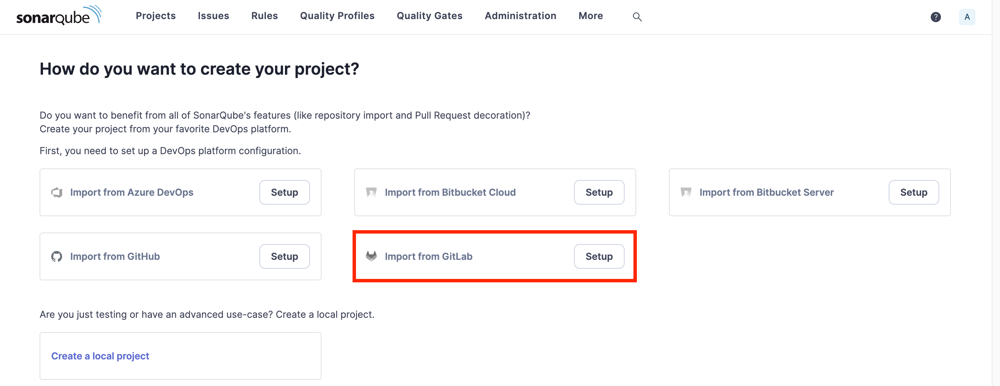
Figure 1. 계정설정을 완료하면 첫 화면이 위 이미지인데, GitLab 과 연동할것이기 때문에 **Import from GitLab** 의 **[Setup]** 을 클릭합니다.

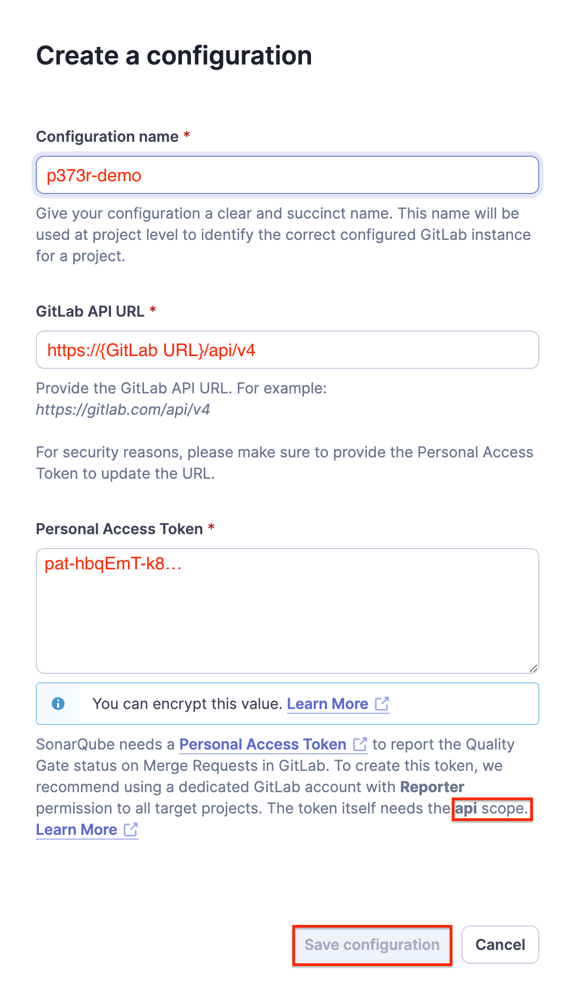
- **Configuration name** : 추후 SonarQube의 *DevOps Platform Integrations* 메뉴에서 각 플랫폼별 식별자 역할을 합니다.  
- **GitLab API URL** : SonarQube와 연결할 GitLab 서버의 REST-API 통신이 가능한 URL 을 입력합니다.  
- **Personal Access Token** : `api scope` 가 있는 GitLab의 개인 엑세스 토큰을 입력합니다.  

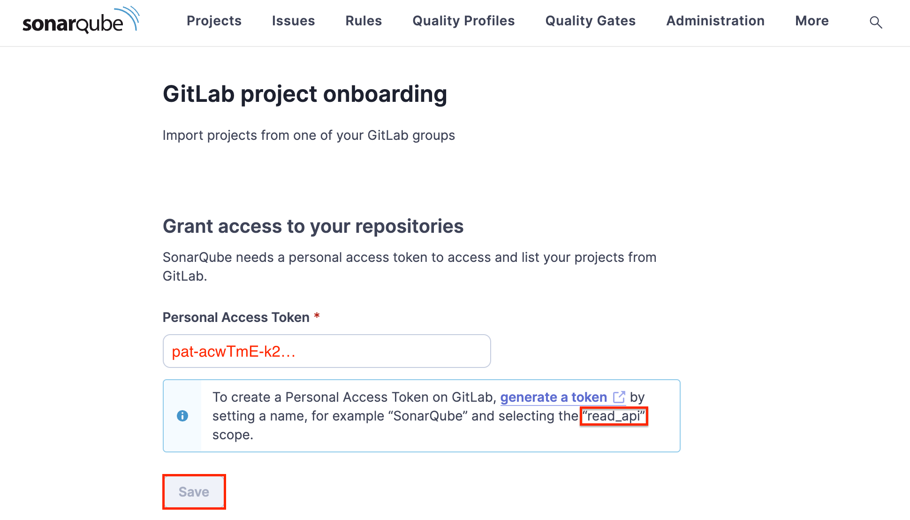
Figure 3. 프로젝트 리스트를 읽기 위한 `read api scope` 가 있는 GitLab의 개인 엑세스 토큰을 입력합니다.  

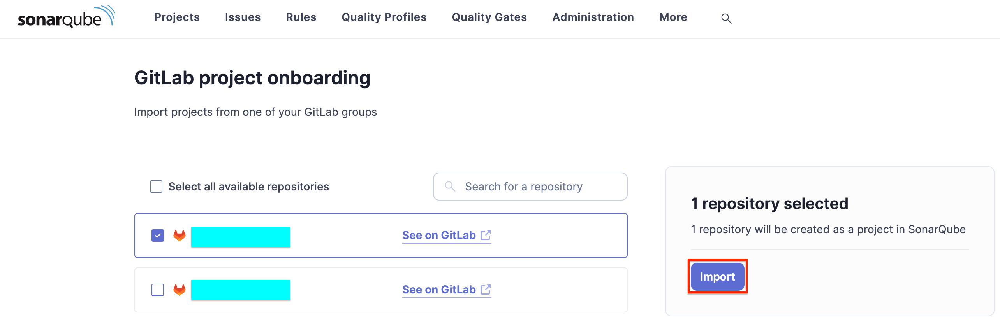
Figure 4. 가져올 프로젝트를 선택하고 **[Import]** 를 클릭합니다.  
  
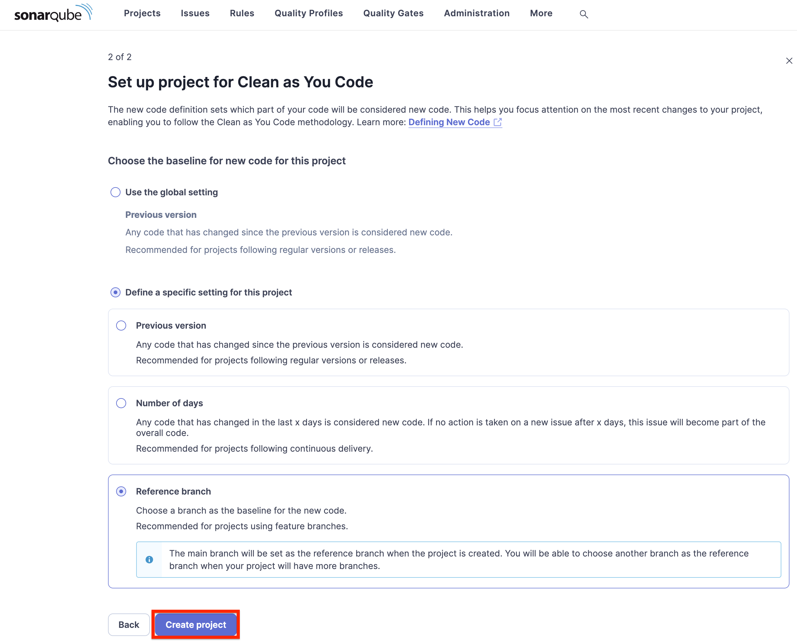
Figure 5. 원하는 옵션을 선택 후 **[Create project]** 를 클릭합니다. 

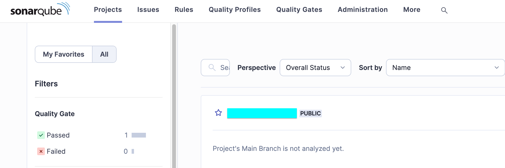
Figure 6. 프로젝트가 추가된것을 확인할 수 있습니다.  


## GitLab CI 구성
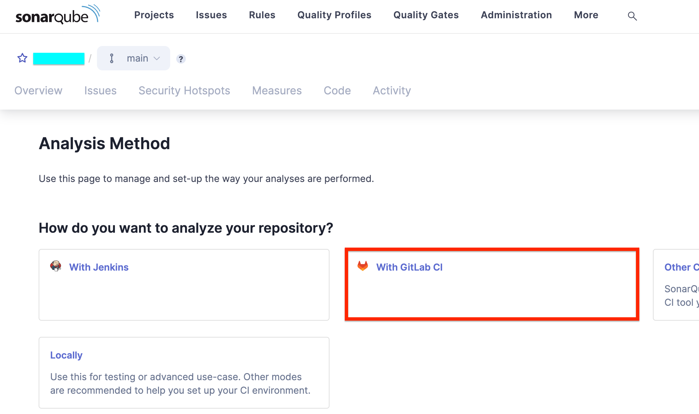
Figure 7. SonarQube에서 연결할 프로젝트를 클릭하면 아래와 같이 프로젝트마다 기본 지침을 제공하고 있습니다. GitLab 과 연동할것이기 때문에 **[With GitLab CI]** 을 클릭합니다.  

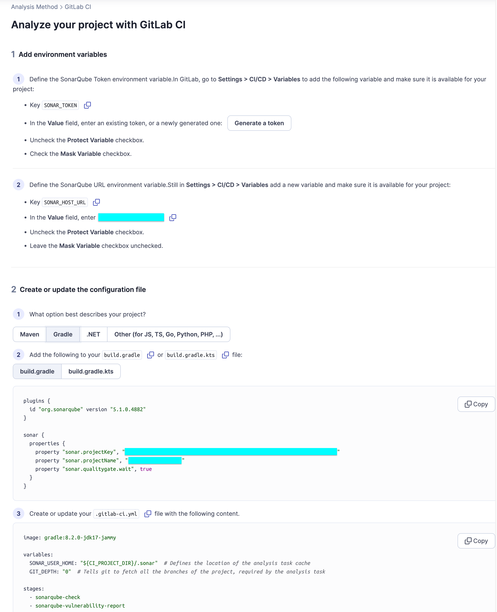
Figure 8. 위 이미지와 같이 기본 지침을 확인할 수 있습니다.  


아래에서 **[Figure 8]** 의 지침을 자세하게 설명하겠습니다.  
### 1. GitLab CI/CD Variables 추가
- `SONAR_HOST_URL` : SonarQube의 HOST URL 을 입력합니다.  
  (ex, `http://localhost:9000`)
- `SONAR_TOKEN` : SonarQube에서 발급한 프로젝트 토큰 또는 글로벌 토큰을 입력합니다.  
  (ex, `sqa_bfa98a...`)

### 2. build.gradle 수정 (java)
아래 구문을 추가합니다. (**Figure 8** 의 지침에 출력된 코드블럭입니다.)
```gradle
plugins {
    ...
    id 'org.sonarqube' version '5.1.0.4882'
}

sonar {
  properties {
    property 'sonar.projectKey', 'SonarQube의 프로젝트 키'
    property 'sonar.projectName', 'SonarQube의 프로젝트 이름'
    property 'sonar.qualitygate.wait', true
    property "sonar.java.binaries", "$buildDir/classes/java/main"
  }
}
```

### 3. gitlab-ci.yml 작성
GitLab 프로젝트에서 SonarQube 분석 파이프라인 구성파일을 작성합니다.  
```yaml
workflow:
  name: 'SonarQube 테스트'
  auto_cancel:
    on_new_commit: interruptible

default:
  interruptible: true
  tags:
    - sonar

stages:
  - sast

sonarqube-analysis:
  stage: sast
  image: arm64v8/gradle:8.6-jdk17
  variables:
    SONAR_USER_HOME: "${CI_PROJECT_DIR}/.sonar"
    GIT_DEPTH: "0"
  script:
    - gradle assemble
    - gradle sonar
  allow_failure: true
  rules:
    - if: $CI_PIPELINE_SOURCE == 'merge_request_event'
    - if: $CI_COMMIT_BRANCH == 'feature'
```

## 결과
파이프라인을 실행하면 아래와 같이 분석결과가 SonarQube 에 올라오는것을 확인할 수 있습니다.  
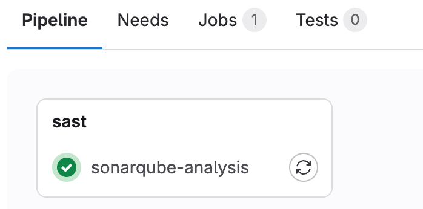
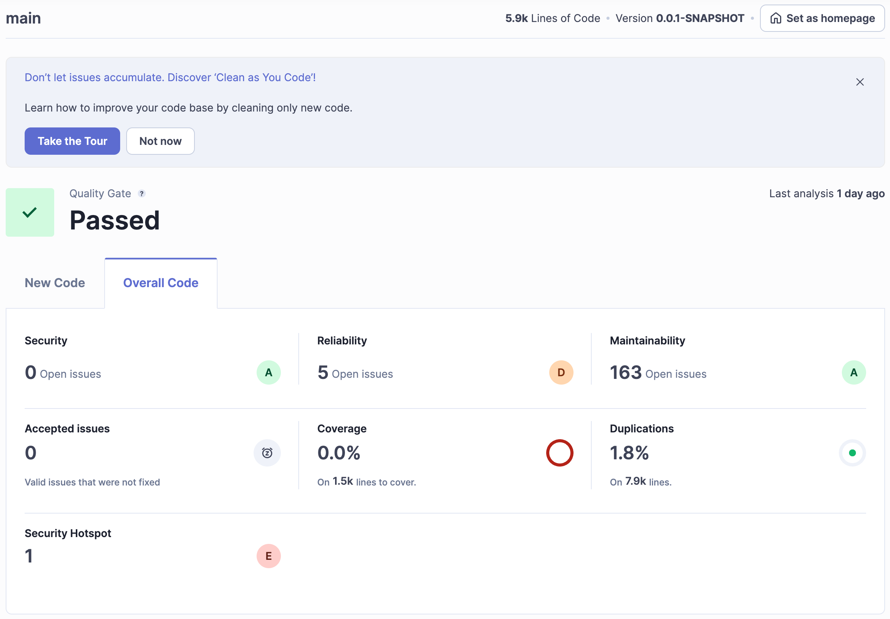