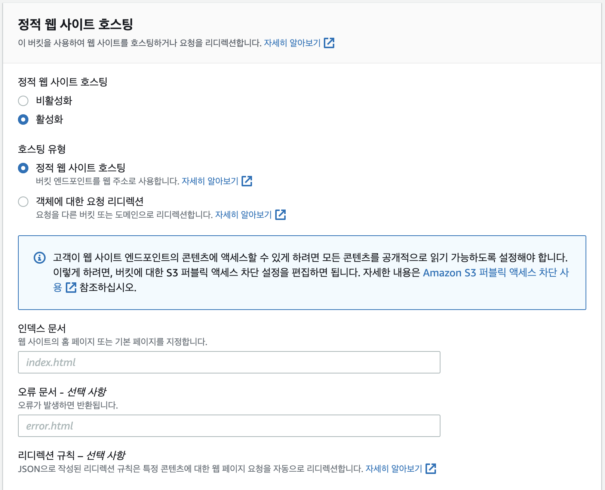

S3에 파일을 저장하면 파일(object) 단위로 URL이 생성된다. 이것을 이용해서 정적 컨텐츠 저장소로 사용할 수 있다. 


[동적웹 vs 정적웹]  
동적웹은 DB와 상호작용한다. 기능은 많지만 보안 취약점이 존재할 수 있다.  
반면, 정적웹은 DB와 상호작용하지 않아 보안성이 높고 단순하다.  


## 1. 아키텍쳐
## 2. S3 - 정적 웹사이트 호스팅 설정
**[버킷 > 속성]** 에서 스크롤 최하단에 위치한 **[정적 웹 사이트 호스팅 > 편집]** 을 클릭합니다.  
활성화를 체크하면 아래 추가 옵션이 보이는데, 호스팅 유형에서 정적 웹 사이트 호스팅을 체크하고 인덱스 문서 및 오류 문서를 입력하고 변경 사항 저장을 클릭합니다.  

## 3. Route53 - 도메인 준비
## 4. ACM - 인증서 발급
## 5. CloudFront - 배포