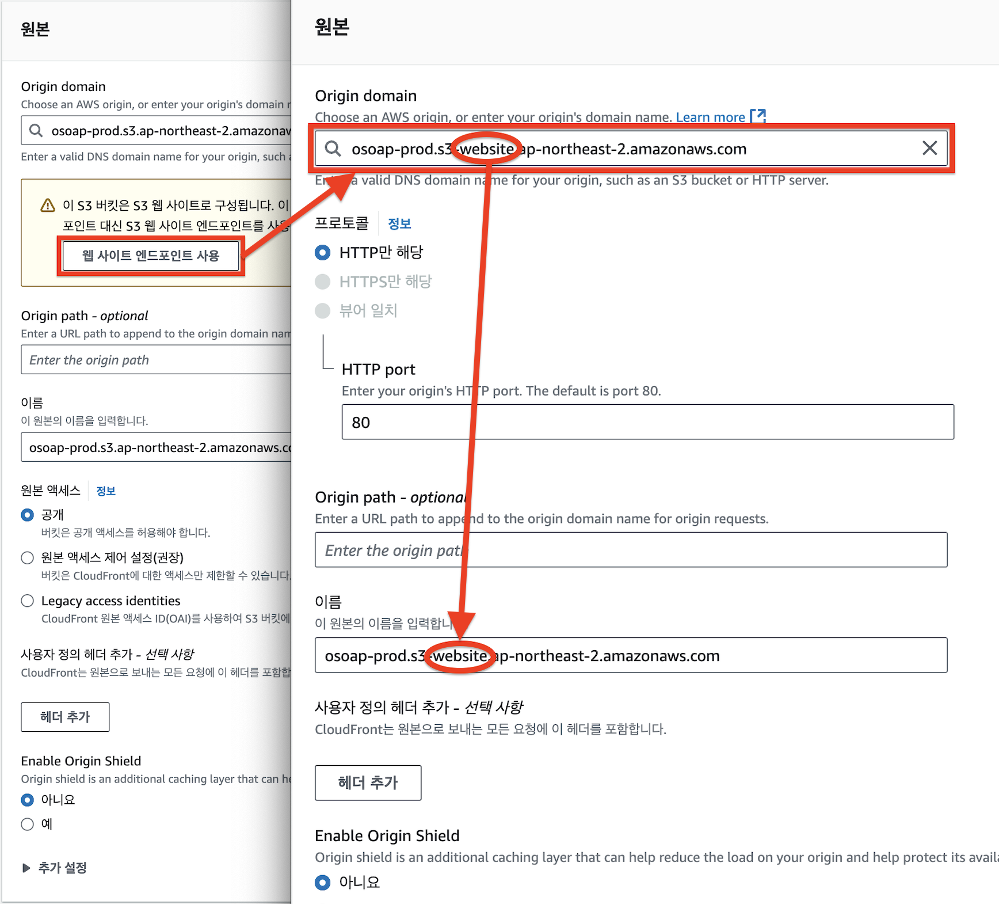

S3에 파일을 저장하면 파일(객체) 단위로 URL이 생성됩니다.  
이를 활용하여 정적 콘텐츠 저장소로 사용할 수 있습니다.  


동적웹 vs 정적웹
- 동적웹은 DB와 상호작용한다. 기능은 많지만 보안 취약점이 존재할 수 있다.  
- 정적웹은 DB와 상호작용하지 않아 보안성이 높고 단순하다.  
- 보통 회사 소개 페이지나 브랜딩 사이트처럼 사용자와의 상호작용 기능이 없이 정적 콘텐츠 제공만을 원할 때, 정적 웹 호스팅을 구성한다.  


## 1. 흐름도

## 2. S3 - 정적 웹사이트 호스팅 설정
**[버킷 > 속성]** 에서 스크롤 최하단에 위치한 **[정적 웹 사이트 호스팅 > 편집]** 을 클릭합니다.  
- [x] 정적 웹 사이트 호스팅 섹션에서 **활성화**를 체크하면 아래 옵션이 추가됩니다.  
- [x] 호스팅 유형에서 정적 웹 사이트 **호스팅을 체크** 합니다.  
- [x] **인덱스 문서** 와 **오류 문서**를 입력하고 변경 사항 저장을 클릭합니다.  


## 3. Route53 - 도메인 준비
외부 도메인 등록사이트(GoDaddy, NameCheap, Cafe24, Gabia 등등) 에서 도메인을 구매하고 네임서버를 AWS 로 옮기든, AWS 에서 도메인을 구입하든 도메인이 필요하다.  
이후, Route53 에 도메인과 같은 이름의 **호스팅 영역(Hosted Zone)** 을 생성한다.  

## 4. ACM - 인증서 발급
3번 과정이 완료되었다면 쉽다.  
**[AWS Certificate Manager > 인증서 요청 > 퍼블릭 인증서 요청 > 도메인 이름 입력]** 을 하고 **[요청]** 을 클릭한다.  
그리고 아래 화면에서 **[Route53에서 레코드 생성]** 을 누르고 5분정도 기다리면 인증서 생성이 완료된다.
  

## 5. CloudFront - 배포
**[CloudFront > 배포]** 를 클릭합니다.
### 5-1. 원본(Origin) 설정
1번 과정에서 설정했던 <ins>정적 호스팅 설정</ins>이 여기서 필요합니다.  
- [x] Origin domain 에 1번에서 생성했던 버킷 주소를 선택합니다.  
- [x] 아래 노란색 메시지박스가 생기면서 **[웹 사이트 엔드포인트 사용]** 버튼이 생깁니다. 클릭합니다.  
  클릭하면 우측 이미지처럼 메뉴가 바뀌는것을 확인 할 수 있습니다.  
- [x] 도메인이 `website` 문자열이 들어간 도메인으로 바뀌었다면 정상적으로 설정이 된 것이다.  
  
  
### 5-2. 캐시(Cache) 설정
- [x] 프로토콜 정책을 적절히 선택합니다.  
- [x] HTTP 메소드를 적절히 선택합니다.  
- [x] 캐시 정책을 적절히 선택합니다.  
- [x] CORS 정책을 적절히 선택합니다.  
  

### 5-3. 일반 설정
- [x] WAF 보안사항을 적절히 선택합니다.  
- [x] 가격 유형을 선택합니다.  
- [x] 연결할 도메인 CNAME 을 입력합니다.  
- [x] 4번 과정에서 생성했던 SSL 인증서를 선택하고 **[배포생성]** 을 클릭합니다.

이것으로 인프라 구성은 완료되었습니다.  
CloudFront 배포완료에 10 ~ 15분정도 소요됩니다.  

## 6. GitLab 파이프라인 연결
### 6-1. CI/CD 환경변수
|Key|Value|
|---|-----|
|`AWS_ACCESS_KEY_ID`|AWS IAM 액세스키(S3권한이 있는)|
|`AWS_SECRET_ACCESS_KEY`|AWS IAM 시크릿키(S3권한이 있는)|

### 6-2. 파이프라인 구성파일(.gitlab-ci.yml)
```yaml
workflow:
  name: '정적 웹 호스팅 데모'
  auto_cancel:
    on_new_commit: interruptible

default:
  interruptible: true
  cache:
    key:
      files:
        - package.json
    paths:
      - ./.npm
  tags:
    - demo

stages:
  - build
  - deploy

build:
  image: node:18.16
  stage: build
  before_script:
    - npm i --cache .npm --prefer-offline
    - export NODE_OPTIONS=--max-old-space-size=4096
  script:
    - npm run build
  artifacts:
    paths:
      - ./dist
    expire_in: 10 mins
  rules:
    - if: $CI_COMMIT_REF_NAME == "demo"

deploy:
  image:
    name: amazon/aws-cli:arm64
    entrypoint: [""]
  stage: deploy
  script:
    - aws s3 sync ./dist s3://p373r-demo
  environment:
    name: demo
    url: https://demo.p373r.net
  needs: [build]
  when: on_success
  rules:
    - if: $CI_COMMIT_REF_NAME == "demo"
```
- `build:script` 에서 소스코드를 빌드합니다.  
- `deploy:script` 에서 `aws s3 sync ./dist s3://p373r-demo` 커맨드로 빌드된 소스코드(dist)를 s3 버킷에 동기화해 변경된 소스코드를 반영합니다.  

## 7. 전체 과정 요약
1. 정적 콘텐츠를 저장할 저장소를 생성합니다. → `S3`
2. 인터넷에 배포를 하기위한 도메인을 준비합니다. → `Route53`
3. https 배포를 위한 SSL 인증서를 준비합니다. → `ACM`
4. https 배포를 합니다. → `CloudFront`
5. 소스코드를 S3 에 배포합니다. → `GitLab`