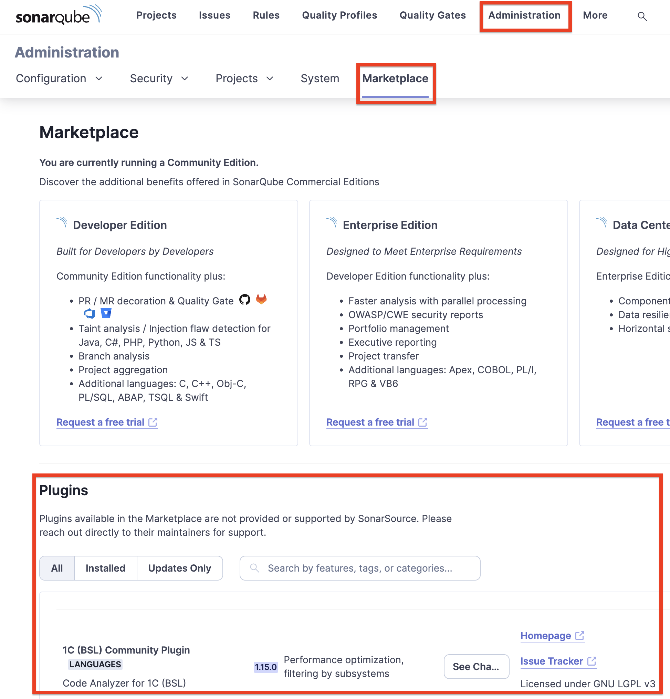
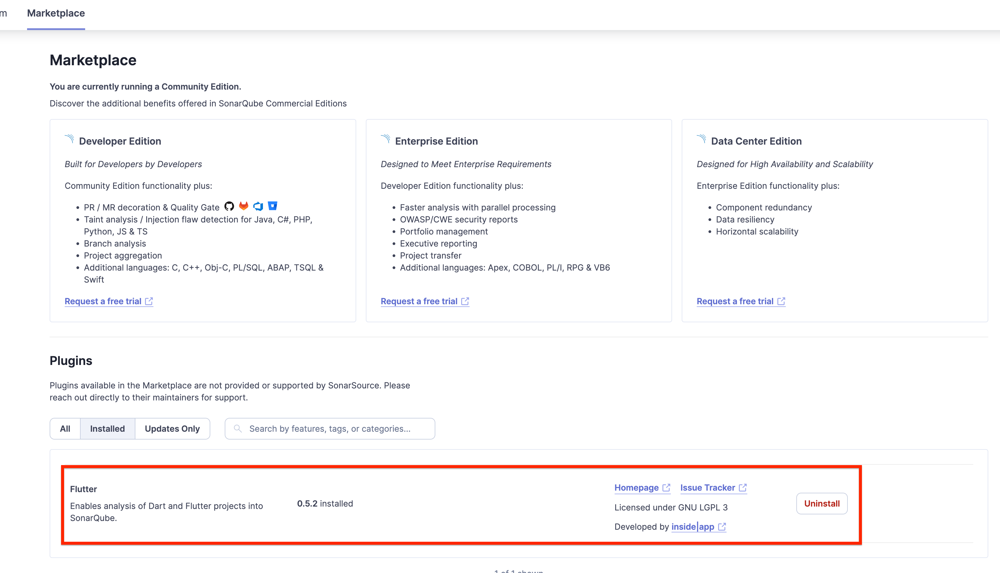

## Marketplace
필요한 플러그인은 보통 **MarketPlace** 에 있다.  
관리자 계정으로 로그인 후 **[Administration > Marketplace]** 에 들어가면 플러그인 목록을 확인할 수 있다.  

## 외부 플러그인 설치
그런데, 필요한 플러그인이 Marketplace 에 없을 수 있다.  
이럴때는 [sonarqube-index](https://www.sonarplugins.com/) 또는 플러그인 개발자의 GitHub Repo 를 확인하여 `*.jar` 파일을 다운로드 한다. (우리에게 필요한 플러그인 파일은 `.jar` 파일이다.)

다운로드 한 `*.jar` 파일을 SonarQube 서버의 `/opt/extensions/plugins` 경로에 넣고 SonarQube 서버를 재시작하면 플러그인이 설치가 진행된다.  

아래와 같이 Marketplace 에는 없는 외부 플러그인이 제대로 설치된것을 확인 할 수 있다.  
