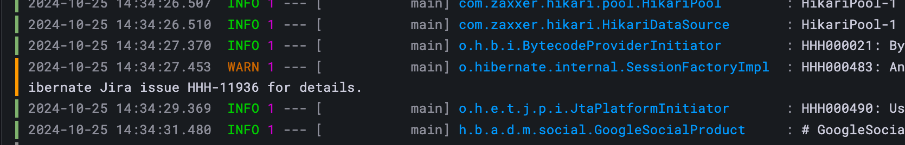

## 1. Fluent-bit 설치
### 서비스 데몬 설치
아래는 서비스 데몬 형태로 로컬에 직접 설치하는 방식의 스크립트이다.  
```bash
{
curl https://raw.githubusercontent.com/fluent/fluent-bit/master/install.sh | sh
sudo systemctl start fluent-bit
sudo systemctl enable fluent-bit
sudo ln -s /opt/fluent-bit/bin/fluent-bit /usr/local/bin/fluent-bit
}
```

## 2. 설정
### 컨테이너 메트릭 수집 설정
아래 설정파일의 경로는 `/etc/fluent-bit/` 이다.  
fluent-bit.conf  
```toml
[SERVICE]
    Flush               1
    Log_level           info

[INPUT]
    Name                docker
    Tag                 docker.containers
    Interval_Sec        1

[OUTPUT]
    Name                cloudwatch_logs
    Match               docker.containers
    Region              ap-northeast-2
    Log_group_name      /aws/ec2/chodan/containers/dev/api
    Log_stream_prefix   chodan-api-dev.
    Auto_create_group   true
```

### 컨테이너 로그 수집 설정
fluent-bit.conf
```toml
[SERVICE]
    Flush               1
    Log_level           info
    Parsers_File        /etc/fluent-bit/parsers.conf

[INPUT]
    Name                tail
    Path                /var/lib/docker/containers/*/*.log
    Parser              docker
    Tag                 docker.containers
    Read_From_Head      true
    Mem_Buf_Limit       5MB

[FILTER]
    Name                parser
    Match               docker.containers
    Key_Name            log
    Parser              json
    Reserve_Data        On

[FILTER]
    Name                lua
    Match               docker.containers
    script              /etc/fluent-bit/remove_ansi.lua
    call                remove_ansi

[OUTPUT]
    Name                cloudwatch_logs
    Match               docker.containers
    Region              ap-northeast-2
    Log_group_name      /aws/ec2/서비스이름/containers/dev/api
    Log_stream_prefix   buster-api-dev.
    Auto_create_group   true
    Log_Format          log
    Log_Key             log

[OUTPUT]
    Name                stdout
    Match               *
```

### 필터 스크립트
Fluent-bit 로 수집된 로그를 바로 CloudWatch 에 전송하면 유니코드 문자열이 그대로 전송되어 한글을 확인할 수 없는 문제가 있다. 이 문제를 아래 스크립트로 이스케이프 할 수 있다.  
```lua
function remove_ansi(tag, timestamp, record)
    local message = record["log"]

    -- 유니코드 -> UTF-8 변환
    local utf8_log = message:gsub("\\u(%x%x%x%x)", function(hex)
        return utf8.char(tonumber(hex, 16))
    end)

    -- \r 및 \n 제거
    utf8_log = string.gsub(utf8_log, "\r", "") -- 캐리지 리턴 제거
    utf8_log = string.gsub(utf8_log, "\n", "") -- 라인 피드 제거
    
    record["log"] = utf8_log
    return 1, timestamp, record
end
```

## 3. 쿼리
아래는 **CloudWatch Logs Insights** 의 쿼리문이다.  
해당 쿼리를 Grafana 에 입력하면 아래 이미지와 같이 로그를 확인할 수 있다.  
```sql
fields @timestamp, @message
| sort @timestamp desc
| limit 10000
```
