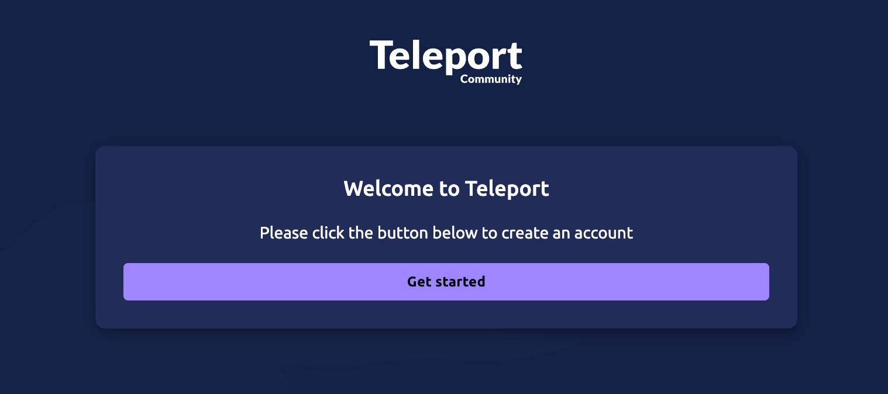

## 1. Self-hosted Auth 서버 설치
### 사전 요구사항
- 80 port
- 443 port
- 3025 port
- 3080 port

### 1-1. 설치
```bash
curl https://cdn.teleport.dev/install.sh | bash -s 17.4.5
```

### 1-2. 인증서 발급(let's encrypt)
```bash
sudo teleport configure -o file --acme --acme-email=user@example.com --cluster-name=teleport.example.com
```

### 1-3. teleport 서비스 등록 및 실행
```bash
sudo systemctl enable teleport
sudo systemctl start teleport
```

### 1-4. 텔레포트 콘솔 계정 생성
```bash
sudo tctl users add test-user --roles=access --logins=tp-test
```
위 명령을 실행했을 때 로그인할 수 있는 시간제한이 있는 url link가 발급되는데, 저기로 접속해보면


웰컴 페이지가 보이고 **[Get started]** 버튼을 클릭하면,  


패스워드 설정하는 페이지가 나오고 원하는 패스워드를 입력 후 **[Next]** 버튼을 클릭하면,  


OTP 설정페이지로 이동되는데, 본인 스마트폰의 구글 Authenticator를 다운받아 해당 QR을 스캔하면 다운받은 앱에 등록이 되는데, 
이때 OTP 코드를 입력하면 등록이 완료되고,  


텔레포트 콘솔 페이지에 접속이 된다.  


별도 로그인 페이지는 아래와 같이 구성되며, 패스워드와 OTP를 모두 입력해야 로그인이 가능하다.  
그러니, OTP 앱 관리가 중요하다.  


#### roles
계정을 생성할때 부여할 수 있는 권한의 종류는 아래와 같다.  
- `access` : 기본적인 SSH 접속 및 세션 관리 권한
- `editor` : 리소스 관리 및 구성 변경 권한
- `auditor` : 감사 로그와 세션 녹화를 볼 수 있는 권한
- `admin` : 모든 시스템 기능에 대한 전체 접근 권한 (가장 강력한 권한)

추가로 다음과 같은 특수 목적 역할도 있다.  

- `reviewer` : 액세스 요청을 검토하고 승인할 수 있는 권한
- `bot` : 자동화된 작업을 위한 제한된 권한
- `db-*` : 데이터베이스 액세스 관련 역할
- `k8s-*` : Kubernetes 액세스 관련 역할
- `app-*` : 애플리케이션 액세스 관련 역할

또한 Teleport는 사용자 지정 역할을 생성하여 더 세분화된 권한 제어가 가능하다.  
이를 통해 특정 노드에만 접근 가능하거나, 특정 시간에만 접속 가능하게 하는 등 조직의 요구사항에 맞는 사용자 지정 권한을 설정할 수 있다.  
사용자 지정 역할은 YAML 파일을 통해 정의하고 `tctl create -f role.yaml` 명령으로 생성할 수 있다.  

#### use-case
사용자 지정 역할을 통한 세분화된 권한 제어가 필요없다면,  
- 일반 관리자 : `editor`, `access`
  ```bash
  sudo tctl users add teleport-admin --roles=editor,access --logins=ubuntu
  ```
- 일반 사용자 : `access`  
  뒤에 **--logins** 옵션에 올 계정은 텔레포트 인증서버의 실제 리눅스 사용자 계정이다.  
  ```bash
  sudo adduser tp-user
  sudo tctl users add teleport-user --roles=access --logins=tp-user
  ```
  
- 시스템 관리자 : `admin`
  ```bash
  sudo tctl users add admin --roles=admin --logins=root
  ```