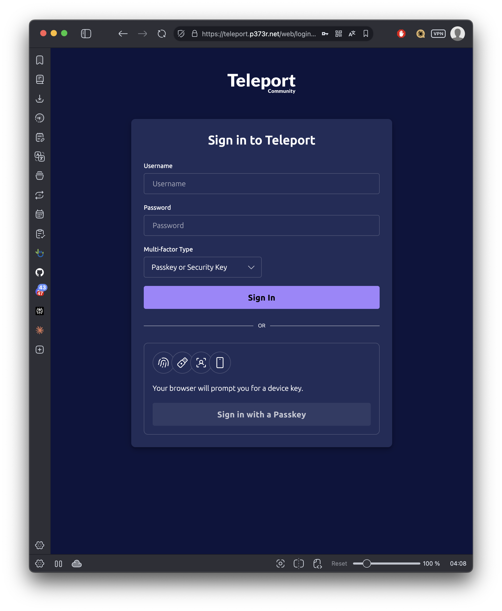
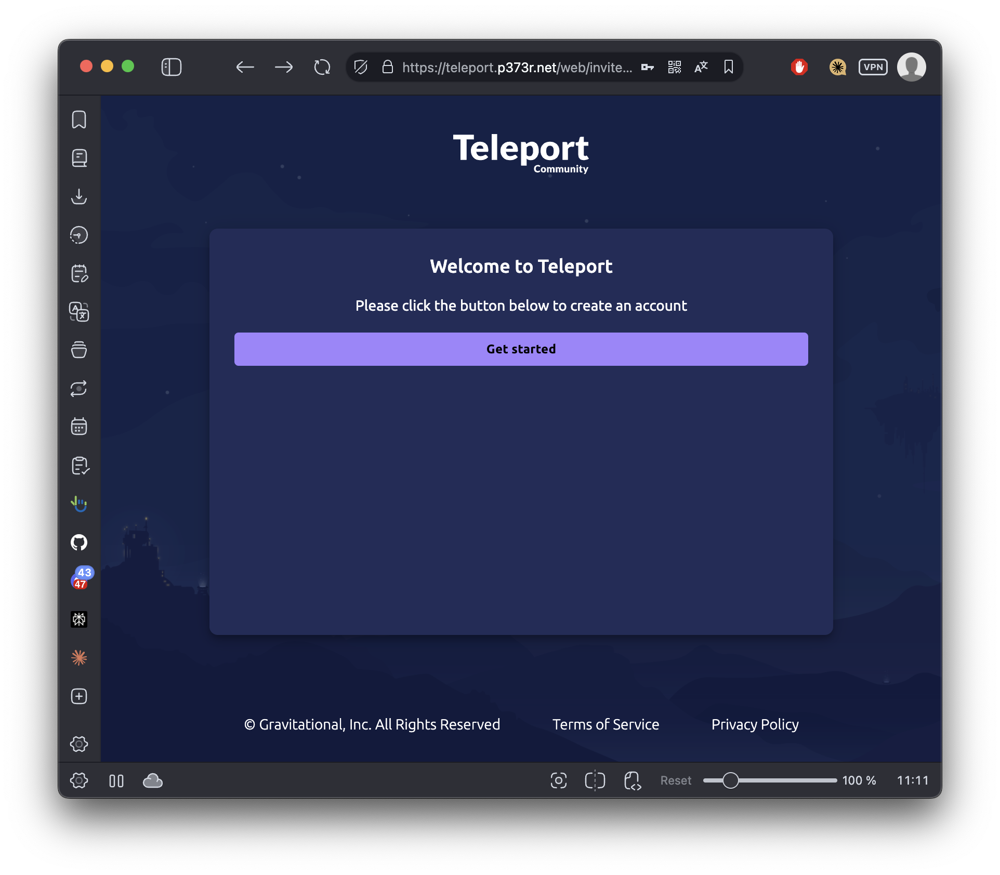
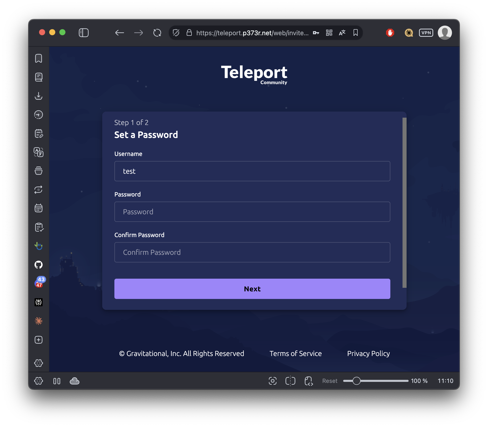
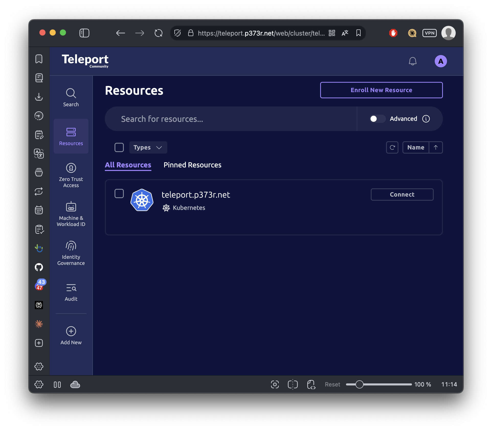

## 사전 요구사항
- 도메인(let's encrypt 로 인증서 발급하기 위해)
- DNS 레코드 설정
  | Type |           Record         |            Source          |
  |------|--------------------------|----------------------------|
  | A    | `teleport.example.com`   | 123.xxx.xxx.xxx(Public IP) |
  | A    | `*.teleport.example.com` | 123.xxx.xxx.xxx(Public IP) |
- Metallb : 기존 공식 가이드에서는 CSP의 LB를 준비하라고 되어있지만, 여기서는 로컬 LB(MetalLB)를 사용하여 구현 예정
- Persistent Volume, dynamic volume provisioner
  ```bash
  k get pv
  k get storageclasses
  ```
- `helm >= 3.4.2`
- `kubernetes >= v1.17.0` → 참고. [k8s 설치방법](https://p373r.net/study/20250417-k8s-install/)

## 1. Metallb 설치
```bash
kubectl apply -f https://raw.githubusercontent.com/metallb/metallb/v0.14.9/config/manifests/metallb-native.yaml
```
### 1-1. coredns 설정
```bash
kubectl edit cm -n kube-system coredns
```
다음과 같이 수정한다.  
```bash
forward . 8.8.8.8 8.8.4.4
```
그리고 CoreDNS를 재시작한다.  
```bash
kubectl rollout restart deployment -n kube-system coredns
```

### 1-2. IPAddressPool 생성
- 서비스에 할당할 수 있는 IP 주소 범위(CIDR)이다.  
- Metallb는 IPAddressPool로 서비스를 위한 외부 IP주소를 관리하고, 서비스가 생성될 때 해당 IP 주소를 동적으로 할당한다. 여기서는 IP 1개를 지정하겠다.  
```bash
cat <<EOF | kubectl apply -f -
apiVersion: metallb.io/v1beta1
kind: IPAddressPool
metadata:
  name: teleport-pool
  namespace: metallb-system
spec:
  addresses:
  - 10.17.73.200/32
EOF
```


<span style="color: #000000;"><b>🐛 IPAddressPool</b></span> 생성 중 아래 에러가 발생한다면 대부분 네트워크 구성 문제인데, 웹훅 검증을 우회하여 임시로 해결할 수 있다.  
  
<span style="color: #FF3333;"><b>Error from server (InternalError): error when creating "STDIN":  Internal error occurred: failed calling webhook "ipaddresspoolvalidationwebhook.metallb.io": failed to call webhook: Post "https://metallb-webhook-service.metallb-system.svc:443/validate-metallb-io-v1beta1-ipaddresspool?timeout=10s": context deadline exceeded</b></span>
  


```bash
# 웹훅 검증 우회
kubectl delete validatingwebhookconfigurations metallb-webhook-configuration
```

### 1-3. L2Advertisement 생성
- 클러스터 내의 서비스가 외부 네트워크에 IP주소를 노출하는 방식을 정의하는 방법
- Layer2 방식으로 클러스터 내의 서비스 IP 주소를 노출해 외부에서 해당 IP 주소에 접근할 수 있도록 한다.  
```bash
cat <<EOF | kubectl apply -f -
apiVersion: metallb.io/v1beta1
kind: L2Advertisement
metadata:
  name: teleport-advert
  namespace: metallb-system
spec:
  ipAddressPools:
  - teleport-pool
  interfaces:
  - ens3
EOF
```

## 2. helm 설치
```bash
{
wget https://get.helm.sh/helm-v3.17.0-linux-amd64.tar.gz
tar -zxvf helm-v3.17.0-linux-amd64.tar.gz
sudo mv linux-amd64/helm /usr/local/bin/helm
rm -rf linux-amd64 helm-v3.17.0-linux-amd64.tar.gz
}
```

## 2. 볼륨 프로비저너 설치
hostPath 기반 로컬 스토리지를 위한 프로비저너를 설치한다.  
```bash
kubectl apply -f https://raw.githubusercontent.com/rancher/local-path-provisioner/master/deploy/local-path-storage.yaml
```

## 3. StorageClass 설정
```bash
kubectl patch storageclass local-path -p '{"metadata": {"annotations":{"storageclass.kubernetes.io/is-default-class":"true"}}}'
```
```bash
# StorageClass 확인
k get storageclasses

# NAME                   PROVISIONER             RECLAIMPOLICY   VOLUMEBINDINGMODE      ALLOWVOLUMEEXPANSION   AGE
# local-path (default)   rancher.io/local-path   Delete          WaitForFirstConsumer   false                  59m
```

<!-- ### 3-1. PVC 수동 생성
```bash
cat <<EOF | kubectl apply -f -
apiVersion: v1
kind: PersistentVolumeClaim
metadata:
  name: teleport-cluster
  namespace: teleport-cluster
spec:
  accessModes:
    - ReadWriteOnce
  resources:
    requests:
      storage: 10Gi
  storageClassName: local-path  # 앞서 생성한 StorageClass 사용
EOF
``` -->

## 4. teleport 헬름 차트 추가
```bash
{
helm repo add teleport https://charts.releases.teleport.dev
helm repo update
}
```

## 5. teleport-cluster 리소스 추가
```bash
{
kubectl create ns teleport-cluster
kubectl label ns teleport-cluster 'pod-security.kubernetes.io/enforce=baseline'
kubectl config set-context --current --namespace=teleport-cluster
}
```

## 6. chart values 작성
```bash
cat << EOF > teleport-cluster-values.yaml
clusterName: teleport.p373r.net
proxyListenerMode: multiplex
acme: true
acmeEmail: juseok@example.com
EOF
```
- `clusterName` : 텔레포트 접근할 때 사용할 도메인
- `acmeEmail` : let's encrypt 알림용 메일주소

## 7. teleport 헬름 차트 설치
```bash
helm install teleport-cluster teleport/teleport-cluster --version 17.4.6 --values teleport-cluster-values.yaml
```

## 8. Teleport 서비스에 HTTP(80) 포트 추가
차트 배포가 완료되면 `teleport-cluster-proxy-xxxx` 파드에서는 에러 로그를 출력하고 있을것이다. 이는 아래 과정때문에 발생하는 문제다.  
1. `teleport-cluster-proxy-xxxx` 파드가 시작될때 acme 프로세스를 시작한다.  
2. `teleport-cluster-proxy-xxxx` 파드는 80포트를 통해 Let's Encrypt의 HTTP-01 챌린지를 수신한다.  
3. Let's Encrypt가 도메인 소유권을 확인하고 인증서를 발급한다.  
4. `teleport-cluster-proxy-xxxx` 파드가 발급받은 인증서를 사용해 443 포트로 HTTPS 연결을 수립한다.  

Teleport에서 제공하는 헬름 차트는 기본적으로 CSP의 LB 사용을 전제로 설계되어 있기 때문에 발생하는 문제이다.  
클라우드 환경에서는 일반적으로 아래 과정으로 인증서 구성이 진행된다.  
1. 클라우드 LB가 HTTP(80) -> HTTPS(443) 리다이렉션 자동 처리
2. 또는 클라우드 LB에서 인증서 자체 관리 가능

아래 명령어로 서비스에 HTTP(80)포트를 추가해야 위 문제를 해결할 수 있다.  
```bash
kubectl patch svc teleport-cluster -n teleport-cluster --type='json' -p='[{"op": "add", "path": "/spec/ports/-", "value": {"name": "http", "port": 80, "protocol": "TCP", "targetPort": 3080}}]'
```

## 9. 포트 포워딩
multipass로 vm을 생성해 쿠버네티스를 설치하고 배포했는데, 로컬호스트와 vm네트워크를 포트포워딩해야 외부에서 접근할 수 있다.  
여기서 필요한 포트는 80, 443 이다.  
```bash
sudo socat TCP-LISTEN:80,fork,reuseaddr TCP:<metallb ip>:80 &
sudo socat TCP-LISTEN:443,fork,reuseaddr TCP:<metallb ip>:443 &
```


## 10. 로컬 유저 생성
다음 역할은 시스템 관리자 권한이다.  
```yaml
# sys-master.yaml
kind: role
version: v7
metadata:
  name: member
spec:
  allow:
    kubernetes_groups: ["system:masters"]
    kubernetes_labels:
      '*': '*'
    kubernetes_resources:
      - kind: '*'
        namespace: '*'
        name: '*'
        verbs: ['*']
```

유저를 생성하기 전에 아래 명령어로 teleport 클러스터에 역할을 생성한다.  
```bash
kubectl exec -i deployment/teleport-cluster-auth -- tctl create -f < sys-master.yaml
```

아래 명령어로 teleport 클러스터에 유저를 생성할 수 있다.  
```bash
kubectl exec -it deployment/teleport-cluster-auth -- tctl users add admin --roles=member,access,editor

# User "admin" has been created but requires a password. Share this URL with the user to complete user setup, link is valid for 1h:
# https://teleport.p373r.net:443/web/invite/613b2ea21ae2fef2b6fae4dbb9a2aaa3

# NOTE: Make sure teleport.p373r.net:443 points at a Teleport proxy which users can access.
```
유저를 생성하면 출력되는 초대 URL로 웹콘솔(gui)에 접근할 수 있다.  
해당 링크는 1시간만 유효하기 때문에 제때제때 로그인해서 계정 생성을 완료해야한다.  

## 11. 로그인
### 11-1. web gui 로그인


패스워드와 2차 인증수단을 등록하면 웹 콘솔에 로그인이 가능하다.  


로그인시 첫 화면이다.  
gui로 인프라를 추가하고 아래 tsh이나 tctl로 접근할 수 있다.  


### 11-2. tsh 로그인
```bash
❯ tsh login --proxy=teleport.p373r.net --user=admin
# Enter password for Teleport user admin:
# Enter an OTP code from a device:
# > Profile URL:        https://teleport.p373r.net:443
#   Logged in as:       admin
#   Cluster:            teleport.p373r.net
#   Roles:              access, editor, sys-master
#   Kubernetes:         enabled
#   Kubernetes groups:  system:masters
#   Valid until:        2025-05-12 21:34:20 +0900 KST [valid for 12h0m0s]
#   Extensions:         login-ip, permit-agent-forwarding, permit-port-forwarding, permit-pty, private-key-policy

#   Profile URL:        https://teleport.hamalab.io:443
#   Logged in as:       admin
#   Cluster:            teleport.hamalab.io
#   Roles:              access, editor, sys-master, ssh-access
#   Logins:             gamedev, root
#   Kubernetes:         enabled
#   Kubernetes groups:  system:masters
#   Valid until:        2025-05-10 05:23:40 +0900 KST [EXPIRED]
#   Extensions:         login-ip, permit-agent-forwarding, permit-port-forwarding, permit-pty, private-key-policy
```