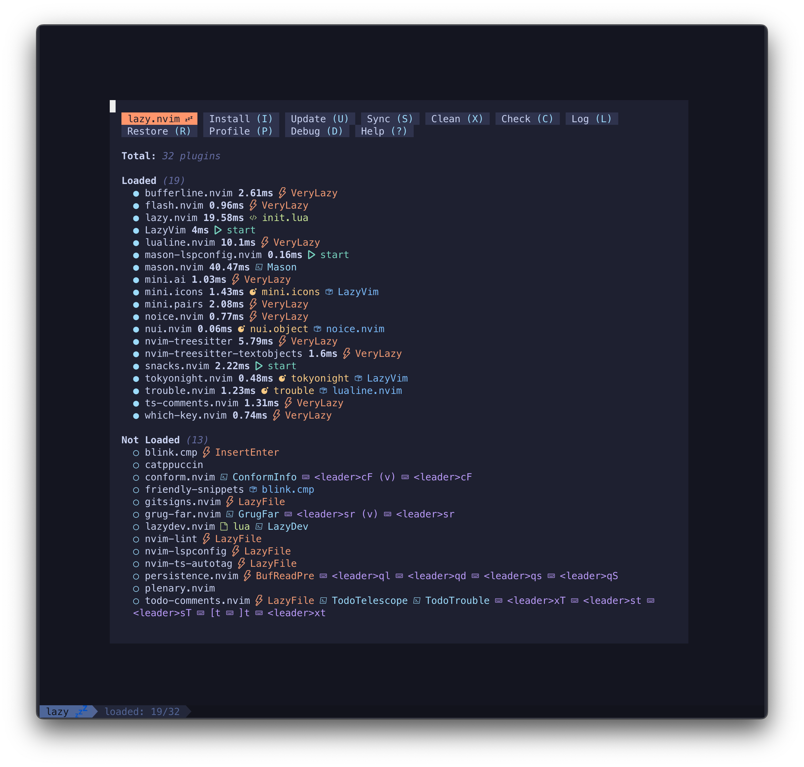
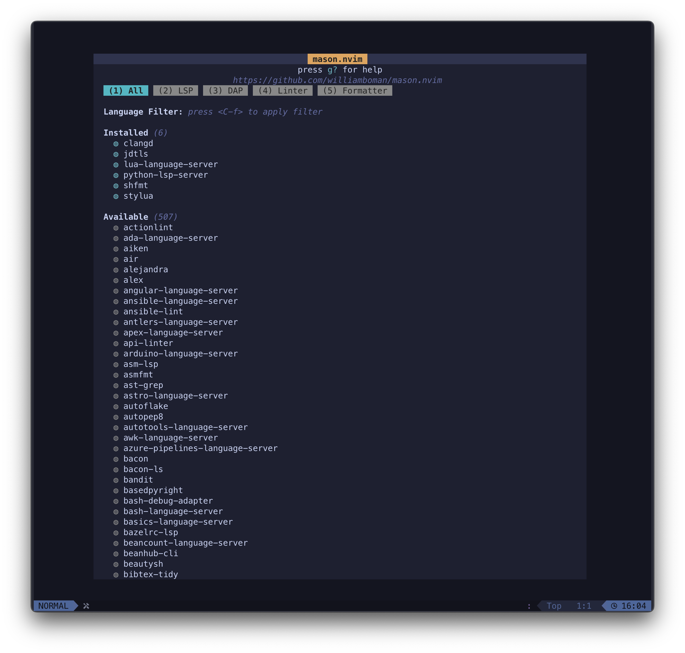
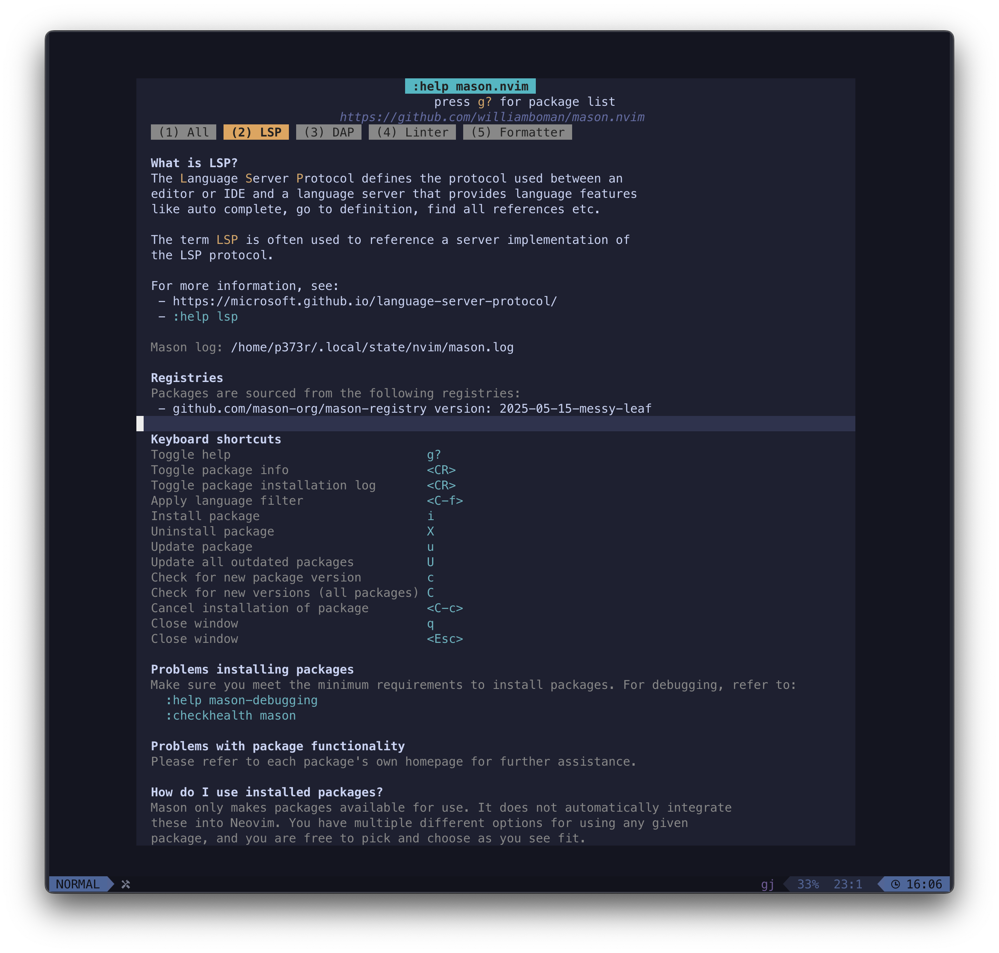
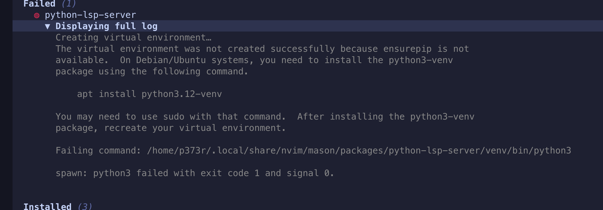
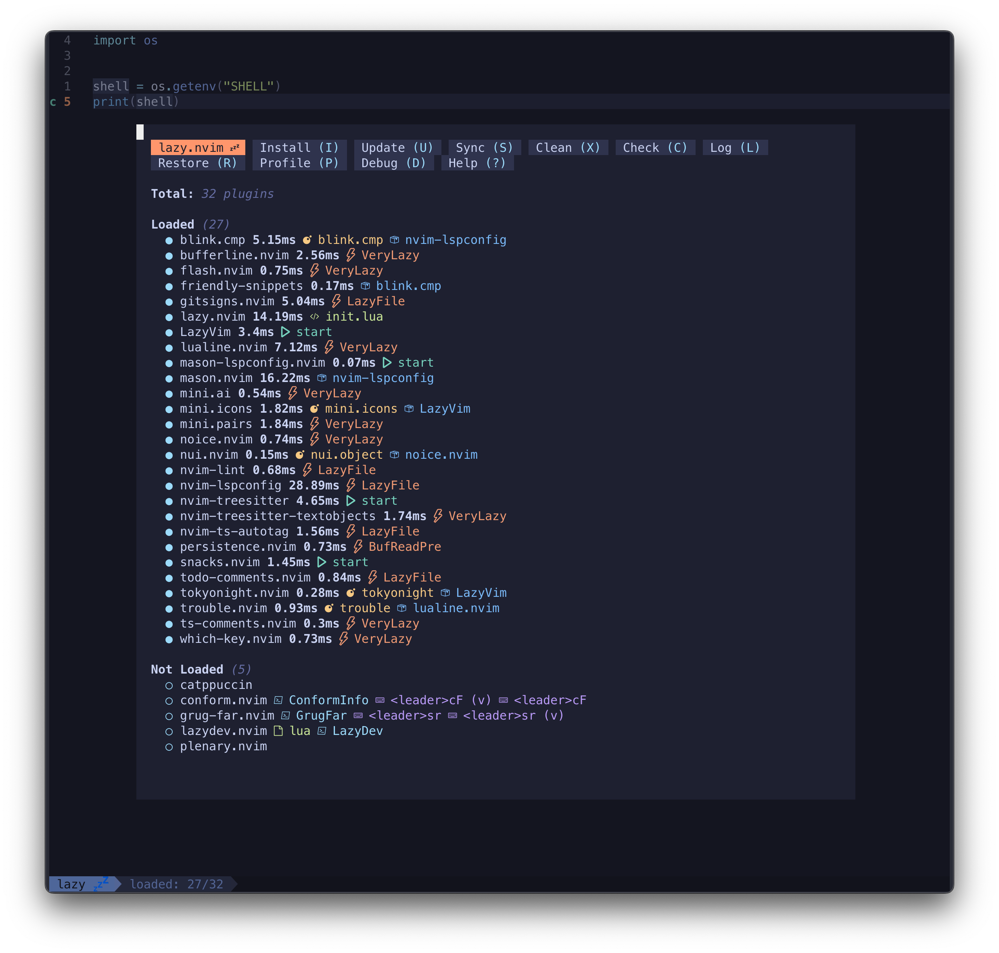
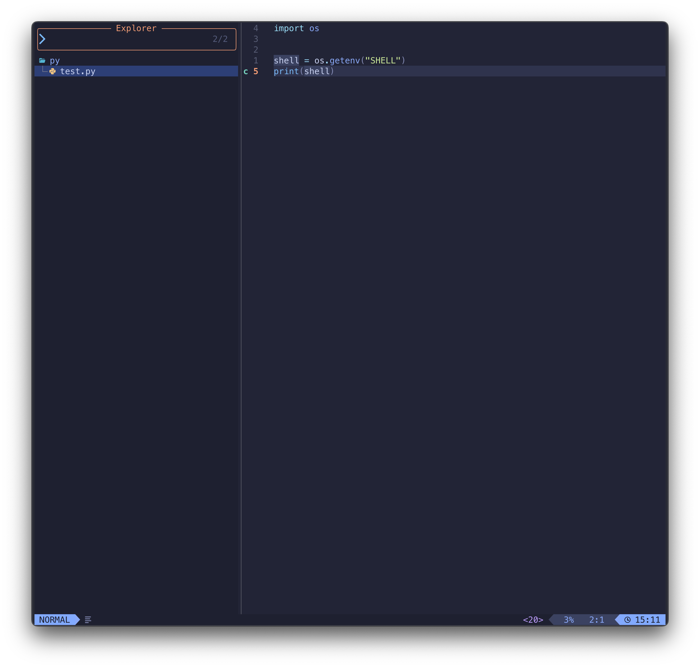
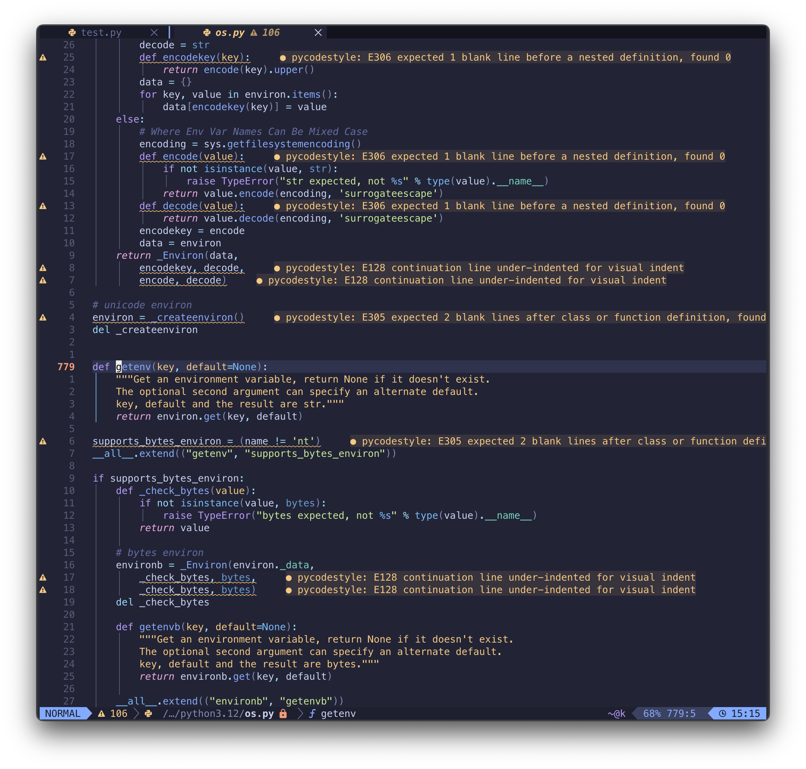
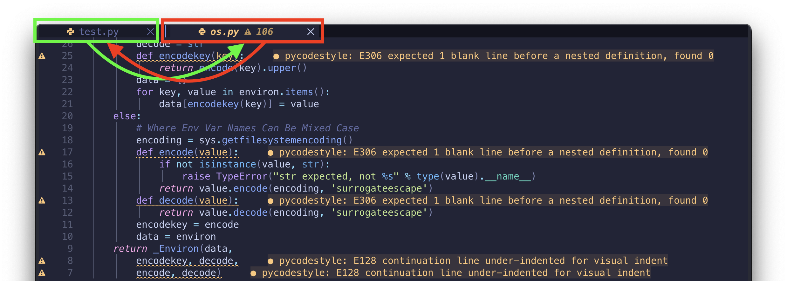

## LazyVim
### 1. 설치
#### 1-1. 사전 요구사항
- ⚙ `neovim` 설치
  - **Linux**
    ```bash
    {
    curl -LO https://github.com/neovim/neovim/releases/latest/download/nvim-linux-x86_64.tar.gz
    sudo rm -rf /opt/nvim
    sudo tar -C /opt -xzf nvim-linux-x86_64.tar.gz
    echo 'export PATH="$PATH:/opt/nvim-linux-x86_64/bin"' >> .bashrc
    rm nvim-linux-x86_64.tar.gz
    }
    ```
  - **MacOS**
    ```bash
    {
    HW_NAME=$(uname -m)
    curl -LO https://github.com/neovim/neovim/releases/download/nightly/nvim-macos-$HW_NAME.tar.gz
    tar xzf nvim-macos-$HW_NAME.tar.gz
    ./nvim-macos-$HW_NAME/bin/nvim
    }
    ```
- ⚙ `ripgrep`, `fzf`, `fd` 패키지 설치
  
  - **Linux(Debian)**
    ```bash
    {
    sudo apt update && sudo apt install -y ripgrep fzf fd-find
    sudo ln -s $(which fdfind) /usr/local/bin/fd
    }
    ```

  - **MacOS(Homebrew)**
    ```bash
    brew install fzf fd ripgrep
    ```
- ⚙ `nvm` : 언어 문법 하이라이트 설정을 위한 패키지 설치시 `npm` 필요
  ```bash
  {
  git clone https://github.com/nvm-sh/nvm.git ~/.nvm && cd ~/.nvm
  git checkout $(git describe --tags $(git rev-list --tags --max-count=1))
  source ~/.nvm/nvm.sh
  cat << 'EOF' >> ~/.bashrc

  export NVM_DIR="$HOME/.nvm"
  [ -s "$NVM_DIR/nvm.sh" ] && \. "$NVM_DIR/nvm.sh"
  [ -s "$NVM_DIR/bash_completion" ] && \. "$NVM_DIR/bash_completion"
  EOF
  source ~/.bashrc
  nvm install node
  }
  ```

#### 1-2. lazyvim 설치(Linux/MacOS)
```bash
{
  git clone https://github.com/LazyVim/starter ~/.config/nvim
  rm -rf ~/.config/nvim/.git
}
```
설치 후 처음 `vi`를 실행하면 기본 내장 플러그인들이 초기화/로드 된다.  
로드된 플러그인중 `VeryLazy` 라고 표시되어있는 플러그인들은 특정 명령어, 키 매핑, 이벤트 또는 파일 타입이 필요할 때만 로딩된다는 것을 뜻한다.  


### 2. 설정 파일
초기 구성 파일의 트리구조는 아래와 같다.  
```bash
~/.config/nvim/lua ································· with p373r@k8s-lab
❯ tree
.
├── config
│   ├── autocmds.lua
│   ├── keymaps.lua
│   ├── lazy.lua
│   └── options.lua
└── plugins
    └── example.lua
```
- `lua/config` 경로에 있는 파일들은 기존구조 그대로 사용하고 각 파일마다 설정을 커스터마이징 해가며 사용해야한다.  
- `lua/plugins` 경로는 사용자 마음대로 해도된다.  
  - `lua/plugins/lsp.lua` 라고 만들어서 `lsp` 관련 설정을 몰아 넣어도 된다는 뜻이다.  

### 3. LSP 설정
#### 3-1. 파일로 설정하기
난 `lua/plugins`에 `mason-workaround.lua` 라는 파일을 생성하고 이곳에 lsp 설정을 몰아 넣었다.  
```lua
return {
  { "mason-org/mason.nvim", version = "^1.0.0" },
  {
    "mason-org/mason-lspconfig.nvim",
    version = "^1.0.0",
    opts = {
      ensure_installed = {
        "pylsp",
        "jdtls",
        "clangd",
      },
      automatic_installation = true,
    },
  },
  {
    "neovim/nvim-lspconfig",
    opts = {
      servers = {
        pylsp = {},
        jdtls = {},
        clangd = {},
      },
    },
  },
}
```
- `mason.nvim` : LSP 서버, 린터, 포맷터 등을 관리하는 패키지 매니저
- `mason-lspconfig.nvim` : Mason과 lspconfig를 연결해주는 플러그인
  - `pylsp` : 파이썬 lsp
  - `jdtls` : 자바 lsp
  - `clangd` : C 계열 lsp
- `nvim-lspconfig.nvim` : LSP 서버를 구성하기 위한 플러그인

#### 3-2. TUI에서 설정하기
`vi`를 실행하고 `:Mason`을 입력해서 `TUI(터미널UI)` 환경에서 설치해도 된다.   
```bash
vi
```
키보드 화살표로 위아래 움직여서 설치하고 싶은 언어의 lsp를 설치하면 된다.


설치를 원하는 lsp에 커서를 움직여서 `i`키를 누르면 설치된다. `i`키를 누르고 맨위로 올라가보면 설치중 또는 설치 실패가 보일것이다.  


난 파이썬 `lsp(python-lsp-server)`을 설치했었는데, 문제가 있었다.
이유는, `python3-venv` 모듈이 없어서 그랬는데, 해당 패키지를 설치하고 다시 시도했더니 정상 설치되었다.  
아래 이미지처럼 실패한 패키지를 펼치면 실패 로그가 뜨는데, 추가로 설치에 싪패한 이유(로그)를 확인하는 명령어는 `:MasonLog` 이다.  



### 4. 자주 사용하는 키
- `<leader>` : 기본값은 스페이스바
- `<leader>-l` : lazy.nvim 메뉴, lazyvim 의 플러그인 매니저
  
- `<leader>-e` : 파일 탐색창(Explorer) 토글
  
- `g-d` : Go to Definition, 함수나 객체 정의로 바로가기
  
- <code>\<leader\>\-`</code> : 버퍼 전환
- `<leader>-bb` : 버퍼 전환
  
- `<leader>-bd` : 버퍼 닫기
- `q` : quit
- `ctrl` + `/` : 현재 파일위치에서 터미널 열기

### 5. 부록
