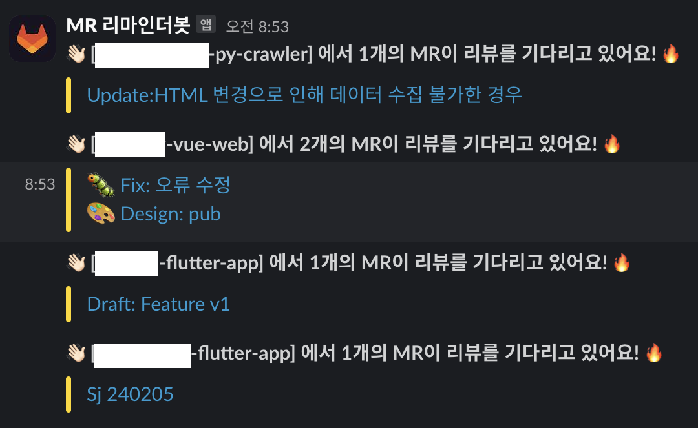

## 1. 개요
1. 서로 바빠서 MR 체크가 잘 되지않음
2. MR이 쌓임
3. 리뷰를 한번에 하려니까 시간적 압박, 스트레스 커짐
4. MR이 산더미가 되기전에 처리할수있도록 리마인더가 필요함
5. 코드 리뷰문화를 바꿔보자ㅏㅏㅏㅏ🔥🔥🔥🔥

## 2. 벤치마킹
[코드 리뷰 문화를 리뷰해 봐요 (코드 리뷰 프로세스 개선 ＆ PR Reminder Bot 개발 이야기)](https://devocean.sk.com/blog/techBoardDetail.do?ID=165255)  
  

해당 기술 블로그 사례는 깃헙이다. 뭐 구조는 다 비슷비슷하니까 구현해보겠다..

## 3. 로직
1. 매주 평일 오전 9시마다 Target project 에 Open 상태로 남아있는 PR 이 있는지 확인
2. 있다면, PR 리뷰 마감까지 얼마나 남았는지 코드리뷰 채널을 통해 구성원들에게 전파
3. 없다면, 행복하고 재밌는 🤪🤣😊 문구 표출

## 4. 메시지 구조
### 4-1. 리뷰를 기다리고 있는 MR이 있을 때 ✅
👋🏻 [프로젝트 - A] 에 총 12개의 MR 이 리뷰를 기다리고 있어요! 🔥  

> [ D-n ] 타이틀1  
[ D-n ] 타이틀2  
[ D-n ] 타이틀3  
[ D-n ] 타이틀4  
...

👋🏻 [프로젝트 - B] 에 총 6개의 MR 이 리뷰를 기다리고 있어요! 🔥  
> [ D-n ] 타이틀1  
[ D-n ] 타이틀2  
[ D-n ] 타이틀3  
[ D-n ] 타이틀4  
...

### 4-2. 리뷰를 기다리고 있는 MR이 없을 때 ❌

> ✨ [타겟 프로젝트] 에 남아있는 MR이 없어서 하마봇(가제)은 행복해요! 🥳

## 5. 순서도
<div style="background-color:white; padding: 5px">

sequenceDiagram
		autonumber
    Developer->>Project: Merge Request 생성
    mr-reminder-bot->>mr-reminder-bot: 파이프라인 스케줄 트리거(평일 오전 9시)
    activate mr-reminder-bot
    mr-reminder-bot->>Project: Merge Request 리스트 조회
    activate Project
    Project-->>mr-reminder-bot: Merge Request 리스트 수신
    deactivate Project
    mr-reminder-bot->>reminder-job: Merge Request Payload 전달
    deactivate mr-reminder-bot
    activate reminder-job
    reminder-job->>slack-mr-bot: 슬랙 웹훅 구동
    deactivate reminder-job
    activate slack-mr-bot
    slack-mr-bot-->>Developer: Merge Request 에 대한 알림 전달
    deactivate slack-mr-bot

</div>

## 6. MR Payload 샘플
```json
{
  "projects": [
    {
      "id": 137,
      "name": "wake-on-ec2",
      "web_url": "https://gitlab.demo.com/demo/wake-on-ec2",
      "mrs": [
        [
          "📝 Docs(README): mr 테스트",
          "https://gitlab.demo.com/demo/wake-on-ec2/-/merge_requests/6"
        ]
      ]
    },
    {
      "id": 136,
      "name": "demo-nest-api",
      "web_url": "https://gitlab.demo.com/demo/demo-nest-api",
      "mrs": [
        [
          "📝 Docs(README): mr 테스트",
          "https://gitlab.demo.com/demo/demo-nest-api/-/merge_requests/98"
        ]
      ]
    },
    {
      "id": 135,
      "name": "demo-py-api",
      "web_url": "https://gitlab.demo.com/demo/demo-py-api",
      "mrs": [
        [
          "📝 Docs(README): mr 테스트",
          "https://gitlab.demo.com/demo/demo-py-api/-/merge_requests/2"
        ]
      ]
    },
    ...
  ]
}
```

## 결과
