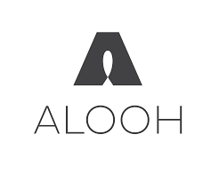
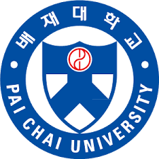
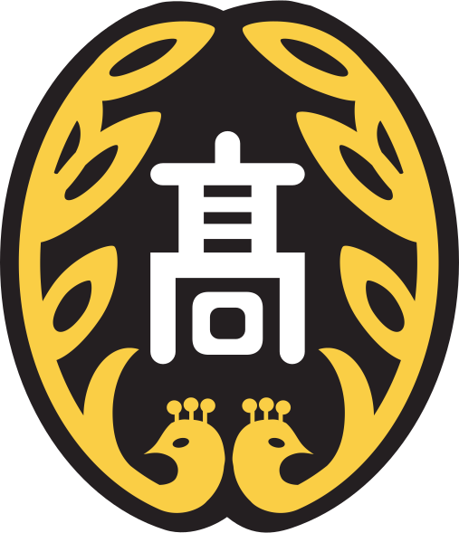
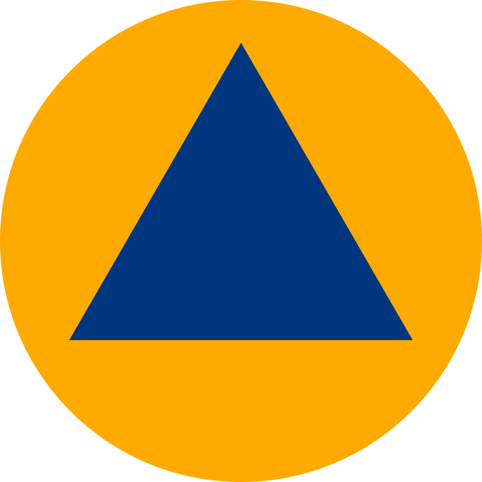

## Experience

<table>
    <thead>
        <tr>
            <th>Company</th>
            <th>Link</th>
            <th>Role</th>
            <th>Dates</th>
            <th>Location</th>
        </tr>
    </thead>
    <tbody>
        <tr>
            <td rowspan=3></td>
            <td rowspan=3><a href="https://hamalab.io/" target="_blank">HamaLab</a></td>
        </tr>
        <tr>
            <td>Junior DevOps Engineer</td>
            <td>2023.01 - Present(2년)</td>
            <td>Seongnam, KR</td>
        </tr>
        <tr>
            <td>Junior AI Researcher</td>
            <td>2022.08 - 2023.01(5개월)</td>
            <td>Seongnam, KR</td>
        </tr>
        <tr>
            <td></td>
            <td><a href="http://cresprit.com" target="_blank">CRESPRIT</a></td>
            <td>Junior AI Researcher</td>
            <td>2020.09 - 2021.11(1년 3개월)</td>
            <td>Bundang, KR</td>
        </tr>
    </tbody>
</table>

---

## Education

<table>
    <thead>
        <tr>
            <th>School</th>
            <th>Link</th>
            <th>Degree</th>
            <th>Date</th>
        </tr>
    </thead>
    <tbody>
        <tr>
            <td rowspan=3></td>
            <td rowspan=3><a href="https://online.hbs.edu/" target="_blank">Paichai University</a></td>
        </tr>
        <tr>
            <td>BSc, Electrical Engineering</td>
            <td>2012.03-2019.02</td>
        </tr>
         <tr>
            <td>Lab Head</td>
            <td>2016-2018</td>
        </tr>
        <tr>
            <td rowspan=3></td>
            <td rowspan=3><a href="http://www.kongjugo.cnehs.kr" target="_blank">Kongju High School</a></td>
        </tr>
        <tr>
            <td>Natural Sciences</td>
            <td>2009.04-2012.02</td>
        </tr>
    </tbody>
</table>

---

## Certificate

<table>
    <thead>
        <tr>
            <th>Company</th>
            <th>Link</th>
            <th>Date</th>
            <th>Issuer</th>
        </tr>
    </thead>
    <tbody>
        <tr>
            <td></td>
            <td><a href="https://www.linkedin.com/learning/certificates/0eaeb2e287e33a5f9234ee480f064ecb31089b4805a9a7a82a4833dee4b9fa56?lipi=urn%3Ali%3Apage%3Ad_flagship3_profile_view_base%3BJca7Gix4TnS89MAhsOMwew%3D%3D" target="_blank">Career Essentials in Generative AI by Microsoft and LinkedIn</a></td>
            <td>2023.12</td>
            <td>Microsoft</td>
        </tr>
        <tr>
            <td></td>
            <td><a href="https://coursera.org/share/d25aa023c92dd7166fb9bc3584b6f567" target="_blank">LME: Assessment and Management</a></td>
            <td>2022.1</td>
            <td>University of Cape Town</td>
        </tr>
        <tr>
            <td></td>
            <td><a href="https://www.eatc.co.kr/" target="_blank">ATC CADMaster Level II</a></td>
            <td>2019.2</td>
            <td>Korea Autodesk Training Center Association</td>
        </tr>
        <tr>
            <td></td>
            <td><a href="https://ybmit.com/mos/mos_faq_view.jsp?board_idx=932" target="_blank">MOS Master 2010</a></td>
            <td>2016.11</td>
            <td>Microsoft</td>
        </tr>
    </tbody>
</table>

---

## Military Service

<table>
    <thead>
        <tr>
            <th>SSI</th>
            <th>Link</th>
            <th>Date</th>
            <th>Location</th>
        </tr>
    </thead>
    <tbody>
        <tr>
            <td></td>
            <td><a href="https://www.cmes.or.kr/" target="_blank">Republic Of Korea Civil Defense Corps</a></td>
            <td>2024-present</td>
            <td>Seongnam, KR</td>
        </tr>
        <tr>
            <td></td>
            <td><a href="https://ko.wikipedia.org/wiki/%EC%A0%9C32%EB%B3%B4%EB%B3%91%EC%82%AC%EB%8B%A8" target="_blank">The 32nd Infantry Division</a></td>
            <td>2013</td>
            <td>Sejong, KR</td>
        </tr>
    </tbody>
</table>