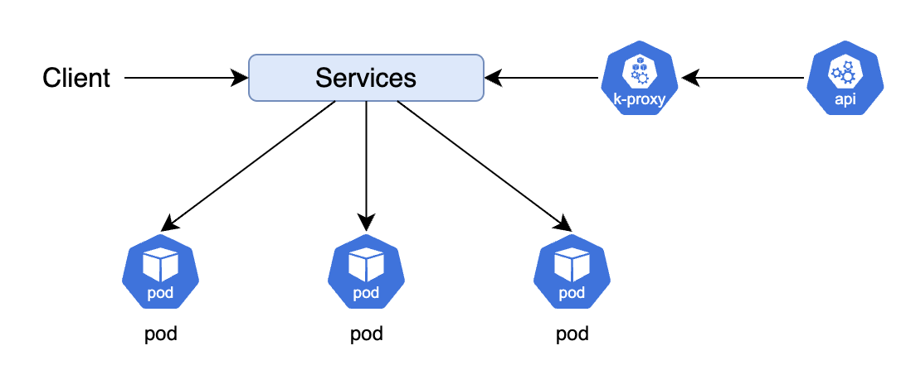

## 1. Cluster Architecture


### 1-1. 마스터 노드(컨트롤 플레인)

마스터 노드는 단일 노드로 구성 될 수도 있고 멀티노드로 구성될수도 있다.  
프로덕션환경에서는 3대정도로 분산 구성한다. (가용성, 안정성을 위해서)  
마스터 노드는 컨트롤 플레인이라고도 부른다.  

### 1-2. 워커 노드(노드)

파드(컨테이너)가 배포되는 서버(인스턴스)를 말한다.  
워커노드의 구성요소는 모두 동일한 인스턴스에서 실행되어야하는데, 마스터 노드는 그렇지 않다.  
컨트롤 플레인(마스터노드) 밑에 etcd(상태 저장소), api 서버, 스케줄러, 컨트롤러매니저가 있고,  
워커노드 밑에 큐브프록시, 큐블릿, 컨트롤러매니저 등이 있다.  

### 1-3. 애드온

부가적으로 애드온 구성요소로 네트워크 인터페이스인 서비스(Services), DNS 서버(coredns), 인그레스(Ingress) 등이 있다. 마스터 노드는 멀티노드로 구성했을때, 내부 구성요소들이 무조건 동일 인스턴스에서 동작하지 않아도 되는데, 이는 가용성 때문이다. 마스터 노드(컨트롤 플레인)에서 `etcd`, `kube-apiserver` 는 여러 인스턴스를 동시 활성화해서 병렬로 실행해 가용성을 높일 수 있다.  

반면에 스케줄러, 컨트롤러 매니저는 리더를 선출하는 방식(`kube-apiserver` 의 **lease api**)을 사용해서 리더 인스턴스만 활성화되고, 나머지 인스턴스는 대기상태로 두는 형식으로 동작한다.  

## 2. 마스터용 컴포넌트
### 2-1. etcd

쿠버네티스에 배포된 모든 오브젝트의 상태 정보는 `etcd` 에 저장된다.  
**etcd** 는 가용성 향상을 위해 여러 노드를 동시 활성화해 병렬 실행이 가능하다. 이 경우는 마스터 노드를 멀티노드로 구성했을때일 것이다. 마스터 노드를 멀티노드로 구성했을때 etcd 또한 각 마스터 노드아래 속하게 되는데, 이때 오브젝트의 일관성, 유효성이 중요할것이다.  

이 문제를 **RAFT 알고리즘**으로 풀었다. RAFT 알고리즘(과반수 알고리즘) 으로 etcd의 리더가 선출된다. 각 etcd 인스턴스에 요청에 대한 처리가 가능한지, 노드가 살아있는지 확인하고, 살아있으면 그중 1개의 노드를 리더로 선출한다. api 서버로 들어온 요청에 대한 모든 상태업데이트는 리더 etcd가 먼저 수행하고 팔로워 etcd 에게 전파(복사)한다.  
이 과정으로 데이터 일관성/유효성을 보장한다.  

이같은 이유 때문에 마스터 노드는 홀수개로 구성되어야한다.  
짝수개로 구성되면 동작이 안되는건 아니지만 그렇다고 이점이 있는것도 아니다. 돈만 더나가는 셈!  


1. 여러개의 마스터 노드에서 병렬로 실행되는 api 서버는 다른 구성요소와 통신하면서 업데이트하고자 하는 상태정보를 얻어온다.  
2. 얻어온 정보를 `etcd` 에 업데이트하려고 할것이다. etcd 에 업데이트하려고하는 값이 etcd 클러스터 내부에서 전체 etcd 갯수 중 과반수 이상이어야 유효하다고 판단하고 업데이트요청을 수락한다.  

### 2-2. kube-apiserver

마스터 노드의 핵심 모듈이다.  
큐브컨트롤(kubectl)의 요청처리, 권한체크, 원하는 상태를 etcd 에 저장하고 저장된 상태를 조회한다.  
파드(Pod)를 노드에 할당하고 상태를 체크하는 작업을 수행한다.  
노드(Node)에서 실행 중인 컨테이너의 로그를 보여주거나 명령을 보내거나 디버거 역할을 하기도한다.  
모든 서비스들은 이곳과 통신한다. 큐브컨트롤, 각종 컨트롤러 등등..  
컴포넌트와 컴포넌트간의 직접 통신은 없다. 무조건 api-server 를 통해서 각 오브젝트들의 상태를 체크한다.  

### 2-3. kube-scheduler

요청받은 **조건**에 부합하는 파드를 각 노드에 할당하는 역할을 한다.  
조건이라하면, 노드의 크기(서버 사양), 동작중인 파드 갯수 등등, 상태를 체크한뒤 어떤 노드에 파드를 쌓을지 선택한다.  
특정 레이블로 조건부로 배포도 가능하다.  

### 2-4. kube-controller-manager

실제 요청에 대한 상태변경, 즉 처리는 얘네들이 도맡아 한다.  
컨트롤러 종류가 매우많아 모두 열거할 수 없다. 그 많은 컨트롤러들을 관리하는 컴포넌트라고 보면된다.  

- 컨트롤러 : 오브젝트의 상태를 관리한다.
    - ex, 디플로이먼트 → 레플리카셋 생성
    - ex, 레플리카셋 → 파드 생성(복제)
    - ex, 파드 → 스케줄러가 관리

## 3. 노드용 컴포넌트

### 3-1. kubelet(큐블릿)

노드에 **할당된** 파드의 생명주기를 관리한다. 각 노드에 다 있다.  
예를들면, 파드에 이상이 있는지 없는지 확인하고 주기적으로 마스터 노드에 상태를 전달하는 고마운 친구이다.  
ex, livenessProbe 에 설정된 값에 의해 상태를 체크하고 체크된 결과를 큐블릿이 마스터에 보고하는 식.  

### 3-2. kube-proxy(큐브 프록시)

파드에 연결된 네트워크를 관리한다.  
초기에는 직접적으로 프록시서버 역할을 했는데 지금은 iptables의 설정들을 관리하는 서비스로 바뀌었다.  
iptables 설정이 쌓이면 느려지는 문제 때문에 최근에는 IPVS 를 지원하기 시작했다.  


#### 3-2-1. userspace 모드

외부에서 서비스의 클러스터 IP 에 요청하고, iptables 를 거쳐서 큐브프록시한테 전달한다.  
이후 각각 적절한 파드에 연결(라운드 로빈 방식)  


#### 3-2-2. iptables 모드(default)

iptables 관리하는 역할만 하는 모드다.  
외부의 트래픽을 직접 받지 않는다.  
외부 요청 트래픽은 iptables 를 거쳐서 직접 파드에 전달. 그래서 userspace 보다 빠르다.  
userspace 모드에서는 파드 연결시 실패하면 다른 파드로 연결 재시도를 하는데, 이 모드에서는 재시도 없다.  



#### 3-2-3. ipvs 모드

= L4 로드밸런서, iptables 보드 빠름, 더 많은 lb 알고리즘


## 4. 오브젝트와 컨트롤러

쿠버네티스는 크게 오브젝트와 오브젝트를 관리하는 컨트롤러로 나뉜다.  
관리자는 템플릿(yaml)으로 쿠버네티스에 원하는 상태를 정의하고 동작 명령을 내린다.  
- 오브젝트 : 파드, 서비스, 볼륨, 네임스페이스 등등..  
- 컨트롤러 : 레플리카셋, 디플로이먼트, 스테이트풀셋, 데몬셋, 잡 등등..  

### 4-1. 네임스페이스

```yaml
kubernetes:
  profiles:                          # 미니쿠베 프로파일
    profile1:
      cluster: minikube-cluster-1    # 해당 프로파일에 대응되는 클러스터
      namespaces:                    # 클러스터를 논리적으로 나눈 단위
        - namespace-a
        - namespace-b
    profile2:
      cluster: minikube-cluster-2
      namespaces:
        - namespace-c
        - namespace-d
    profile3:
      cluster: minikube-cluster-3
      namespaces:
        - namespace-e
        - namespace-f
```

위와 같은 문법은 없다, 다만 yaml 로 관계를 시각화해봤다.  
네임스페이스는 하나의 클러스터 내에서 자원을 논리적으로 분리하는 구분자의 역할을 한다.  
반면 미니쿠베 프로파일은 서로 독립된 클러스터 설정을 나타낸다.  
미니쿠베 프로파일 > 클러스터 > 네임스페이스 순이다.  
쿠버네티스를 처음 설치하면 기본으로 몇개의 네임스페이스가 생성된다.  

- **default** : `kubectl` 로 명령을 내릴때 옵션을 주지않으면 해당 네임스페이스에 명령을 내리게된다.
- **kube-system** : 쿠버네티스 시스템에서 관리하는 네임스페이스.
- **kube-public** : 사용량같이 모두가 확인할 수 있는 정보를 관리하는 네임스페이스
- **kube-node-lease** : `kube-controller-manager`  나 `kube-scheduler` 와 같은 컨트롤 플레인 컴포넌트의 **고가용성** 설정을 보장하기 위해 **리더 선출**이나 **노드의 하트비트**를 관리하는 오브젝트들이 위치하는 네임스페이스
- **docker** : 쿠버네티스 드라이버를 도커로 설정하고 설치했다면 생성되는 네임스페이스

## 5. 템플릿

쿠버네티스 클러스터의 오브젝트나 컨트롤러가 어떤 상태여야하는지 정의하는 파일.  
도커에서는 도커 컴포즈(docker-compose.yml) 파일이 있다.  

### Example
```yaml
apiVersion: v1              # object(여기서는 Pod) 의 api 버전
kind: Pod                   # 유형
metadata:                   # kind의 메타데이터
  name: ubuntu              # = Pod의 이름
  labels:                   # Pod의 레이블
    app: ubuntu
    ver: 20-04-lts
spec:                       # 파드에 배치될 컨테이너의 스펙
  containers:               # 파드에 컨테이너가 여러개 배치될수도 있다.(복수형)
    - name: ubuntu          # 첫번째 컨테이너의 이름
      image: ubuntu:20.04   # 첫번째 컨테이너의 이미지
```