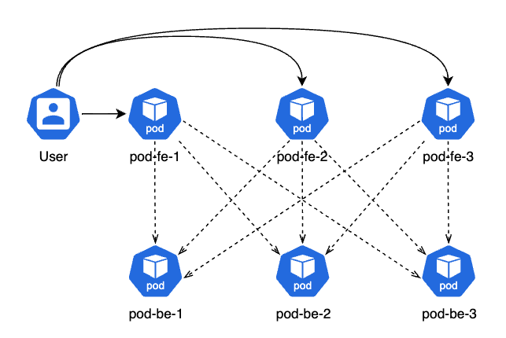
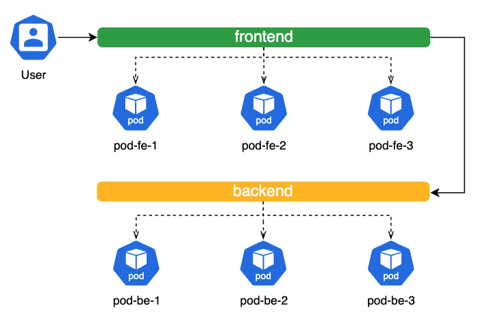
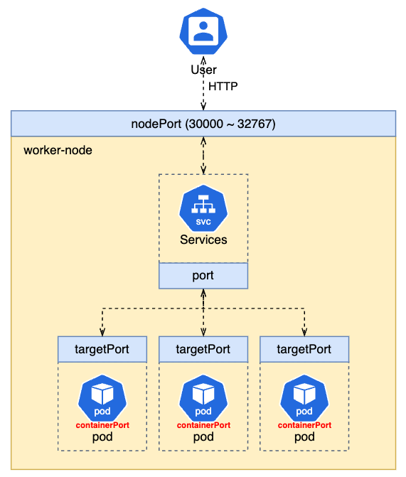

**Service**는 클러스터 내부에 있는 파드가 또 다른 파드에 접속하거나 외부 사용자와 연결하는것을 도와주는 일종의 인터페이스다.  

## 1. ClusterIP (default)

**ClusterIP** 는 클러스터 내부에 있는 파드가 또 다른 파드에 접속하기위해 사용하는 리소스다.  
특이한점은, 공통된 고정 IP만 만드는것이 아니라 도메인도 생성한다는것이다.  
서비스 이름이 만약 `redis` 라면, `redis.default.svc.cluster.local` 으로 생성된다.  

서비스는 외부와의 통신을 위한 **통로** 역할이기도 하다. → **ClusterIP**  
외부와 통신을 위한 **통로** 역할을 하면서 외부에서 들어온 요청을 각각의 파드로 **라우팅**하는 역할을하기도 한다. → **도메인**

```yaml
apiVersion: apps/v1
kind: Deployment
metadata:
	name: redis
spec:
  selector:
    matchLabels:
      app: counter
      tier: db
    template:
      metadata:
        labels:
          app: counter
          tier: db
      spec:
        containers:
          - name: redis
            image: redis
            ports:
              - containerPort: 6379
                protocol: TCP
---
apiVersion: v1
kind: Service
metadata:
  name: redis
spec:
  ports:
    - port: 6379            # 서비스 포트
      protocol: TCP
      # targetPort: 6379    # 접근할 파드 포트(생략가능)
                            # 서비스 포트와 접근할 파드의 포트가 같을시 생략가능
  selector:         # 접근할 파드의 label 조건
    app: counter
    tier: db
```

파드는 각자 부여된 내부IP 가 있다. 파드는 끊임없이 생성/삭제가 반복되는 mutable한 객체다. → 유동IP  

그렇다면, 외부에서 내부로 또는 파드와 파드간의 통신을 하기 위해 매번 파드IP 를 어떻게 체크할까?  

이 문제를 **ClusterIP** 라는 서비스 유형으로 해결할 수 있다.  
예를 들어 아래 그림처럼 백엔드 관련 파드가 3개, 프론트엔드 관련 파드가 3개라고 하면, 6개의 IP를 알아내고 각각을 다 연결짓기엔 너무 손이 많이 간다.  



프론트엔드를 하나의 서비스로, 백엔드를 하나의 서비스로 각각 묶고 각각의 서비스에 IP를 부여할 수 있다. 
그리고 각각의 서비스 IP는 파드의 IP와는 달리 수시로 바뀌지 않는다. 이 IP를 **ClusterIP** 라고 부른다.  



위와같이 통신이 가능하도록 상태를 고정할 수 있다. 

> **ClusterIP = Static IP(Private)**

엔드포인트 컨트롤러가 **서비스 요청**을 체크하고있다가 생성요청이 들어오면 엔드포인트를 만들고 그 엔드포인트를 큐브프록시가 확인해서 iptable을 세팅하고 그래서 외부에서 서비스엔드포인트에 접속하면 큐브 프록시가 연결해놓은 iptable 규칙을 통해 파드에 접속할수 있게 되는식으로 동작한다.  

CoreDNS 라는 리소스가 도메인을 생성하고 그 생성된 도메인을 서비스의 **ClusterIP** 에 연결한다.  

## 2. NodePort

ClusterIP 는 클러스터 내부에서만 접근할 수 있다. 클러스터 외부에서 접근하기 위해 NodePort 를 활용할 수 있다.  



쿠버네티스에는 4종류의 포트가 존재한다.  

1. 컨테이너포트 : 파드에 포함된 컨테이너의 각각의 포트  
2. 타겟포트 : Pod 의 포트  
3. 서비스포트(포트) : 서비스 인터페이스의 포트  
4. 노드포트 : 워커 노드의 포트, 30000 ~ 32767  

배포한 파드, 즉 컨테이너로 배포된 애플리케이션 그룹과 외부의 유저가 서로 통신하기 위해서는 아래 순서로 연결되어 서로 통신한다.  

> 컨테이너의 포트 ↔ 파드의 타겟포트 ↔ 서비스의 포트 ↔ 워커노드의 노드포트 ↔ 유저

주로 외부에서 워커노드에 배포된 애플리케이션을 웹브라우저로 접근해야할때 사용한다.  
노드포트와 연결지을 파드를 선택하는 조건은 `selector` 로 설정한다.  

```yaml
apiVersion: apps/v1
kind: Deployment
metadata:
  name: redis
spec:
  selector:
    matchLabels:
      app: counter
      tier: db
    template:
      metadata:
        labels:
          app: counter
          tier: db
      spec:
        containers:
          - name: redis
            image: redis
            ports:
              - containerPort: 6379
                protocol: TCP
---
apiVersion: v1
kind: Service
metadata:
  name: redis
spec:
  type: NodePort    # type 이 없으면 기본값 ClusterIP로 동작한다.
  ports:
  # - targetPort: 6379
    - port: 6379
      protocol: TCP
      nodePort: 30001
  selector:
    app: counter
    tier: db
```


## 3. LoadBalancer

ReplicaSet 이 단독으로 배포되지않고 Deployment 로 감싸 배포하듯이, 보통 NodePort 타입 단독으로 배포하지 않는다. 보통 LB 가 붙어있는 형태로 배포한다.  
이유는 NodePort 는 살아있을수도 있고 죽어있을 수도 있기때문이다.  

반면에 LB는 그렇지 않다. 항상 NodePort 를 바라보고 있고 죽어있는 상태가 없고 항상 존재한다. 때문에 LB를 붙여서 배포한다.  

하지만 치명적 단점이 있는데, LB는 하나의 서비스에만 연결될 수 있다.  
LB1 - app1 / LB2 - app2 이런식으로 말이다.  

LB1 - app1, app2, app3 이런식의 연결은 불가능하다. 매번 서비스 배포시 LB를 달아줘야하는 번거로움이 존재하는데 이것을 이보다 더 상위개념인 **Ingress** 라는 서비스로 해결 가능하다.  

> Ingress 로 서비스를 라우팅할 수 있다. ⇒ Ingress 하나로 관리가 가능하다.  

## 4. ExternalIP

ClusterIP 는 Pod 간 통신을 위해 필요한 내부 IP 이고,  
**ExternalIP 는 외부와의 통신을 위한 외부 IP 이다.**  

파드 네트워크에 노드 네트워크를 바인딩한다. 여기서 노드 네트워크는 노드의 Internal IP 를 말한다.  
노드의 External IP 의 경우 OS에서 인식할 수 없기 때문에 ExteranlIP로 활용될 수 없다.  

> ClusterIP = Private IP  
> **ExteranlIP = Public IP**

`spec.type` 이 따로 없다. **ExternalIP** 의 type 은 `ClusterIP` 다.  

<div style="background-color:white; padding: 5px;">

flowchart TD
    ExternalIP:port --> ClusterIP:port
    ClusterIP:port --> ContainerIP:targetPort

</div>

```yaml
apiVersion: v1
kind: Service
metadata:
  name: eip
spec:
  type: ClusterIP     # ExternalIP는 ClusterIP 의 일종
  selector:
    app: sample-app
  externalIPs:        # ExternalIP 설정
    - 10.178.0.61     # 노드 IP
    - 10.178.0.62     # 노드 IP
  ports:
    - name: "http-port"
      protocol: "TCP"
      port: 8080      # ExternalIP 수신포트 / ClusterIP 수신포트
      targetPort: 80  # 컨테이너 포트
```

```bash
# 노드 목록, IP 조회 명령어
k get no -o custom-columns="NAME:{metadata.name},IP:{status.addresses[].address}"

# 서비스 조회 명령어
k get svc
```

## 5. Headless
## 6. ExteranlName
## 7. None-Selector