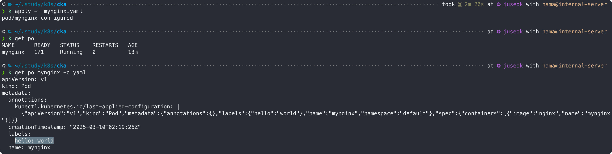

```bash
# ~/.zshrc
alias k='kubectl'
```

편의상 `kubectl` → `k` 로, `pod` → `po` 로 축약하겠다.    
  

아래 명령어를 입력하면, 각 리소스별 약어를 확인할 수 있다.  
```bash
k api-resources
```


## 1. 기본 명령
|      설명                |    docker               |    kubernetes                  |
|-------------------------|-------------------------|--------------------------------|
| 컨테이너 실행              | **docker run**            | `k run <NAME> --image <IMAGE>` |
| 컨테이너 조회              | **docker ps**             | `k get po`                     |
| 컨테이너 상세정보 확인       | **docker inspect**        | `k describe po <NAME>`         |
| 컨테이너 로깅              | **docker logs**           | `k logs <NAME>`                |
| 컨테이너 명령 전달          | **docker exec**           | `k exec <NAME> -- <CMD>`       |
| 컨테이너 <-> 호스트 파일복사  | **docker cp**             | `k cp <TARGET> <SOURCE>`       |
| 컨테이너 정보 수정          | **docker update**         | `k edit po <NAME>`             |
| 컨테이너 삭제              | **docker rm**             | `k delete po <NAME>`           |
| 선언형 파일 기반 컨테이너 생성      | **docker compose -f <FILE\> up** | `k apply -f <FILE>` |

### 1-1. 컨테이너 실행
```bash
# k run <NAME> --image <IMAGE>
k run mynginx --image nginx
```


### 1-2. 컨테이너 조회
```bash
k get po
```


```bash
# k get po <NAME> -o yaml
k get po mynginx -o yaml
```


```bash
k get po -o wide
```


### 1-3. 컨테이너 상세정보 확인
```bash
# k describe po <NAME>
k describe po mynginx
```


### 1-4. 컨테이너 로깅
```bash
# k logs -f <NAME>
k logs -f mynginx
# -f 옵션은 --follow, 계속 조회하겠다는 뜻
```


### 1-5. 컨테이너 명령 전달
```bash
# k exec <NAME> -- <CMD>
k exec mynginx -- apt-get update
```


### 1-6. 컨테이너/호스트간 파일 복사
```bash
# k cp <TARGET> <SOURCE>
k cp test.txt mynginx:/tmp/test.txt
```


### 1-7. 컨테이너 정보 수정
```bash
# k edit pod <NAME>
k edit po mynginx
```


### 1-8. 컨테이너 삭제
```bash
# k delete po <NAME>
k delete po mynginx
```


### 1-9. 선언형 명령 정의서(YAML) 기반의 컨테이너 생성
```bash
# k apply -f <FILE_NAME>
k apply -f mynginx.yaml
```


```bash
# k apply -f <URL>
k apply -f https://raw.githubusercontent.com/kubernetes/website/master/content/en/examples/pods/simple-pod.yaml
```


기존 파일 수정 시(`metadata:labels:hello` 추가)


변경된 파일이 반영되어 configured 라고 출력되는것을 확인할 수 있다.  

변경없이 기존 파일을 다시 `apply` 할 시

`unchanged` 로 출력되는것을 확인할 수 있다.  
`apply` 명령은 멱등성을 보장해 여러번 실행되더라도 최종결과가 달라지지 않는다.  

## 2. 고급 명령
### 2-1. Service(svc)

```bash
# 서비스 확인  
k get svc

# 서비스 상세정보 확인
k describe svc kubernetes
```


```bash
# 노드 확인
k get node

# 노드 상세정보 확인
k describe no juseok
```


### 2-2. Namespace(ns)
```bash
# 네임스페이스 확인
k get ns

# 네임스페이스 상세정보 확인
k describe ns kube-system
```


네임스페이스 지정해서 컨테이너 생성하기
```bash
# kube-system 네임스페이스에 컨테이너 생성
k run mynginx-ns --image nginx -n kube-system

# kube-system 네임스페이스에 있는 pod 확인
k get po mynginx-ns -n kube-system

# kube-system 네임스페이스에 있는 pod 삭제
k delete po mynginx-ns -n kube-system
```


네임스페이스를 생략하면 기본 네임스페이스인 default 로 설정된다.  
위 아래 결과가 같은것을 확인 할 수 있다.  


### 2-3. 자동완성 설정하기
```bash
echo 'source <(kubectl completion zsh)' >> ~/.zshrc
source ~/.zshrc
```


### 2-4. 즉석 리소스 생성
```bash
cat << EOF | k apply -f -
apiVersion: v1
kind: Pod
metadata:
  name: cat-nginx
spec:
  containers:
  - image: nginx
    name: cat-nginx
EOF
```


### 2-5. 리소스 특정 정보 추출
`jsonpath` 로 데이터를 추출할 수 있다.  

```bash
# 추출할 데이터 확인
k get no juseok -o json

# 특정 데이터 추출
k get no juseok -o jsonpath="{.status.addresses[0].address}"
```


### 2-6. 모든 리소스 조회
```bash
k api-resources
```


쿠버네티스의 리소스는 크게 네임스페이스 레벨의 리소스와 클러스터 레벨의 리소스로 구분된다.  
- 네임스페이스 레벨 리소스 : 해당 리소스가 반드시 특정 네임스페이스에 속해야하는 리소스  
  ex) Pod
- 클러스터 레벨 리소스 : 네임스페이스와 무관  
  ex) Node

아래는 네임스페이스 레벨의 리소스를 확인하는 명령어이다.  
```bash
k api-resources --namespaced=true
```


### 2-7. 리소스 정의 설명
```bash
k explain po
```


### 2-8. 클러스터 상태 확인
```bash
# kube-apiserver 작동 여부 확인
k cluster-info

# 전체 노드 상태 확인
k get no

# 쿠버네티스 핵심 컴포넌트의 Pod 상태 확인
k get po -n kube-system
```


### 2-9. 클라이언트 설정 파일
`kubectl` 툴은 내부적으로 `~/.kube/config` 에 위치한 **KUBECONFIG** 파일을 참조해 마스터 주소, 인증 정보등을 관리한다.  
직접 해당 파일을 수정할수도 있고, `k config` 명령으로 수정할수도 있다.  
```bash
# k config <SUBCOMMAND>
k config view
```

**KUBECONFIG** 파일은 크게 아래 3가지 영역으로 나뉜다.  
- clusters : kubectl 이 바라보는 클러스터 정보
- users : 클러스터에 접속하는 사용자 정보
- contexts : cluster와 user를 연결해주는 인터페이스

#### * 모든 파드 제거
```bash
k delete po --all
```