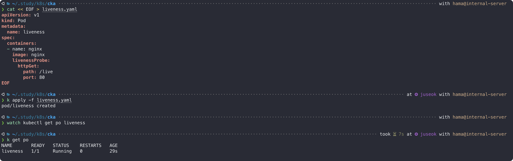
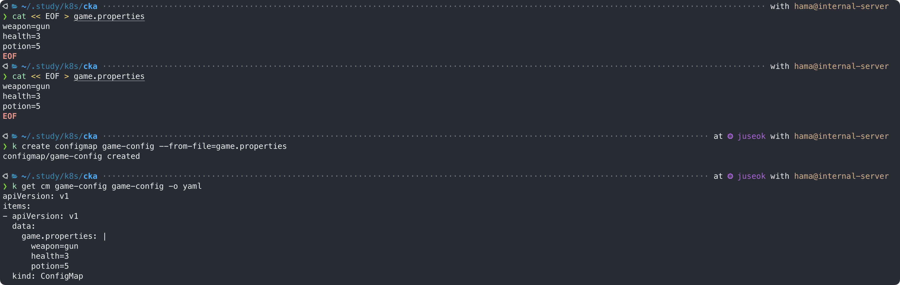

## 1. Pod 소개
플랫폼별 실행 최소 단위
- VM : Instance
- Docker : Container
- **Kubernetes** : **Pod**

Pod는 일반적으로 1개의 컨테이너, 많게는 3개, 그 이상의 컨테이너를 가질 수 있는데 실질적으로 3개 이상 넘어가는 경우는 거의 없다.  
Pod 내에 실행되는 컨테이너들은 반드시 동일 노드에 할당되고 동일한 생명주기를 갖는다.  
Pod 삭제 시, Pod 내의 모든 컨테이너가 함께 삭제된다.  
Pod 내의 컨테이너들은 같은 IP를 공유하고 포트로 구분된다. 때문에 한 Pod내의 컨테이너끼리 `localhost`로 통신이 가능하다.  
또한 볼륨도 공유가능해서 컨테이너간 서로 파일을 주고 받을 수 있다.  

쿠버네티스의 모든 리소스는 YAML 포맷의 매니페스트(템플릿 파일)를 사용하는데, `--dry-run`과 `-o yaml`을 조합하면 Pod를 실제로 생성하지 않고 템플릿파일(매니페스트)를 생성할 수 있다.  
```bash
k run mynginx --image nginx --dry-run=client -o yaml > mynginx.yaml
```

파일을 확인해보면 몇가지 property 가 있는데,
- `apiVersion`: 리소스마다 각기 다른 버전이 정의되어있다. 전 단원에서 학습했던 아래 명령어로 확인 가능하다.  
  ```bash
  k api-resources
  ```
- `kind`: 리소스의 타입이다. 이번엔 Pod라는 리소스에 대해 살펴볼 예정이다.  
- `metadata`: 위에서 정의했던 리소스의 메타데이터이다.  
  추후, 복제 및 배포 시 선택하는 구분자의 역할을 한다.  
- `spec`: 리소스의 상세 스펙이다.  
  - `containers`: 1개 이상의 컨테이너를 정의한다.
    - `name`: 컨테이너 이름
    - `image`: 이미지 이름

Pod를 생성하면 아래 순서로 실행된다.  
<div style="background-color:white; padding: 5px">

flowchart LR
  u["User"]
  k["Kubectl"]
  a["API Server"]
  kl["Kubelet"]
  p["Pod"]
  c["Containers"]
  
  subgraph Client
  u-->k
  end
  
  subgraph Master
  k-->a
  end

  subgraph Node
    kl
    subgraph Pod
    p-->c
    end
    kl-->Pod
  end
  Master-->Node

</div>

## 2. 레이블링 시스템
```bash
# 레이블 부여 : k label po <NAME> <KEY>=<VALUE>
k label po mynginx iwanna=gohome
```


```bash
# 기본 레이블 : k run <NAME> ... 할때 NAME 이 run=<NAME> 으로 기본 설정된다.
k get po mynginx -L run
```


```bash
# 레이블을 이용한 조건 필터링
# key가 run인 Pod 출력
k get po -L run

# key가 run이고 value가 mynginx인 Pod 출력
k get po -L run=mynginx
```


```bash
# 레이블 조회 : k get no --show-labels
k get no --show-labels
```


### nodeSelector를 이용한 노드 선택
레이블링 시스템을 이용해 특정 노드에 파드를 할당되도록 스케줄링 할 수 있다.  
레이블을 추가하는건 위에서 해봤다. 편의상 `hostname=juseok` 인 노드에 할당해보겠다.  
```bash
# 노드 선택(nodeSelector)
cat << EOF > node-selector.yaml
apiVersion: v1
kind: Pod
metadata:
  name: node-selector
spec:
  containers:
  - name: nginx
    image: nginx
  nodeSelector:
    kubernetes.io/hostname: juseok
EOF

k apply -f node-selector.yaml
```


레이블 수정은 템플릿 파일을 직접 수정하는 방법과 아래 명령어로 하는 방법이 있다.  
```bash
# 레이블 수정 : k label po <NAME> <KEY>=<NEW_VALUE> --overwrite
```
여기서는 파일을 직접 수정하겠다.  


에러가 발생했다. `jihoon` 이라는 레이블을 갖고있는 노드가 없기 때문이다.  
이 처럼 nodeSelector 로 파드가 실행될 노드를 직접 선택할 수 있다는 것을 알 수 있다.  


```bash
# 레이블 삭제 : k label po <NAME> <KEY>-
```


## 3. 실행 명령 및 파라미터 지정
Pod 생성 시, 커맨드와 파라미터를 전달할 수 있다.
|      설명                |    docker               |    kubernetes     |
|-------------------------|-------------------------|-------------------|
| 실행 명령                 | **ENTRYPOINT**          | `command`         |
| 실행 명령의 입력 파라미터     | **CMD**                 | `args`            |
| 재시작 정책                | **restart**             | `restartPolicy`<br>`['Always', 'Never', 'OnFailure']` |
- **Always** : Pod 정상 종료(exit 0)시 항상 재시작
- **Never** : 절대 재시작 X
- **OnFailure** : Pod 비정상 종료(exit != 0)시 재시작

```yaml
apiVersion: v1
kind: Pod
metadata:
  name: cmd
spec:
  restartPolicy: OnFailure
  containers:
  - name: nginx
    image: nginx
    command: ["/bin/echo"]
    args: ["hello"]
```


cmd 파드 로그가 restart 되지 않고 한번만 찍히는 이유는, echo는 원래 한번 실행되고 종료되는 명령어이기 때문에 실패가 아닌 정상종료로 간주되기 때문이다.  
  

## 4. 환경변수 설정
```bash
cat << EOF > env.yaml
apiVersion: v1
kind: Pod
metadata:
  name: env
spec:
  containers:
  - name: nginx
    image: nginx
    env:
    - name: hello
      value: "world!"
EOF
```
- `env:name` : 환경 변수의 key
- `env:value` : 환경 변수의 value


## 5. 볼륨 연결
Pod 내부 스토리지는 휘발성이다. Pod가 사라지면 함께 사라진다.  
Pod 생명주기와 상관없이 지속되게 하려면 볼륨을 따로 연결해야한다.  
쿠버네티스에는 여러가지 볼륨타입이 존재한다.  
|    볼륨 타입                  |    설명                                               |
|-----------------------------|------------------------------------------------------|
| **emptyDir**                | 주로 캐시나 임시 파일 저장용                                |
| **hostPath**                | 파드가 실행 중인 노드의 파일 시스템                          |
| configMap                   | 애플리케이션 설정과 같은 텍스트 데이터를 저장용                  |
| secret                      | 비밀번호, API 키 등 민감한 데이터를 암호화된 상태로 저장용        |
| persistentVolumeClaim (PVC) | 영속성 데이터 저장소, 외부 스토리지 연결용                     |
| nfs (Network File System)   | 네트워크로 접근가능한 외부 저장소, 여러 파드가 동일한 NFS 공유 가능 |

### 5-1. hostPath
hostPath는 docker의 `-v` 옵션과 유사하게 호스트 파일시스템에 Pod가 데이터를 저장할 수 있게 해준다.  
```bash
cat << EOF > volume.yaml
apiVersion: v1
kind: Pod
metadata:
  name: volume
spec:
  containers:
  - name: nginx
    image: nginx
    volumeMounts:
    - mountPath: /container-volume
      name: my-volume
  volumes:
  - name: my-volume
    hostPath:
      path: /home
EOF
```
- volumeMounts: 컨테이너 내부 볼륨
  - mountPath: 컨테이너 내부 path
  - name: volumeMounts와 volumes를 연결하는 식별자
- volumes: Pod에서 사용할 volume
  - hostPath: 호스트 서버의 path
  - name: volumeMounts와 volumes를 연결하는 식별자


### 5-2. emptyDir
emptyDir은 보통 컨테이너끼리 파일 데이터를 주고받을 때 사용한다.  
Pod와 운명공동체이다. Pod와 함께 제거된다.  
```bash
cat << EOF > volume-empty.yaml
apiVersion: v1
kind: Pod
metadata:
  name: volume-empty
spec:
  containers:
  - name: nginx
    image: nginx
    volumeMounts:
    - mountPath: /container-volume
      name: my-volume
  volumes:
  - name: my-volume
    emptyDir: {}
EOF
```

## 6. 리소스 관리
쿠버네티스는 컨테이너 실행에 필요한 리소스를 제약할 수 있는 메커니즘을 제공한다.

### 6-1. requests
Pod가 보장받을 수 있는 최소 리소스 사용량이다.  
```bash
cat << EOF > requests.yaml
apiVersion: v1
kind: Pod
metadata:
  name: requests
spec:
  containers:
  - name: nginx
    image: nginx
    resources:
      requests:
        cpu: "250m"
        memory: "500Mi"
EOF
```



cpu 에서 1000m 은 1core 를 뜻한다. 250m 은 0.25core 를 뜻한다.  
250m 대신 0.25 로 선언해도 똑같이 동작한다. 하지만, 0.001 처럼 값이 작아질수록 m 으로 나타내는것이 더 직관적일 수 있다.  
  

### 6-2. limits
Pod가 최대로 사용할 수 있는 최대 리소스 사용량이다.  
```bash
cat << EOF > limits.yaml
apiVersion: v1
kind: Pod
metadata:
  name: limits
spec:
  restartPolicy: Never
  containers:
  - name: mynginx
    image: python:3.7
    command: [ "python" ]
    args: [ "-c", "arr = []\nwhile True: arr.append(range(1000))" ]
    resources:
      limits:
        cpu: "500m"
        memory: "1Gi"
EOF
```


## 7. 상태 확인
Pod가 정상동작중인지 확인하는 Health check 기능이 있다.  

### 7-1. livenessProbe
Pod가 정상 동작하는지 확인할때 사용한다.  
```bash
cat << EOF > liveness.yaml
apiVersion: v1
kind: Pod
metadata:
  name: liveness
spec:
  containers:
  - name: nginx
    image: nginx
    livenessProbe:
      httpGet:
        path: /live
        port: 80
EOF
```
- httpGet : 선언한 path에 내부적으로 **HTTP(GET)** 요청을 보내 2xx ~ 3xx 응답이 있는지 확인하고 범주 안의 응답코드라면 정상으로 간주, 그외 코드라면 비정상으로 간주해 컨테이너를 재시작시킨다.  

위 파일을 실행하면 404 에러가 발생해 컨테이너가 끊임없이 재시작 되는것을 확인할 수 있는데, live path 가 없어서 그렇다.  


live 파일을 생성해 200 응답을 반환하도록 하면 재시작 수가 증가하지 않는것을 확인할 수 있다.  


### 7-2. readinessProbe
readinessProbe 는 정상적인 Pod 에만 트래픽을 보내고 싶을때 사용한다.  
예를들어 Pod 10개를 생성했다고 가정하자. 준비상태 Pod 5개, 생성상태 Pod 5개라면, 준비상태 Pod 5개에만 트래픽을 라우팅하게 된다.  
```bash
cat << EOF > readiness.yaml
apiVersion: v1
kind: Pod
metadata:
  name: readiness
spec:
  containers:
  - name: nginx
    image: nginx
    readinessProbe:
      httpGet:
        path: /ready
        port: 80
EOF
```


http 통신뿐만 아니라 커맨드 실패 여부를 통해서도 정상 여부를 확인할 수 있다.  
```bash
cat << EOF > readiness-cmd.yaml
apiVersion: v1
kind: Pod
metadata:
  name: readiness-cmd
spec:
  containers:
  - name: nginx
    image: nginx
    readinessProbe:
      exec:
        command:
        - cat
        - /tmp/ready
EOF
```


## 8. 다중 컨테이너 실행
```bash
cat << EOF > multi-container.yaml
apiVersion: v1
kind: Pod
metadata:
  name: multi-container
spec:
  containers:
  - name: nginx
    image: nginx
  - name: curl
    image: curlimages/curl
    command: ["/bin/sh"]
    args: ["-c", "while true; do sleep 5; curl localhost; done"]
EOF
```

curl 컨테이너에서 5초를 지연시킨 이유가 뭘까?  
쿠버네티스는 Pod 내부 컨테이너끼리 실행 순서를 보장하지 않기 때문에 5초 지연시킨것이다.  
  


`-c` 옵션은 `--container=''` 의 축약, 로그를 확인할 컨테이너를 지정한다.  

## 9. 초기화 컨테이너
앞에서 Pod 내부의 컨테이너끼리 실행 순서가 보장되지 않는다고 했다.  
그렇다면 메인 컨테이너가 실행되기 전에 미리 초기화 작업이 필요할때는 어떻게 할까?  
이럴 때 `initContainers`를 사용해 초기화 작업을 수행할 수 있다.  

```bash
cat << EOF > init-container.yaml
apiVersion: v1
kind: Pod
metadata:
  name: init-container
spec:
  restartPolicy: OnFailure
  containers:
  - name: busybox
    image: busybox
    command: [ "ls" ]
    args: [ "/tmp/moby" ]
    volumeMounts:
    - name: workdir
      mountPath: /tmp
  initContainers:
  - name: git
    image: alpine/git
    command: ["sh"]
    args:
    - "-c"
    - "git clone https://github.com/moby/moby.git /tmp/moby"
    volumeMounts:
    - name: workdir
      mountPath: "/tmp"
  volumes:
  - name: workdir
    emptyDir: {}
EOF
```


## 10. Config 설정
ConfigMap은 메타데이터(각종 설정값)를 저장하는 리소스이다.  
Pod에 직접 설정값을 입력하면 Pod가 늘어날수록 관리하기 힘들어지고 추적이 어렵다.  
ConfigMap에 저장해놓고 Pod에서 불러다 사용할 수 있다.  

### 10-1. ConfigMap 생성
#### 1. 파일로 불러와서 생성
```bash
cat << EOF > game.properties
weapon=gun
health=3
potion=5
EOF

# k create configmap <key> <data-source>
k create configmap game-config --from-file=game.properties

# configmap 의 축약형 cm
k get cm game-config game-config -o yaml
```


#### 2. 선언형 커맨드로 직접 지정
```bash
k create cm special-config \
  --from-literal=special.power=10 \
  --from-literal=special.strength=20
```


#### 3. 매니페스트(YAML)로 생성
```bash
cat << EOF > monster-config.yaml
apiVersion: v1
kind: ConfigMap
metadata:
  name: monster-config
  namespace: default
data:
  monsterType: fire
  monsterNum: "5"
  monserLife: "3"
EOF
```


### 10-2. ConfigMap 활용
#### 1. 볼륨 연결
ConfigMap을 직접 볼륨으로써 Pod에 직접 마운트하여 활용하는 방법이 있다.  
```bash
cat << EOF > game-volume.yaml
apiVersion: v1
kind: ConfigMap
metadata:
  name: game-volume
spec:
  restartPolicy: OnFailure
  containers:
  - name: game-volume
    image: busybox
    command: [ "/bin/sh", "-c", "cat /etc/config/game.properties" ]
    volumeMounts:
    - name: game-volume
      mountPath: /etc/config
  volumes:
  - name: game-volume
    configMap:
      name: game-config
EOF
```


#### 2. 환경변수 - valueFrom(env)
ConfigMap을 Pod의 환경변수로 직접 지정하는 방법이다.  
```bash
cat << EOF > special-env.yaml
apiVersion: v1
kind: Pod
metadata:
  name: special-env
spec:
  restartPolicy: OnFailure
  containers:
  - name: special-env
    image: busybox
    command: [ "printenv" ]
    args: [ "special_env" ]
    env:
    - name: special_env
      valueFrom:
        configMapKeyRef:
          name: special-config
          key: special.power
EOF
```


#### 3. 환경변수 - envFrom
valueFrom에서 env는 해당 ConfigMap에서 특정 키를 선택해 적용했다면,  
envFrom은 파일 내용전체를 환경변수로 등록한다.  
```bash
cat << EOF > monster-env.yaml
apiVersion: v1
kind: Pod
metadata:
  name: monster-env
spec:
  restartPolicy: OnFailure
  containers:
  - name: monster-env
    image: busybox
    command: [ "printenv" ]
    envFrom:
    - configMapRef:
        name: monster-config
EOF
```


## 11. Secret 관리
### 11-1. Secret 생성
API Key 라던지, 각종 액세스키, 자격증명, 배포키, 계정정보 등등 민감한 데이터를 저장하고 불러다 사용할 수 있는 저장소 역할을 하는 리소스다.  
각 노드의 디스크에 저장되지 않고 tmpfs 라는 메모리기반 파일시스템을 사용해 보안에 강하다.  
또한 평문으로 조회되지않고 base64로 인코딩된 문자열로 출력된다.  
인코딩되어 출력될뿐 암호화는 아니어서 누구나 디코딩이 가능하다고 한다.. 그래서 실제 보안을 위해서는 etcd 암호화나 외부 시크릿 관련 도구(Vault)를 연동해 사용하는 편이다.  
```bash
echo -ne admin | base64         # YWRtaW4=
echo -ne password123 | base64   # cGFzc3dvcmQxMjM=

cat << EOF > user-info.yaml
apiVersion: v1
kind: Secret
metadata:
  name: user-info
type: Opaque
data:
  username: YWRtaW4=
  password: cGFzc3dvcmQxMjM입
EOF
```
- `type:Opaque` : 사용자 정의 임의 데이터 ([시크릿 타입](https://kubernetes.io/ko/docs/concepts/configuration/secret/#secret-types))
- `data` : 저장할 시크릿 데이터


위 방법은 사용자가 직접 문자열을 인코딩하여 집어넣어야하므로 귀찮다.  
쿠버네티스가 base64로 인코딩 처리해주길 원한다면 아래 방법을 사용하자.
```bash
cat << EOF > user-info-stringdata.yaml
apiVersion: v1
kind: Secret
metadata:
  name: user-info-stringdata
type: Opaque
stringData:
  username: admin
  password: password123
EOF
```


매니페스트 형식뿐만아니라 cli 커맨드로 생성할수도 있다.  
```bash
cat << EOF > user-info.properties
username=admin
password=password123
EOF

k create secret generic user-info-from-file \
  --from-env-file=user-info.properties
```


### 11-2. Secret 활용
#### 1. 볼륨 연결
ConfigMap과 동일하게 볼륨으로써 Pod에 직접 마운트해서 활용이 가능하다.  
```bash
cat << EOF > secret-volume.yaml
apiVersion: v1
kind: Secret
metadata:
  name: secret-volume
spec:
  restartPolicy: OnFailure
  containers:
  - name: secret-volume
    image: busybox
    command: [ "sh" ]
    args: ["-c", "ls /secret; cat /secret/username"]
    volumeMounts:
    - name: secret
      mountPath: "/secret"
  volumes:
  - name: secret
    secret:
      secretName: user-info
EOF
```


#### 2. 환경변수 - valueFrom(env)
```bash
cat << EOF > secret-env.yaml
apiVersion: v1
kind: Pod
metadata:
  name: secret-env
spec:
  restartPolicy: OnFailure
  containers:
  - name: secret-env
    image: busybox
    command: [ "printenv" ]
    env:
    - name: USERNAME
      valueFrom:
        secretKeyRef:
          name: user-info
          key: username
    - name: PASSWORD
      valueFrom:
        secretKeyRef:
          name: user-info
          key: password
EOF
```


#### 3. 환경변수 - envFrom
```bash
cat << EOF > secret-envfrom.yaml
apiVersion: v1
kind: Pod
metadata:
  name: secret-envfrom
spec:
  restartPolicy: OnFailure
  containers:
  - name: secret-envfrom
    image: busybox
    command: [ "printenv" ]
    envFrom:
    - secretRef:
        name: user-info
EOF
```


## 12. 메타데이터 전달
Pod의 메타데이터를 내부의 컨테이너에 전달할 수 있는 메커니즘이 있다.  
이것을 Downward API 라 부르고 실행되는 Pod의 정보를 컨테이너에 노출하고 싶을때 사용한다.  

### 12-1. 볼륨 연결
```bash
cat << EOF > downward-volume.yaml
apiVersion: v1
kind: Pod
metadata:
  name: downward-volume
  labels:
    zone: ap-north-east
    cluster: cluster1
spec:
  restartPolicy: OnFailure
  containers:
  - name: downward
    image: busybox
    command: ["sh", "-c"]
    args: ["cat /etc/podinfo/labels"]
    volumeMounts:
    - name: podinfo
      mountPath: /etc/podinfo
  volumes:
  - name: podinfo
    downwardAPI:
      items:
      - path: "labels"
        fieldRef:
          fieldPath: metadata.labels
EOF
```


### 12-2. 환경변수 - valueFrom(env)
```bash
cat << EOF > downward-env.yaml
apiVersion: v1
kind: Pod
metadata:
  name: downard-env
spec:
  restartPolicy: OnFailure
  containers:
  - name: downward
    image: busybox
    command: ["printenv"]
    env:
    - name: NODE_NAME
      valueFrom:
        fieldRef:
          fieldPath: spec.nodeName
    - name: POD_NAME
      valueFrom:
        fieldRef:
          fieldPath: metadata.name
    - name: POD_NAMESPACE
      valueFrom:
        fieldRef:
          fieldPath: metadata.namespace
    - name: POD_IP
      valueFrom:
        fieldRef:
          fieldPath: status.podIP
EOF
```
