## 1. 소개
### 1-1. Pod vs Service
파드는 배포사이클 중 가장 빈번히 변하고 언제든지 종료될 수 있는 불안정한 리소스이다.  
파드에는 고유한 IP가 부여된다. 언제든지 종료될 수 있다는것은 언제든지 변경될 수 있다는 뜻이고 이 고유한 IP는 언제든지 바뀔수 있다는 뜻이된다.  
수시로 바뀌기 때문에 해당 IP로 애플리케이션을 운영할 수 없다. 이러한 문제를 해결하고자 **Service**라는 리소스가 등장하게 되었다.  

실제 애플리케이션은 파드에 배포된다. 애플리케이션을 배포하는 행위는 파드(컨테이너)에 애플리케이션을 탑재하는 행위, 그리고 애플리케이션이 안정적으로 지속되도록 구성하는 일을 말한다.  
"**Service**는 애플리케이션이 탑재된 파드에 어떻게 안정적으로 접근할것인가"에 대한 고민의 결과물인것이다.  

**Service**는 Pod의 앞단에 위치하며 Service로 들어오는 트래픽을 Pod로 전달하는 **리버스 프록시**와 같은 역할을 수행한다.  
덕분에 하나의 Pod의 IP가 변경되더라도 사용자입장에서는 동일한 IP로 서비스에 안정적으로 접근할 수 있고 1개의 Pod가 죽어도 다른 Pod로 트래픽을 전달하기 때문에 안정적으로 애플리케이션을 운영할 수 있다.  


하나의 Service에 여러개의 Pod가 있을 수 있다.  
Service에도 고유한 IP가 부여된다.
 

### 1-2. Service 생성
```yaml
apiVersion: v1
kind: Service
metadata:
  labels:
    hello: world
  name: myservice
spec:
  ports:
  - port: 8080
    protocol: TCP
    targetPort: 80
  selector:
    run: mynginx
```
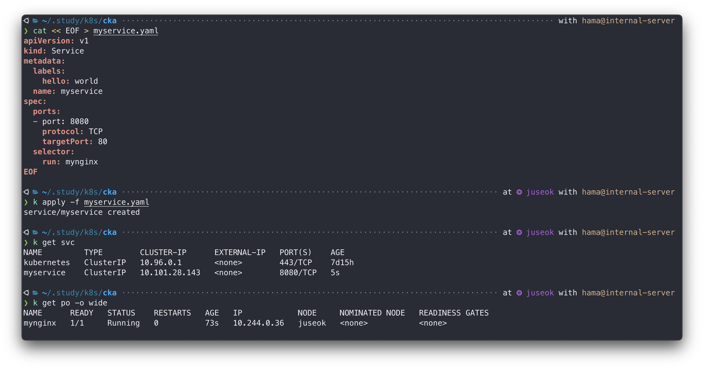
> 조회된 Service 중 `kubernetes`는 쿠버네티스 최초 설치 시 **기본 생성되는 Service 이다.**  

#### LabelSelector로 Pod를 선택하는 이유
Service의 트래픽을 전달할 Pod를 선택하기 위해 레이블셀렉터를 사용한다.  
k8s의 Label은 AWS의 Tag와 유사한 개념인데, 오브젝트의 특성을 식별하는데 사용한다.  
Label로 Pod를 선택하는 간접 참조 방식을 채택하지 않고 직접 선택하는 직접 참조 방식을 채택한다면, 어떤 문제가 생길까?  
Pod는 전에 가장 불안한 리소스라고 말했다. 끊임없이 삭제되고 생성되는 리소스이므로 직접 선택해 배포한다면 매번 파일 내용이 변경되어야 할 것이다.  
반면, Label로 Pod를 선택하는 간접 참조 방식을 채택한다면 매번 파일을 수정하지 않고 Service에서 바라보는 특정 Label을 가지고 있는 어떠한 Pod에도 트래픽을 전달할 수 있다.  

### 1-3. Service 접근
```bah
k run client --image nginx

k exec client -- curl <Pod-IP>

k exec client -- curl <Service-IP>
```


```bash
k exec client -- curl <Service-Domain-Name(label):Service-Port>
```
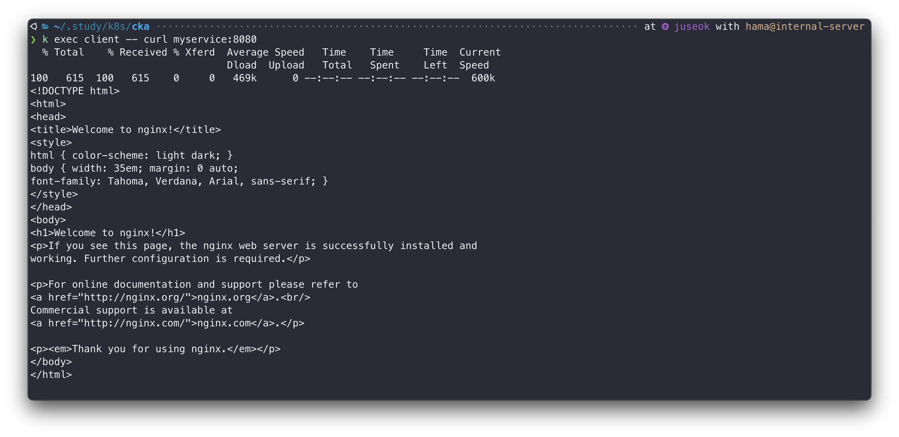

### 1-4. Service 도메인 주소 법칙
> <서비스 이름>.<네임스페이스>.svc.cluster.local
```bash
# nslookup 설치
k exec client -- sh -c "apt update && apt install -y dnsutils"

k exec client -- nslookup myservice
```
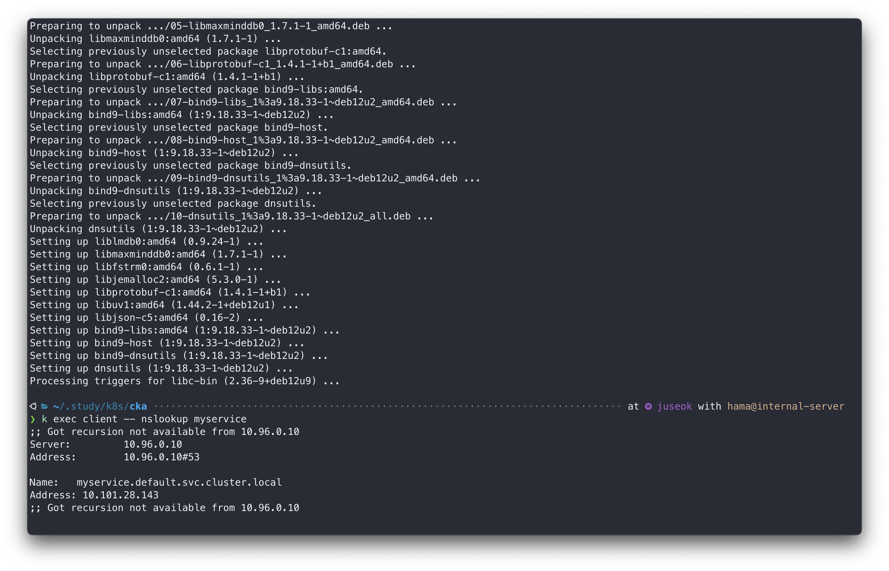

```bash
# 전체 도메인 주소로 접근
k exec client -- nslookup myservice.default.svc.cluster.local

# 일부 도메인 주소로 접근
k exec client -- nslookup myservice.default

# 서비스 이름으로 접근
k exec client -- nslookup myservice
```
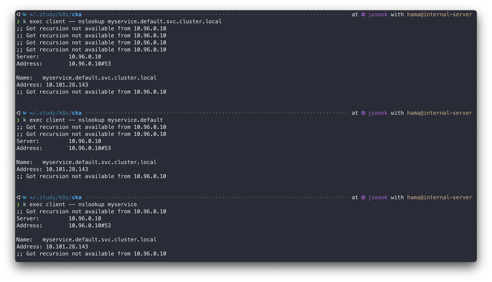

### 1-5. 클러스터 DNS 서버
Service 이름을 도메인 주소로 사용이 가능한 이유는 쿠버네티스에서 제공하는 DNS 서버가 있기 때문이다.  
```bash
# Pod의 DNS 설정 확인
k exec client -- cat /etc/resolv.conf
```
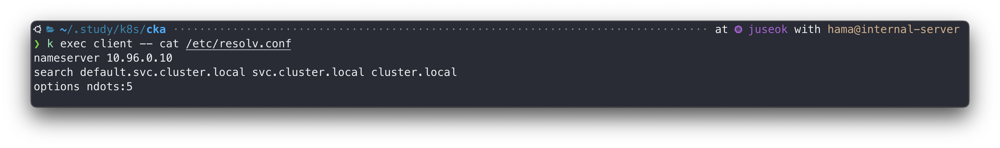
`nameserver`에 부여되어있는 IP `10.96.0.10`를 확인할 수 있다. 쿠버네티스의 모든 Pod들은 이 IP로 DNS를 조회한다.  
이 IP는 어디서 왔을까? 쿠버네티스 핵심 컴포넌트가 존재하는 `kube-system` 네임스페이스의 Service 중 `kube-dns` 의 IP 이다.  
```bash
# kube-dns ip 조회
k get svc kube-dns -n kube-system --show-labels

# 매핑되는 파드 확인 -> coredns
k get po -n kube-system -l k8s-app=kube-dns
```
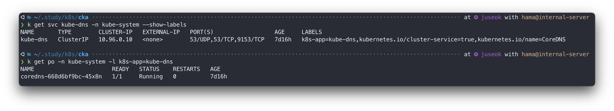
`coredns-xxx` 라는 Pod가 조회된다. **coredns**는 쿠버네티스에서 제공하는 DNS 서버다.  
모든 Pod들은 클러스터 내/외부 DNS 요청을 coredns를 통해 수행한다.  
그러므로 쿠버네티스 클러스터 안에서 자체적인 DNS를 가질 수 있게 된것이다.  

<div style="background-color:white; padding: 5px;">

graph LR;
  pod[Pod]-. "example.com <br> 192.01.11.33" <.->dns-resolver([DNS Resolver]);
  subgraph cluster[k8s Cluster]
  dns-resolver<-->|"10.96.0.10 <br> 192.01.11.33"|service["Service<br>(kube-dns)"];
  dns-resolver;
  service<-->|"192.01.11.33"|pod1["Pod <br> (coredns)"];
  end
  classDef plain fill:#ddd,stroke:#fff,stroke-width:4px,color:#000;
  classDef k8s fill:#326ce5,stroke:#fff,stroke-width:4px,color:#fff;
  classDef cluster fill:#fff,stroke:#bbb,stroke-width:2px,color:#326ce5;
  class dns-resolver,service,pod1,pod k8s;
  class cluster cluster;

</div>

## 2. Service 종류

### 2-1. ClusterIP
Service 의 default 값.
ClusterIP 엔드포인트는 클러스터 내부에서만 접근이 가능하다. 클러스터 내부에 존재하는 Pod에서만 접근할 수 있고 당연히 외부에서는 접근할 수 없다.  

🙋🏻 **외부에서 접근하지 못하는 ClusterIP, 언제 사용할까?**
- 네트워크 보안 및 트래픽 관리
  : 외부에서 접근할 수 있는 서비스는 몇개의 엔드포인트로 제한되는데, 외부 트래픽은 이런 엔드포인트를 통해 들어오고 내부에서 필요한 서비스로 전달되는 구조로 관리됨. 
  즉, 내부 서비스를 외부에 노출하지 않고, ClusterIP를 사용해 내부 통신 전용으로 안전하게 유지가 가능.
- 쿠버네티스 네트워크의 기본 빌딩 블록
  : 다른 확장 네트워킹 기능(LoadBalancer, Ingress)을 만들기 위한 베이스임. 복잡한 네트워킹 구성을 구현하기 전에 ClusterIP가 내부 서비스간의 통신을 책임짐.

<div style="background-color:white; padding: 5px;">

graph LR;
  traffic[Traffic]-.->client-pod[Client Pod];
  subgraph node[⚙️ Node]
  client-pod-->|"port :8080"|service["Service<br>(kube-dns)"];
  client-pod;
  service-->pod1["Pod <br> (coredns)"];
  end
  classDef k8s fill:#326ce5,stroke:#fff,stroke-width:4px,color:#fff;
  classDef node fill:#fff,stroke:#bbb,stroke-width:2px,color:#326ce5;
  class client-pod,service,pod1 k8s;
  class node node;

</div>

**ClusterIP 생성**
```bash
k run cluster-ip --image nginx --expose --port 80 \
  --dry-run=client -o yaml > cluster-ip.yaml
```
```yaml
apiVersion: v1
kind: Service
metadata:
  creationTimestamp: null
  name: cluster-ip
spec:
  ports:
  - port: 80
    protocol: TCP
    targetPort: 80
  selector:
    run: cluster-ip
status:
  loadBalancer: {}
---
apiVersion: v1
kind: Pod
metadata:
  creationTimestamp: null
  labels:
    run: cluster-ip
  name: cluster-ip
spec:
  containers:
  - image: nginx
    name: cluster-ip
    ports:
    - containerPort: 80
    resources: {}
  dnsPolicy: ClusterFirst
  restartPolicy: Always
status: {}
```
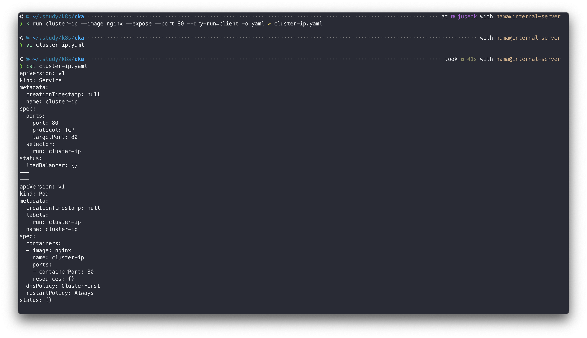
**Service**쪽을 확인해보면 기본값인 ClusterIP 타입이 생략되어있다.  
앞에서 생성했던 myservice Service도 별도 타입을 지정하지 않았기 때문에 ClusterIP 였다.  
때문에 요청 테스트시 로컬호스트에서 바로 호출하지 않고 클라이언트 파드를 생성한 후 요청했다.  

### 2-2. NodePort
**NodePort**는 도커 컨테이너 포트 매핑과 비슷하게 로컬 호스트의 특정 포트를 Service의 특정 포트와 연결시켜 외부 트래픽을 Service까지 전달한다.   
```yaml
apiVersion: v1
kind: Service
metadata:
  name: node-port
spec:
  type: NodePort
  ports:
  - port: 8080
    protocol: TCP
    targetPort: 80
    nodePort: 30080
  selector:
    run: mynginx
---
apiVersion: v1
kind: Pod
metadata:
  labels:
    run: node-port
  name: node-port
spec:
  containers:
  - image: nginx
    name: nginx
    ports:
    - containerPort: 80
```
- port : Service 포트
- targetPort : Pod 포트
- nodePort : 호스트 서버에서 사용할 포트, 포트 범위는 `30000-32767` 이다.
- containerPort : Pod에 속하는 컨테이너의 포트

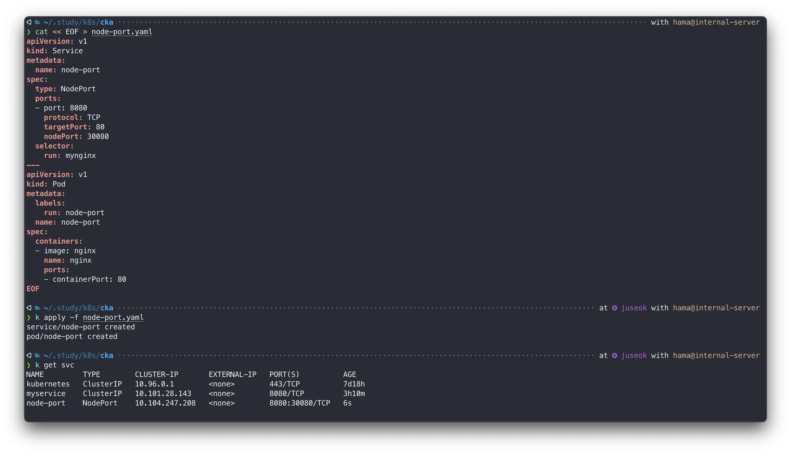


Service 포트(port)와 Pod 포트(targetPort)가 같을때 `targetPort`는 생략이 가능하다.  
위 예시에서는 서로 달라서 생략불가
 

```bash
# juseok 노드의 Internal IP(Node IP) 조회
MASTER_IP=$(kubectl get node juseok -o jsonpath="{.status.addresses[0].address}")

curl $MASTER_IP:30080

# 워커 노드 세팅 안해놓았으므로.. 패스하지만, 동일하게 접근 가능!
```
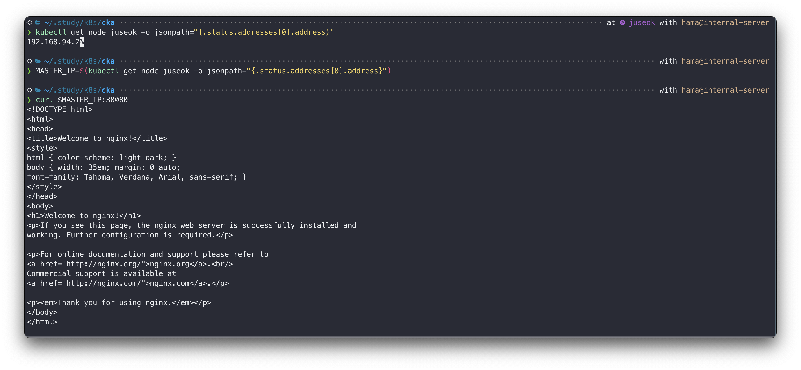

쿠버네티스는 클러스터 시스템이기 때문에 특정 노드에서만 서비스되지 않고 모든 노드에 분산되어 서비스 된다. 
`kube-proxy`가 이러한 것을 가능하게 만들어주는 컴포넌트다.  
`kube-proxy`는 리눅스 커널의 `netfilter`를 이용해 커널레벨에서 특정 트래픽을 가로채 다른 곳으로 라우팅해주는 역할을 수행한다.  
이를 통해 배포된 Pod가 있는 노드뿐만 아니라 모든 노드에서 동일한 NodePort로 원하는 서비스에 접근할 수 있다. (`externalTrafficPolicy: Cluster`의 경우)  


- `netfilter` : kernel space 에서 패킷의 생명주기를 관리하는 툴
- `iptables` : netfilter의 생명주기 룰을 쉽게 조작할 수 있게 도와주는 툴, linux에서 방화벽을 설정할 때 사용함
- `kube-proxy` : iptables의 룰을 정의하고 iptables룰은 netfilter에도 생성되어 실제로 netfilter에 의해 특정 경로로 패킷을 전달하게 됨
 

바깥에서 `curl <공인IP>:30080` 또는 `http://공인IP:30080`로도 접근이 되는것을 확인할 수 있다.  
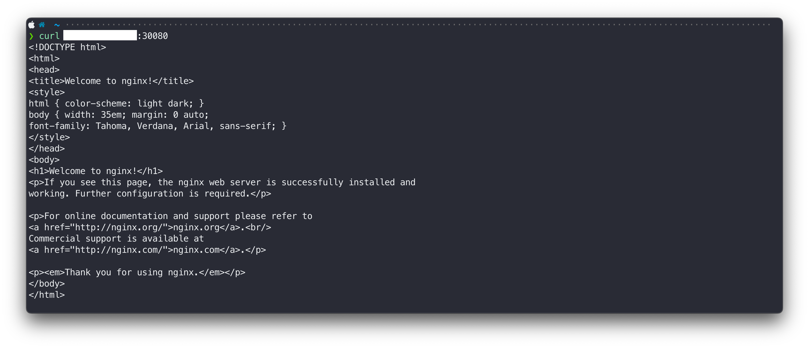

### 2-3. LoadBalancer
NodePort 로도 외부트래픽을 클러스터 내부로 잘 전달할수 있다는것을 확인했다.  
근데 왜 **LoadBalancer**를 사용할까? 아래 두가지 이유 때문이다.  
1. 보안적 측면  
  : 노드 포트 대역(30000-32767)을 직접 외부에 노출하지않고 **LoadBalancer**를 외부 네트워크에 두고 _**well-known**_ 포트로 엔드포인트를 제공해 네트워크 보안을 지킬 수 있다.  
2. 안정적인 접근
  : LoadBalancer를 앞단에 두면 사용자가 각각의 서버 IP를 직접 알 필요 없이 LoadBalancer의 IP만으로 요청을 보낼 수 있기에 편리하다.  

<details>
<summary>well-known 포트</summary>
<table>
  <tr>
    <th scope="col">포트</td>
    <th scope="col">설명</td>
  </tr>
  <tr>
    <th scope="col">20</td>
    <th scope="col">FTP 데이터 포트</td>
  </tr>
  <tr>
    <th scope="col">21</td>
    <th scope="col">FTP 제어, 인증 포트</td>
  </tr>
  <tr>
    <th scope="col">22</td>
    <th scope="col">SSH 포트</td>
  </tr>
  <tr>
    <th scope="col">23</td>
    <th scope="col">Telnet 평문 전송 포트</td>
  </tr>
  <tr>
    <th scope="col">25</td>
    <th scope="col">SMTP 이메일 전송 포트</td>
  </tr>
  <tr>
    <th scope="col">53</td>
    <th scope="col">DNS 도메인 -> IP 변환 포트</td>
  </tr>
  <tr>
    <th scope="col">67</td>
    <th scope="col">DHCP 서버 포트</td>
  </tr>
  <tr>
    <th scope="col">68</td>
    <th scope="col">DHCP 클라이언트 포트</td>
  </tr>
  <tr>
    <th scope="col">80</td>
    <th scope="col">HTTP</td>
  </tr>
  <tr>
    <th scope="col">110</td>
    <th scope="col">POP3 수신용 메일 서버</td>
  </tr>
  <tr>
    <th scope="col">139</td>
    <th scope="col">NETBIOS</td>
  </tr>
  <tr>
    <th scope="col">143</td>
    <th scope="col">IMAP4 이메일 포트</td>
  </tr>
  <tr>
    <th scope="col">443</td>
    <th scope="col">HTTPS</td>
  </tr>
  <tr>
    <th scope="col">445</td>
    <th scope="col">SMB 파일 공유 포트</td>
  </tr>
  <tr>
    <th scope="col">993</td>
    <th scope="col">SSL 위의 IMAP4 암호화 전송 포트</td>
  </tr>
  <tr>
    <th scope="col">995</td>
    <th scope="col">SSL 위의 암호화 전송 포트</td>
  </tr>
</table>
</details>

> ClusterIP가 Pod레벨에서의 안정적인 엔드포인트라면,  
  LoadBalancer는 Node레벨에서의 안정적인 엔드포인트이다.  

```yaml
apiVersion: v1
kind: Service
metadata:
  name: lb
spec:
  type: LoadBalancer
  ports:
  - port: 8080
    protocol: TCP
    targetPort: 80
    nodePort: 30088
  selector:
    run: mynginx
---
apiVersion: v1
kind: Pod
metadata:
  labels:
    run: lb
  name: lb
spec:
  containers:
  - image: nginx
    name: nginx
    ports:
    - containerPort: 80
```
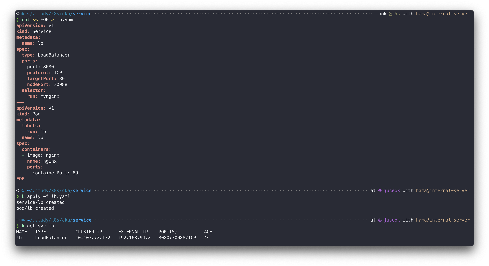

```bash
# 로드밸런서 IP 로 호출 : curl <EXTERNAL-IP>:<SERVICE-PORT>
curl 192.168.94.2:8080
```
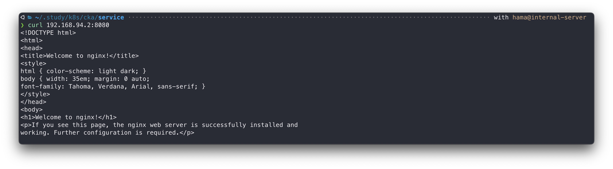

<div style="background-color:white; padding: 5px;">

graph LR;
  user[User]-. "port :8080" .->lb([Load Balancer]);
  lb-->|"port :30088"|service["Service <br> (port: 8080)"];
  lb;
  subgraph node[⚙️ Node]
  service-->pod1[Pod];
  end
  classDef plain fill:#ddd,stroke:#fff,stroke-width:4px,color:#000;
  classDef k8s fill:#326ce5,stroke:#fff,stroke-width:4px,color:#fff;
  classDef cluster fill:#fff,stroke:#bbb,stroke-width:2px,color:#326ce5;
  class lb,user k8s;
  class node cluster;

</div>

### 

생성된 Service 리소스를 살펴보면 `EXTERNAL-IP` 열에 IP 가 부여되어있는것을 확인할 수 있는데, 필자는 minikube 를 사용하므로 내부 IP 가 부여되었다.  
CSP의 k8s를 사용한다면 직접 접근이 가능한 외부IP(공인IP, Public IP)가 부여된다.  
 


### 2-4. ExternalName
클러스터 내부에서 사용할 수 있도록 **ExternalName**으로 외부 DNS를 등록할 수 있다.  
아래처럼 구성하면 `google-svc` 라는 alias로 외부 DNS인 `google.com`을 클러스터 내부에서 참조가 가능하다.  
**ExternalName**은 k8s 클러스터 내부에 존재하지 않는 외부 서비스에 네트워킹 확장을 원할때 사용한다.  
```yaml
apiVersion: v1
kind: Service
metadata:
  name: google-svc
spec:
  type: ExternalName
  externalName: google.com
```
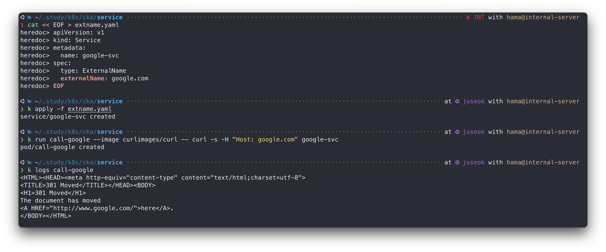

종합하면 Service 는 아래 네가지 타입으로 존재하는데,  
`ClusterIP`는 클러스터 **내부전용**이라서 Traffic이 클러스터 그룹 안에 위치하고,  
`NodePort`, `LoadBalancer` 는 **외부연결 가능**이라서 Traffic이 클러스터 그룹 바깥에 있고,  
`ExternalName`은 네트워크 확장의 개념으로 사용되기 때문에 **화살표의 방향이 바깥**으로 나가게끔 그려져있는것을 확인할 수 있다.  
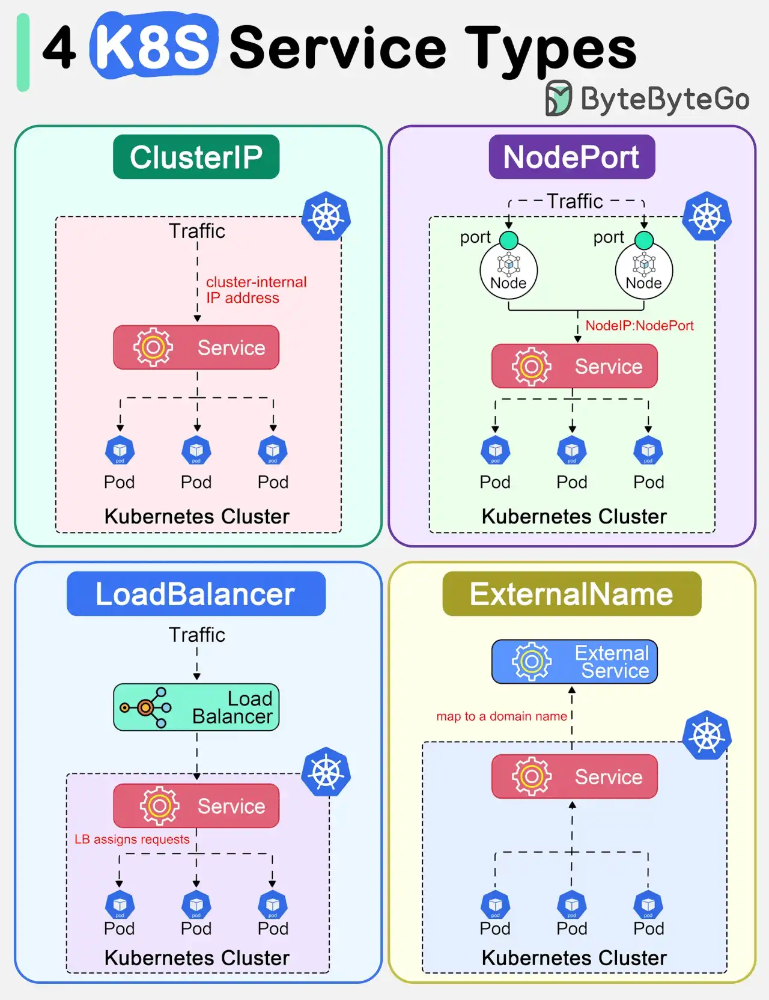
- **ClusterIP** : Service의 기본값, 클러스터 내부 IP 주소가 할당된다. **클러스터 내에서만 연결성 보장**
- **NodePor**t : ClusterIP 위에 클러스터에 대한 포트를 추가해 클러스터 **외부에 서비스를 노출**시킨다. `NodeIP:NodePort`로 요청이 가능함
- **LoadBalance**r : CSP(AWS, Azure, GCP 등등)의 LB를 사용해 **서비스를 외부에 노출**시킨다.  
- **ExternalName** : 도메인네임에 매핑한다. **외부 DNS와 연결**하기위해 사용한다. 

## 3. 네트워크 모델
### 3-1. 쿠버네티스의 네트워크 모델 특징
- 각 Node간 NAT 없이 통신이 가능해야 한다.
- 각 Pod간 NAT 없이 통신이 가능해야 한다.
- Node와 Pod간 NAT 없이 통신이 가능해야 한다.
- 각 Pod는 고유의 IP를 부여받는다.
- 각 Pod IP 네트워크 제공자를 통해 할당받는다.
- Pod IP는 클러스터 내부 어디서든 접근이 가능해야 한다.

### 3-2. 쿠버네티스의 네트워크 모델 장점
- 모든 리소스(Node, Pod)가 다른 모든 리소스(Node, Pod, Service)를 고유한 IP로 접근할 수 있다.
- NAT 통신으로 인한 부작용에 대해 신경 쓸 필요가 없다.
- 새로운 프로토콜을 재정의할 필요 없이 기존의 TCP, UDP, IP 프로토콜을 그대로 이용할 수 있다.
- Pod간 네트워킹이 어느 노드에서든지 동일하게 동작한다(호스트 서버와의 종속성이 없어 결과적으로 이식성 향상).