## 컨트롤러란?
특정 리소스의 상태를 주기적으로 체크하고 사용자가 **바라는 상태(Desired state)** 가 되도록 어떤 작업을 수행하는 주체를 말한다.  
현재상태(Current state)와 바라는 상태(Desired state)가 같은지 체크하고 차이점이 존재하면 현재상태를 바라는 상태로 업데이트하도록 액션을 취하는 루프가 있고 이것을 계속 반복합니다.  
쿠버네티스의 모든 컨트롤러는 내부적으로 아래 방식으로 동작한다.  

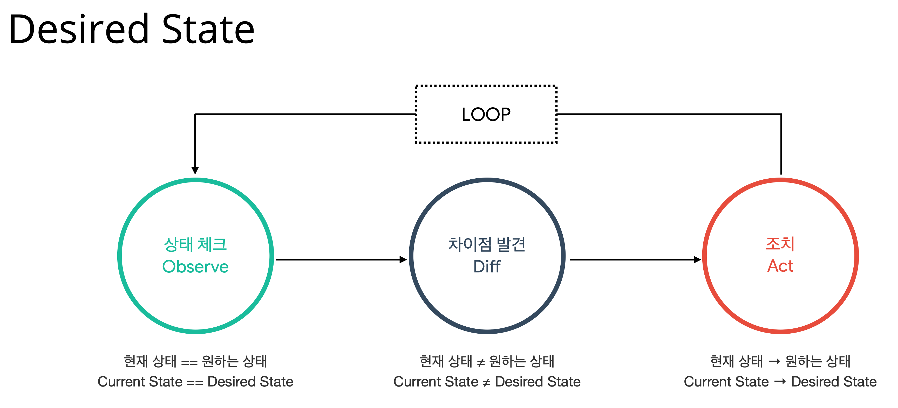

## 1. ReplicaSet
ReplicaSet은 이름에서도 알 수 있듯이 Pod의 복제본을 관리하는 컨트롤러입니다.  
바라는 상태가 파드 2개일때 파드가 1개가 죽었다면, 바라는 상태(2개)가 일정하게 유지되도록 파드의 갯수를 증/감 시키는 역할을 합니다.  

```yaml
apiVersion: v1
kind: ReplicaSet
metadata:
  name: myreplicaset
spec:
  replicas: 2
  selector:
    matchLabels:
      run: nginx-rs
  template:
    metadata:
      labels:
        run: nginx-rs
    spec:
      containers:
      - name: nginx
        image: nginx
```
- `replicas` : 복제할 Pod의 개수를 정의하는 부분, 여기서는 2개
- `selector.matchLabels` : 복제 개수를 유지할 Pod 선택하는 부분
- `template` : 복제할 Pod를 정의하는 부분

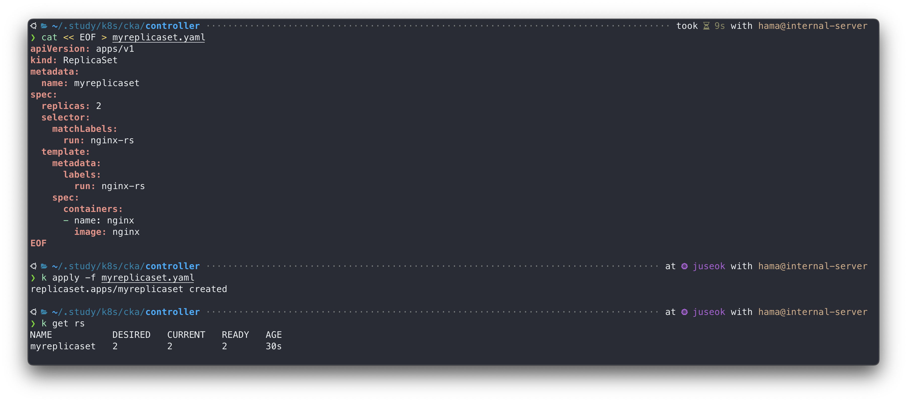
- `DESIRED` : 바라는 Pod 개수, 2개
- `CURRENT` : 현재 Pod 개수, 2개
- `READY` : 생성된 Pod 중 준비가 완료된 Pod 개수(readinessProbe)

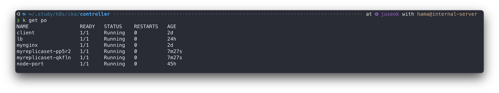

  
```bash
# replica 갯수 수정
k scale rs --replicas <NUMBER> <NAME>
```
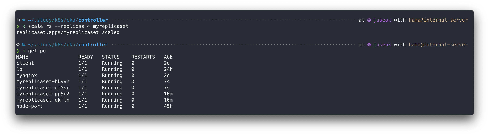

그럼 반대로 Pod를 삭제하면 어떻게 될까?
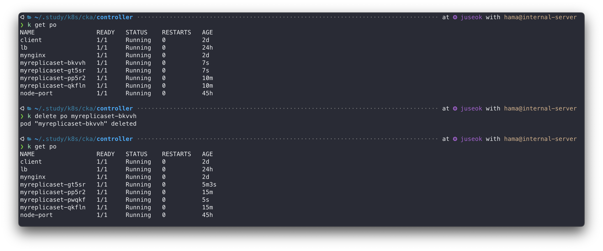

이처럼 **ReplicaSet**의 역할은 바라는 개수의 복제본을 유지시키는것이다.  
control-loop(desired state loop)를 끊임없이 돌며 Pod의 현재 개수와 사용자가 요청한 바라는 개수를 비교해 지속적으로 상태를 맞춘다.  

## 2. Deployment
Deployment는 ReplicaSet과 유사하지만 리소스의 이름처럼 앱 업데이트 및 배포에 특화된 기능을 갖고 있다. 그 기능은 아래와 같다.  
- 롤링 업데이트 지원, 업데이트 비율 조절가능
- 업데이트 히스토리 저장 및 롤백 기능
- Pod 개수 scale-out
- 배포 상태 확인

```yaml
apiVersion: apps/v1
kind: Deployment
metadata:
  name: mydeploy
spec:
  replicas: 10
  selector:
    matchLabels:
      run: nginx
  strategy:
    type: RollingUpdate
    rollingUpdate:
      maxUnavailable: 25%
      maxSurge: 25%
  template:
    metadata:
      labels:
        run: nginx
    spec:
      containers:
      - name: nginx
        image: nginx
```
- `replicas` : 유지할 Pod의 개수
- `selector.matchLabels` : 배포를 수행할 Pod 선택
- `strategy.type` : 배포전략 종류, ['RollingUpdate', 'Recreate']
  - RollingUpdate는 한개씩 점진적으로 교체되는 방식
  - Recreate는 한번에 전체 Pod가 삭제되었다가 새로운 Pod로 한꺼번에 교체되는 방식
- `strategy.rollingUpdate.maxUnavailable` : 최대 중단 Pod 허용 개수 or 비율, 여기서는 25%니까 소수점내림해서 2개, 배포중에 구버전 Pod가 최대 2개 일시중단 될 수 있다는 뜻
- `stragety.rollingUpdate.maxSurge` : 최대 초과 Pod 허용 개수 or 비율, 여기서는 25%, 소수점올림해서 3개, 배포중 새버전 Pod가 최대 3개를 초과 생성될 수 있다는 뜻, 최대 13개 허용

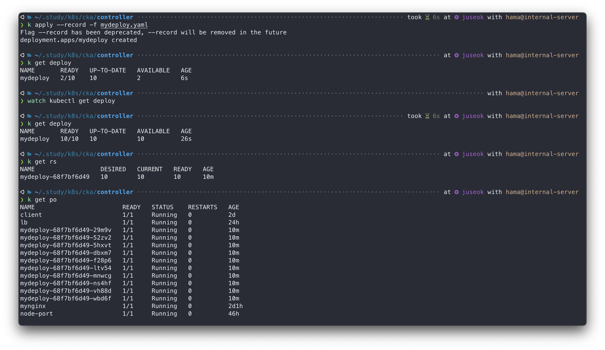

Deployment로 애플리케이션을 생성했습니다.  
Deployment가 ReplicaSet을 만들었고, ReplicaSet이 Pod 복제본을 생성했습니다.  
- Deployment : 배포 담당
- ReplicaSet : 복제 담당
- Pod : 컨테이너 실행 담당

그럼 새버전으로 배포해보겠다.  
```bash
k set image deploy mydeploy nginx=nginx:1.27.4 --record
```
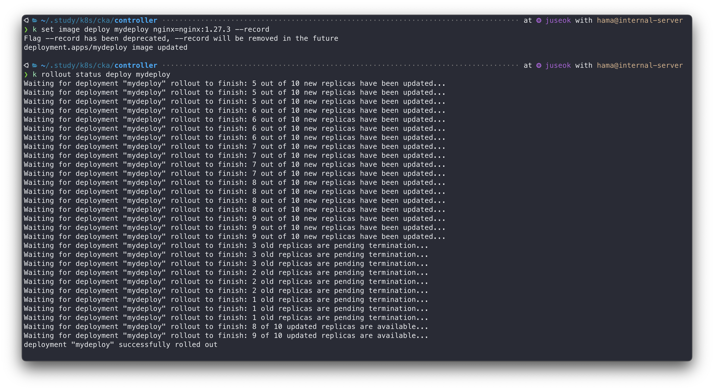

이렇게 Deployment로 롤링업데이트하고 Service로 안정적인 엔드포인트를 제공해 무중단 배포가 가능하다.  

Deployment에는 롤백기능도 있다. 배포 과정중 문제상황을 의도적으로 발생시키고 배포상태를 확인해보겠다.  
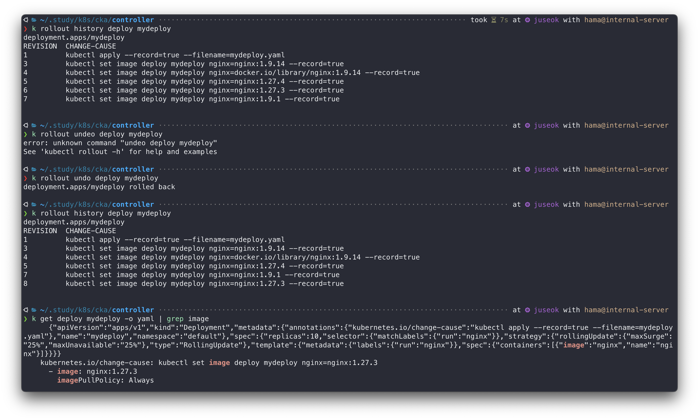
현재 필자는.. OCI 버전 문제로 구버전의 nginx 이미지 pull 이 안되는 상황이다. 이를 이용해 문제상황을 발생시켰다.  
OCI 버전 호환이 안되는 구버전의 nginx 이미지가 제대로 pull 되지않아서 `ImagePullBackOff`가 발생한 상황이다.  
구버전(1.9.1) -> 최신버전(1.27.3)으로 롤백하는 과정인데, **Deployment**로 배포할때 `--record` 를 사용한 이유는 위와 같이 문제상황이 발생했을때 어떤 명령을 사용했는지 추적하기 위함이다.  
`--record` 옵션을 사용하지 않으면 `<NONE>`으로 표시되어 확인하기 힘들다.  

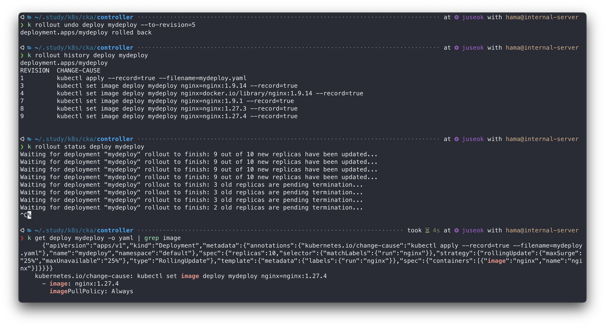

ReplicaSet과 마찬가지로 복제본 개수도 조절할 수 있다.  
```bash
# deployment 의 복제본 개수 조절
k scale deploy --replicas <NUMBER> <NAME>
```
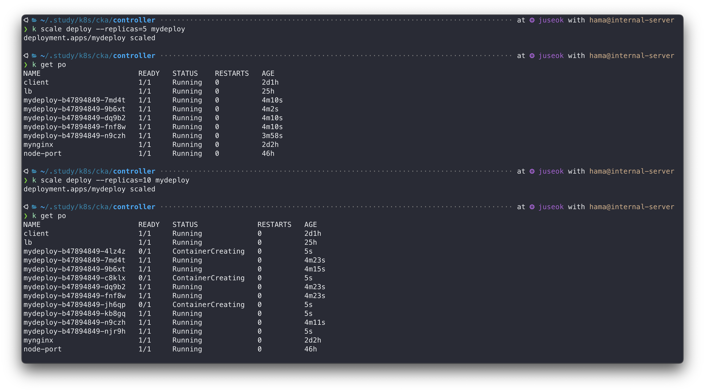


직접 edit 명령으로 YAML을 수정할 수도 있다.  
수정시 기본 에디터로 열려서 눈이 아플 수 있다.  
아래는 원하는 에디터로 바꾸는 방법이다.
```bash
# 현재 로그인된 쉘에서만 (일시적 설정)(필자는 neovim 유저)
export KUBE_EDITOR="nvim"

# 한번 설정하면 다음 로그인때도 적용(설정 지속됨)
echo 'export KUBE_EDITOR="nvim"' >> ~/.zshrc && source ~/.zshrc
```
```bash
k edit deploy mydeploy
```
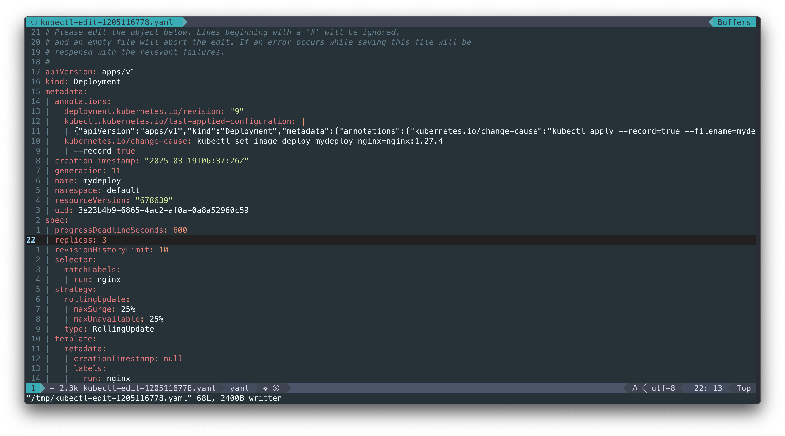
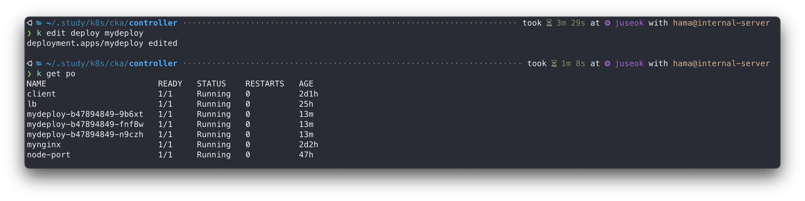


## 3. StatefulSet

<figure style="display: flex; flex-direction: column; align-items: center;">
  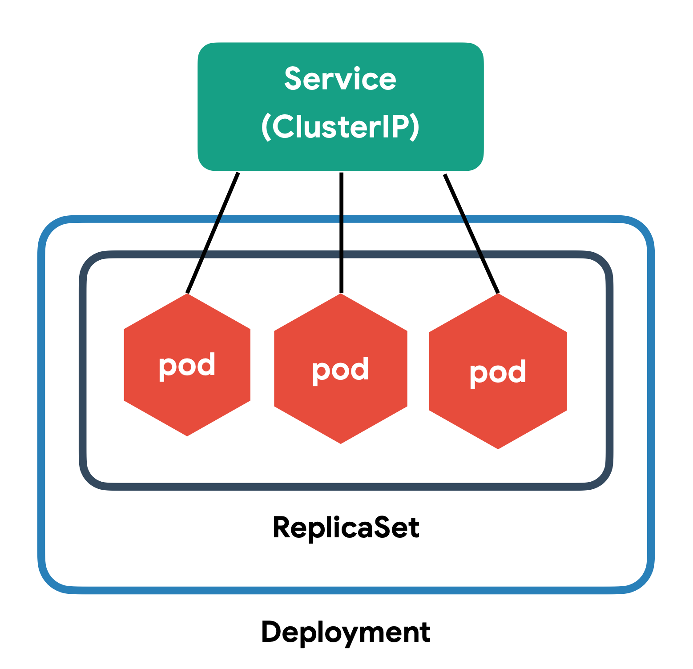
  <figcaption style="font-style: italic; margin-top: 5px;">쿠버네티스 컨셉</figcaption>
</figure>

- **Service** : 네트워킹 담당
- **Deployment** : 배포 담당
- **ReplicaSet** : 복제 담당

StatefulSet은 Stateful한 Pod를 생성해야하는 경우 사용한다.  

동일한 이미지로 Pod를 생성하지만 각기 다른 역할을 가진 Pod일때, 서로 치환될 수 없을 때 사용한다.
 

Deployment 와의 차이점은 Deployment에서의 모든 Pod는 완벽히 동일하며 순서가 없는 반면에, StatefulSet의 Pod는 각 **순서**와 **고유성**을 보장한다는 것이다.  
- 고유의 Pod 식별자가 필요한 경우
- 명시적으로 Pod마다 저장소가 지정되어야 하는 경우(1번 디스크는 pod1, 2번 디스크는 pod2, ...)
- Pod끼리의 순서에 민감한 애플리케이션인 경우(1번 생성 Pod가 Master, 나머지가 Slave인 경우)
- 애플리케이션이 순서대로 업데이트되어야 하는 경우

Deployment와 마찬가지로 애플리케이션 배포에 관여하는데, Pod끼리 명시적으로 순서를 지정할 수 있다는 점이 가장 큰 차이점이다.  

```yaml
apiVersion: apps/v1
kind: StatefulSet
metadata:
  name: mysts
spec:
  serviceName: mysts
  replicas: 3
  selector:
    matchLabels:
      run: nginx
  template:
    metadata:
      labels:
        run: nginx
    spec:
      containers:
      - name: nginx
        image: nginx
        volumeMounts:
        - name: nginx-vol
          mountPath: /usr/share/nginx/html
  volumeClaimTemplates:
  - metadata:
      name: nginx-vol
    spec:
      accessModes: [ "ReadWriteOnce" ]
      resources:
        requests:
          storage: 1Gi
---
apiVersion: v1
kind: Service
metadata:
  name: mysts
spec:
  clusterIP: None
  ports:
  - port: 8080
    protocol: TCP
    targetPort: 80
  selector:
    run: nginx
```
- `serviceName` : StatefulSet과 연결할 Service 이름
- `selector.matchLabels` : StatefulSet으로 배포할 Pod 선택
- `template` : 복제할 Pod 정의
- `volumeClaimTemplates` : 동적으로 볼륨을 생성하는 속성.

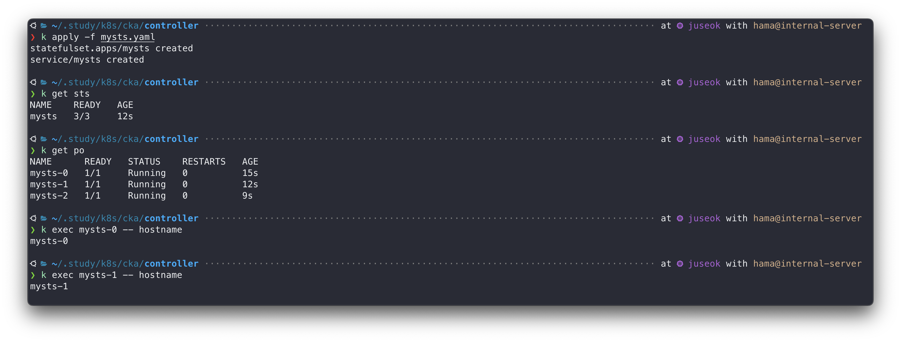
`mysts-x` 포맷으로 pod 이름에 순서에 대한 식별자가 붙었습니다.  
호스트명도 각 Pod의 이름과 마찬가지로 순서에 대한 식별자로 구분됩니다.  

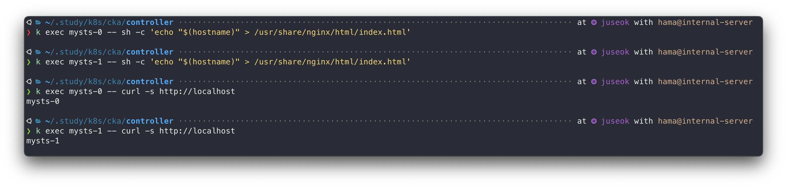
각 Pod가 바라보는 저장소가 동일하지않고 각자의 볼륨을 사용하는것을 알 수 있다.  
PVC 또한 명시적으로 순서가 적힌 식별자로 각각 생성된다.  
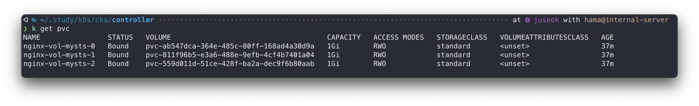

StatefulSet의 replica 개수를 줄이는 방법은 ReplicaSet 때와 동일하다.
```bash
k scale sts --replicas=0 mysts
```
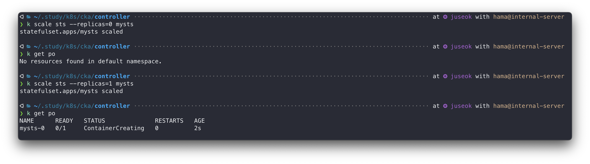

너무 빨리 지나가서 포착하지 못했는데,,,
생성될때와 반대로 식별자의 역순으로 Pod가 삭제된다.  
이미지는 동일해서 완전히 서로다른 컨테이너는 아니지만, 완벽히 일치하는 동작을 수행하는것이 아니며, Pod의 순서에 따라 다른 역할을 맡거나 Pod생성순서를 보장받아야 할 때 사용한다.  
예를 들면,
- zookeeper, etcd 같은 분산 시스템에서의 리더 선출이 필요할 경우
- Kafka, RabbitMQ 같은 메시지브로커의 경우
- Redis Sentinel같은 HA 환경의 경우
- MinIO 같은 분산 노드 스토리지의 데이터 무결성을 위해

## 4. DaemonSet
**DaemonSet**은 모든 노드에 동일한 Pod를 실행시켜야할때 사용한다.  
리소스 메트릭 모니터링, 로그 수집기 등과 같이 모든 노드에 동일한 Pod가 위치하면서 노드의 정보를 추출할때 많이 사용한다.  
다음은 모든 노드의 로그정보를 추출하는 fluentd 데몬셋 예시다.  


Fluentd ?  
: 컨테이너 로그를 수집해서 elasticsearch, s3, datadog, aws cloudwatch 등등 원하는 곳에 전달할 수 있음
 

```yaml
apiVersion: apps/v1
kind: DaemonSet
metadata:
  name: fluentd
spec:
  selector:
    matchLabels:
      name: fluentd
  template:
    metadata:
      labels:
        name: fluentd
    spec:
      containers:
      - name: fluentd
        image: quay.io/fluentd_elasticsearch/fluentd:v2.5.2
        volumeMounts:
        - name: varlibdockercontainers
          mountPath: /var/lib/docker/containers
          readOnly: true
      volumes:
      - name: varlibdockercontainers:
        hostPath:
          path: /var/lib/docker/containers
```
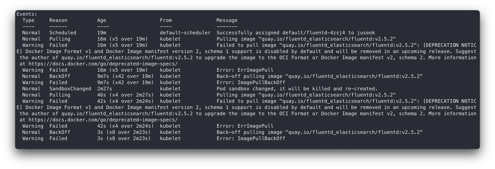

```bash
k get ds
# NAME      DESIRED  CURRENT  READY  UP-TO-DATE  AVAILABLE   NODE ..
# fluentd   2        2        2      2           2             ..
```


## 5. Job & CronJob
Job은 일반 Pod처럼 항상 실행되고 있는 서비스 프로세스가 아닌, 단발성 일괄처리 프로세스용이다.  
```yaml
apiVersion: batch/v1
kind: Job
metadata:
  name: example-job
spec:
  template:
    metadata:
      name: example-job
    spec:
      containers:
      - name: example-container
        image: busybox
        command: ["echo", "Hello, Kubernetes Job!"]
      restartPolicy: Never
```
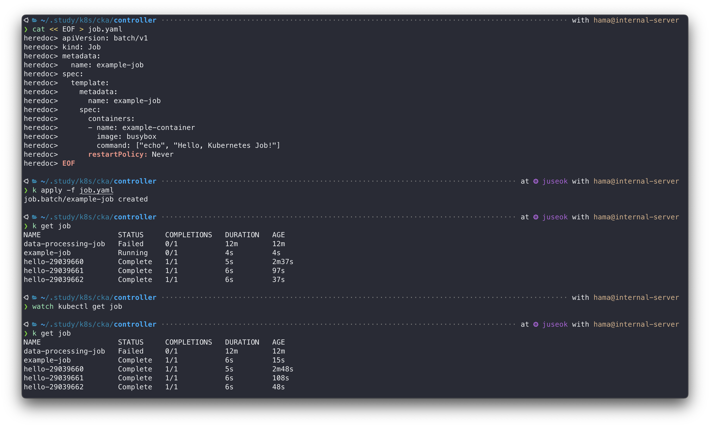

CronJob은 Job과 유사하지만 주기적으로 Job을 실행할 수 있도록 확장된 리소스다.  
일정 주기마다 메일을 보낸다거나, 알림을 보낸다거나 할때 유용할것같다.  
```yaml
apiVersion: batch/v1
kind: CronJob
metadata:
  name: hello
spec:
  schedule: "*/1 * * * *"
  jobTemplate:
    spec:
      template:
        spec:
          containers:
          - name: hello
            image: busybox
            args:
            - /bin/sh
            - -c
            - date; echo Hello from the Kubernetes cluster
          restartPolicy: OnFailure
```
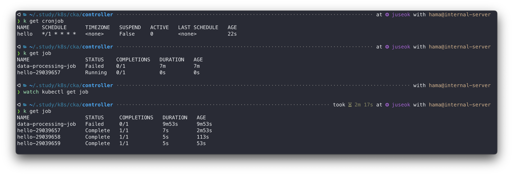