## 1. helm 이란?
**helm**은 쿠버네티스 패키지매니저이다.  
python의 pip, debian계열 linux의 apt, redhat계열 linux의 yum 처럼,

아래는 helm chart의 구조이다.  
```bash
.
├── values.yaml   # > 설정값들(자주 변경되거나 사용자마다 달라지는 값들)
└── templates/    # > 설치할 리소스 파일(Deployment, Service, 등등)이 존재한다.
                  #   각 리소스의 설정값은 비워져있다(placeholder).
                  #   이 설정값은 values.yaml 값들로 채워진다.
```

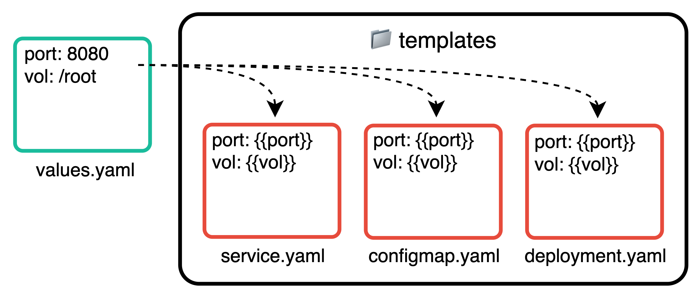

### 1-1. helm 설치
```bash
curl https://raw.githubusercontent.com/helm/helm/master/scripts/get-helm-3 | bash -s -- --version v3.2.2
```

### 1-2. chart 생성
```bash
helm create <CHART_NAME>
```
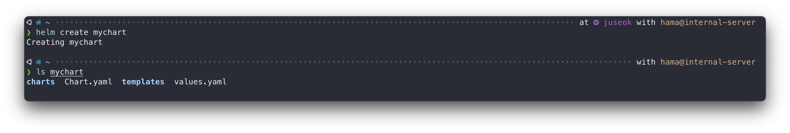
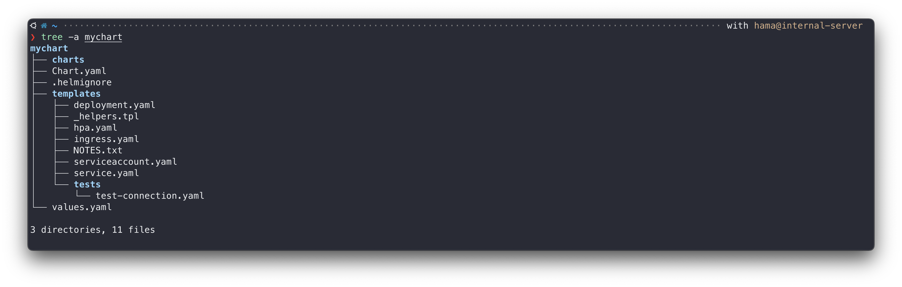
- `Chart.yaml` : 차트 이름, 버전 정보 및 차트의 전반적인 메타데이터
- `charts` : 상속 차트(기본적으로는 비어있음)
- `templates` : 차트의 뼈대가 되는 쿠버네티스의 리소스가 위치
- `values.yaml` : 사용자 정의 설정값

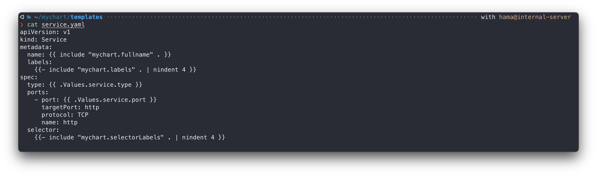
값에 `{}` 로 placeholder 설정 되어있는것을 확인 할 수 있다. 이곳에 values 의 값이 들어온다.  

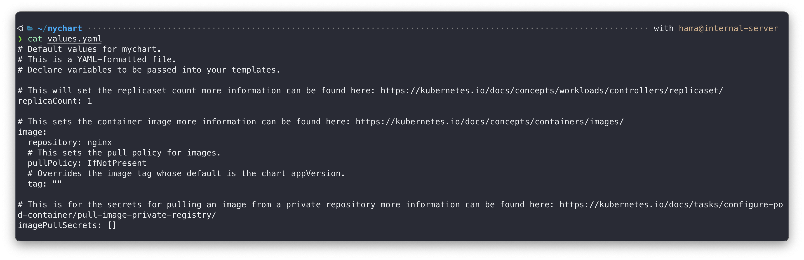
여기서 설정값을 조금 수정해보자.
```yaml
image:
  repository: nginx
  pullPolicy: IfNotPresent

imagePullSecrets: []
nameOverride: ""
fullnameOverride: ""

...

service:
  type: LoadBalancer
  port: 8888
```

### 1-3. chart 설치
```bash
helm install <CHART_NAME> <CHART_PATH>
```
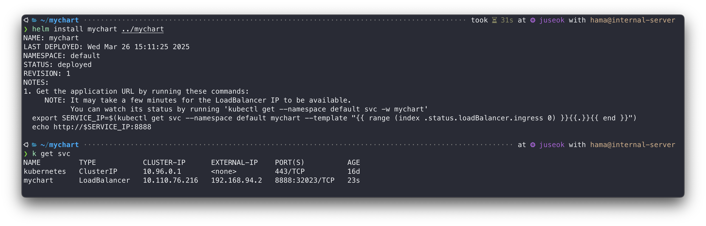
`LoadBalancer`가 클러스터에 배포된것을 확인 할 수 있다. 😲😲😲 

### 1-4. chart 리스트 조회
```bash
helm list
```
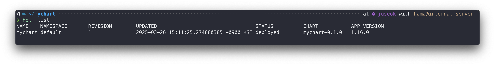

### 1-5. chart 렌더링
```bash
helm template <CHART_PATH>
```
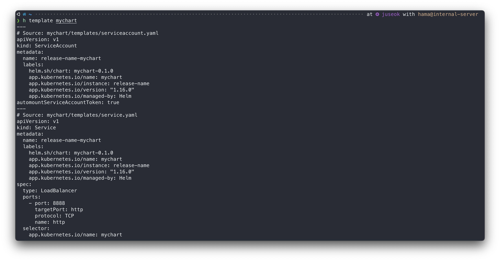

### 1-6. chart 업그레이드
```bash
helm upgrade 
```
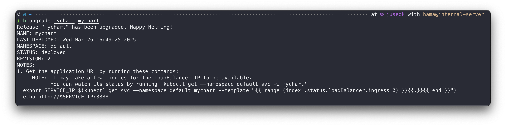

### 1-7. chart 배포상태 확인
```bash
helm status <CHART_NAME>
```
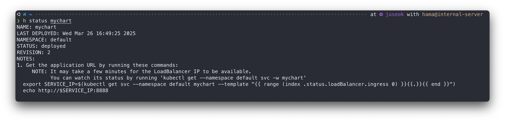


## 2. 원격 리파지토리 (repository)

### 2-1. 리파지토리 추가
```bash
helm repo add stable https://kubernetes-charts.storage.googleapis.com
```
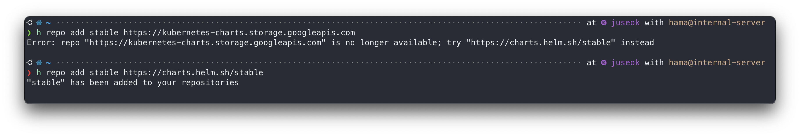

### 2-2. 리파지토리 업데이트
```bash
helm repo update
```
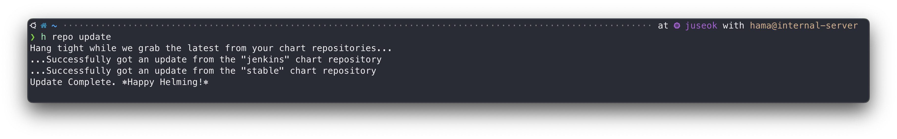

### 2-3. 리파지토리 조회
```bash
helm repo list
```
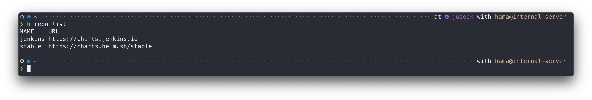

### 2-4. 리파지토리내 chart 조회
```bash
helm search repo stable
```
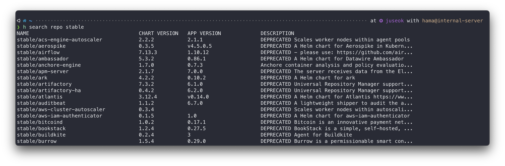

## 3. 외부 chart 설치 (e.g., wordpress)
### 3-1. chart install
```bash
helm install wp stable/wordpress \
  --version 9.0.3 \
  --set service.port=8080 \
  --namespace default
```
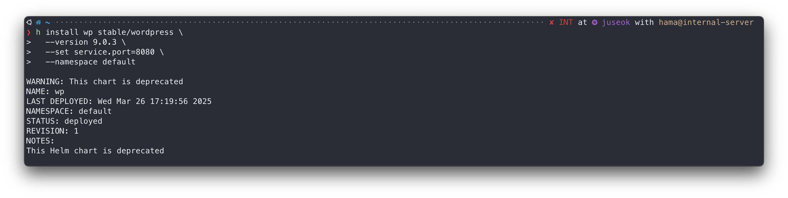
- `--version` : chart의 버전 지정
- `--set` : values.yaml 을 동적으로 설정가능
- `--namespace` : chart가 설치될 네임스페이스 지정

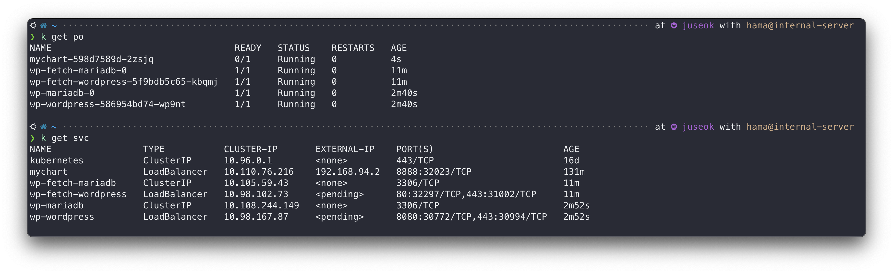

### 3-2. chart fetch
```bash
helm fetch --untar stable/wordpress --version 9.0.3
```
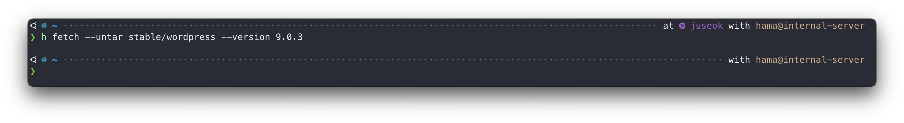

```bash
helm install wp-fetch ./wordpress
```
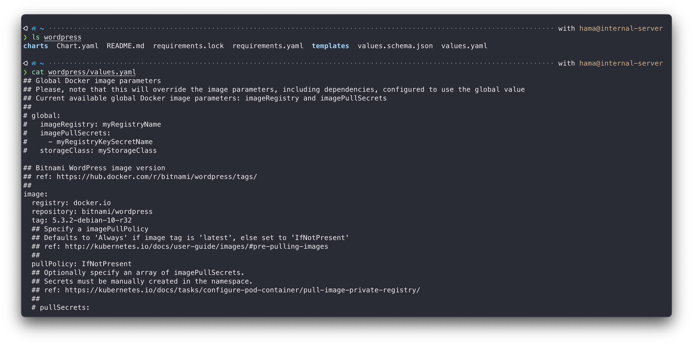
