## 1. Ingress
**Ingress**는 네트워크 Layer7에 대한 설정을 담당하는 리소스이다. (aws에서는 ALB에 해당.)  
http->https, 부하 분산, 도메인 기반 라우팅 등을 제공한다.  
클러스터 내부 서비스에 외부에서 접근 가능한 URL을 부여해 일반 사용자들이 쉽게 접근할 수 있는 엔드포인트를 제공한다.  


### 1-1. Ingress Controller
실제 트래픽 처리 및 **Ingress** 리소스에 정의된 규칙 적용을 담당하는 핵심 컴포넌트이다.  

|    기능    |                    설명                    |
|-----------|-------------------------------------------|
| 트래픽 수신  | 로드 밸런서/노드포트에서 전달된 트래픽 수신         | 
| 규칙 해석   | Ingress 리소스에 정의된 라우팅 규칙 적용         |
| 라우팅 실행  | 호스트/경로 기반 트래픽 분기 처리                | 
| 부가 기능   | SSL/TLS 종료, 요청 제한, WAF 적용             | 

여러 타입의 Ingress Controller 가 있는데, 그 예시는 아래와 같다.  
- NGINX Ingress
- HAProxy
- AWS ALB Ingress
- Ambassador
- Kong
- traefik


쿠버네티스에서 **Ingress** 리소스 단독으로는 외부 트래픽을 처리할 수 없다.  
**Ingress** 리소스 자체는 라우팅 규칙일 뿐이다.  
실제 트래픽 수용 및 라우팅을 위해서는 **로드 밸런서(LoadBalancer)** 또는 **노드 포트(NodePort)** 와 같은 네트워크 노출 수단이 반드시 필요하며, 이와 함께 **Ingress Controller**가 **Ingress** 규칙을 실행해야 한다.


#### 트래픽 흐름
전체 프로세스는 다음 구조로 동작한다.  
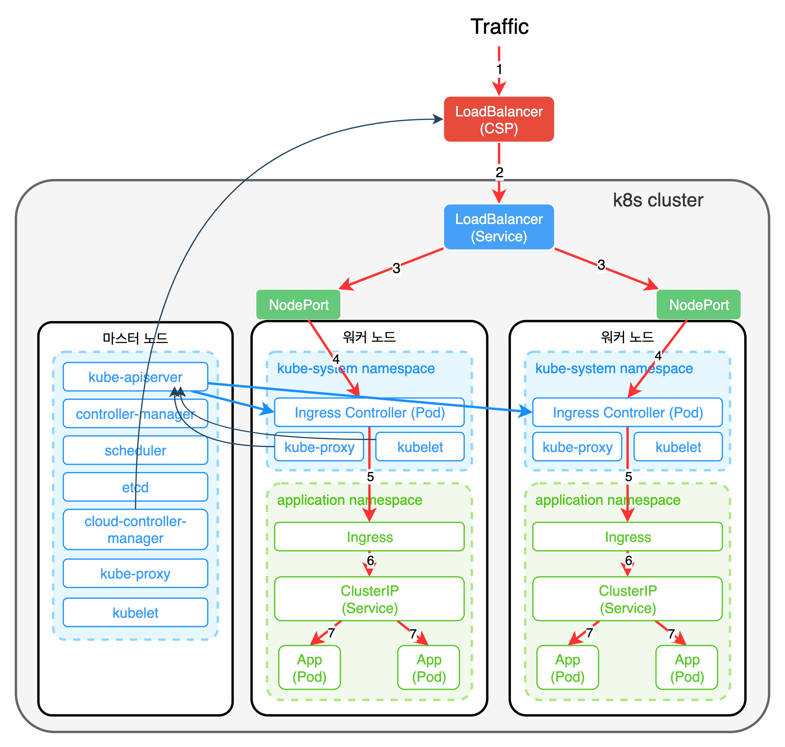
**Ingress Controller**는 일반적으로 `deployments/pods`로 배포되는데 이 컨트롤러가 외부 트래픽을 받기 위해서는 서비스를 통해 노출되어야 한다.  
이때 사용되는 서비스 타입은 주로 **LoadBalancer**, **NodePort**이다.  
**ClusterIP + HostNetwork** 조합으로 배포되기도 한다.  

대개 **Ingress Controller**는 `kube-system` 네임스페이스에 배포되는데 반드시 `kube-system` 네임스페이스에 배포될 필요는 없다.  
Ingress Controller는 일반적으로 인프라 레벨 컴포넌트로 간주되어 클러스터 관리자나 운영팀에 의해 배포 및 관리된다.  

보통 **Ingress** 뒤에 있는 서비스의 타입은 ClusteIP 이다. 이 서비스들은 외부에 직접 노출될 필요가 없기 때문이다. 
뒷단에 있는 수많은 서비스들은 **Ingress** 리소스들에 의해 참조된다.  
**Ingress Controller**가 외부 트래픽을 받아 **Ingress** 뒤에 있는 서비스로 라우팅한다.  
**Ingress Controller**를 외부에 노출하기 위해 생성한 **LoadBalancer**는 생성될때 내부적으로 **NodePort**를 생성한다.  

LoadBalancer는 특정 NodePort로 트래픽을 라우팅하고 Ingress Controller를 호출하고 Ingress를 참조하여 Ingress 규칙에 적혀있는 서비스/파드로 트래픽을 라우팅한다.  

대략적인 트래픽 흐름은  
`Client` → `LoadBalancer(CSP)` → `LoadBalancer(Service)` → `NodePort` →  
`Ingress Controller(Pod)` → `ClusterIP(Service)` → `Application(Pod)`

### 1-2. NGINX Ingress Controller
가장 많이 사용되는 Ingress 이다.  
```bash
# NGINX Ingress Controller를 위한 네임스페이스 생성
k create ns ctrl

# nginx-ingress chart 설치
h install nginx-ingress stable/nginx-ingress --version 1.40.3 -n ctrl
```
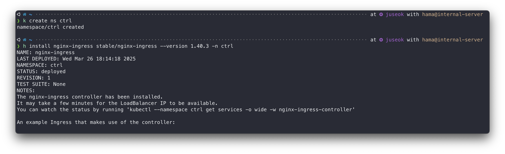

```bash
k get po -n ctrl
k get svc -n ctrl
```
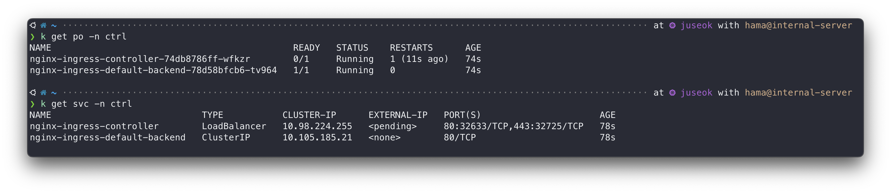
로드 밸런서 타입의 서비스에 80포트와 443포트가 열린것을 확인할 수 있다.  
앞으로 Ingress에 들어오는 모든 트래픽은 ingress controller service로 들어오게 된다.  

## 2. 기본 사용법
### 2-1. 도메인 주소 테스트
**Ingress**는 Layer7 통신이기 때문에 도메인 주소가 있어야 제대로 된 Ingress 테스트를 할 수 있다.  
https://sslip.io라는 서비스를 이용하면 따로 도메인을 구매하지 않아도 도메인 주소를 얻을 수 있다.  

**Ingress Controller IP 확인 방법**
```bash
INGRESS_IP=$(kubectl get svc -n ctrl nginx-ingress-controller -o jsonpath="{.status.loadBalancer.ingress[0].ip}")
echo $INGRESS_IP
```

### 2-2. Ingress 생성
```bash
# ingress와 연결할 리소스 생성
k run mynginx --image nginx --expose --port 80
```
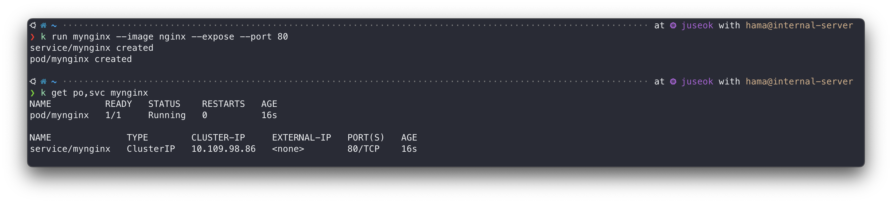

```yaml
# mynginx-ingress.yaml
apiVersion: networking.k8s.io/v1
kind: Ingress
metadata:
  annotations:
    spec.ingressClassName: nginx
  name: mynginx
spec:
  rules:
  - host: 192.168.94.2.sslip.io    # 위에서 확인한 INGRESS_IP를 sslip.io 앞에 입력
    http:
      paths:
      - path: /
        pathType: Prefix
        backend:
          service:
            name: mynginx
            port:
              number: 80
```
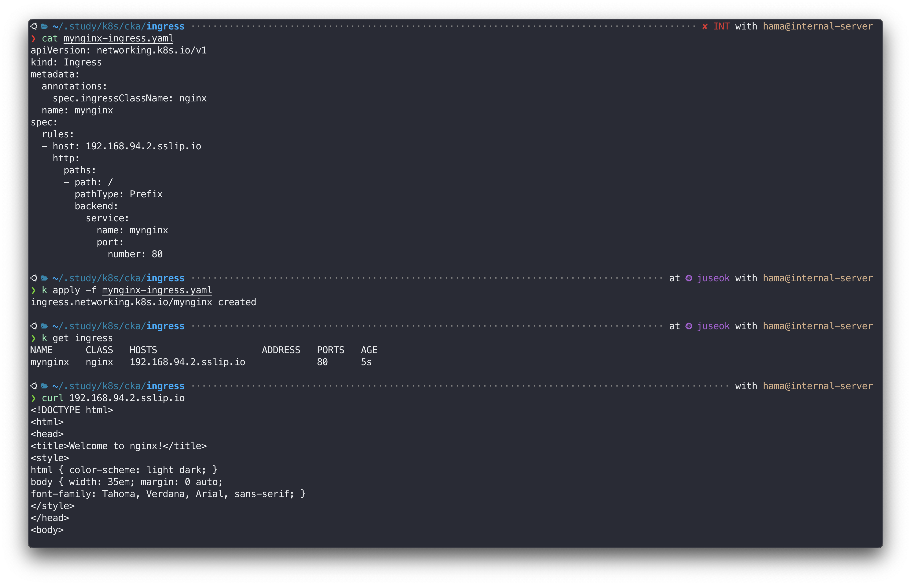
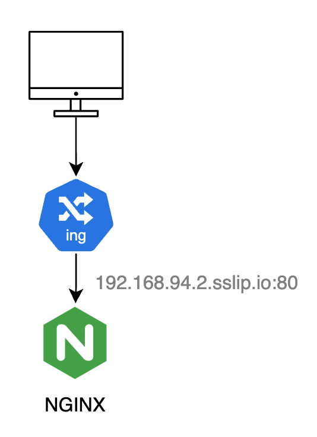

- **annotations** : 메타정보를 저장하기 위한 property
  label과 비슷하지만 annotations로는 리소스를 필터하지는 못하고 단지 메타데이터를 저장하는 용도로 사용한다.  
  `spec.ingressClassName`의 의미는 해당 Ingress가 NGINX Ingress Controller에 의해 처리될것을 명시한것이다.  
- **rules** : 외부 트래픽을 어떻게 처리할지 정의하는 property, rules 아래 여러개의 규칙 정의 가능
- **ruels[0].host** : 특정 도메인으로 들어오는 트래픽에 대해 라우팅 정의,  
  생략시 모든 호스트 트래픽(`*`) 처리
- **rules[0].http.paths[0].path** : Ingress path를 정의(path based routing)
- **rules[0].http.paths[0].backend** : Ingress의 트래픽을 받을 서비스와 포트 정의

#### 1. Domain 기반 라우팅
```bash
# apache web server
k run apache --image httpd --expose --port 80

# nginx web server
k run nginx --image nginx --expose --port 80
```
```yaml
# domain-based-routing.yaml
apiVersion: networking.k8s.io/v1
kind: Ingress
metadata:
  annotations:
    spec.ingressClassName: nginx
  name: apache-domain
spec:
  rules:
  - host: apache.192.168.94.2.sslip.io
    http:
      paths:
      - path: /
        pathType: Prefix
        backend:
          service:
            name: apache
            port:
              number: 80
---
apiVersion: networking.k8s.io/v1
kind: Ingress
metadata:
  annotations:
    spec.ingressClassName: nginx
  name: nginx-domain
spec:
  rules:
  - host: nginx.192.168.94.2.sslip.io
    http:
      paths:
      - path: /
        pathType: Prefix
        backend:
          service:
            name: nginx
            port:
              number: 80
```
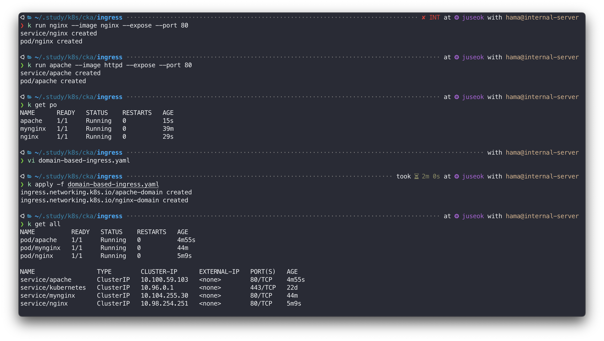
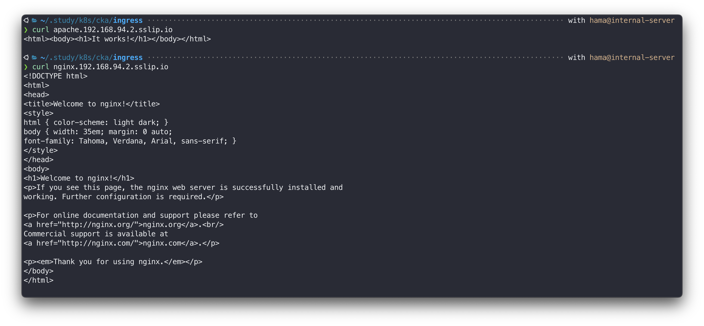

#### 2. Path 기반 라우팅
```yaml
# path-based-routing.yaml
apiVersion: networking.k8s.io/v1
kind: Ingress
metadata:
  annotations:
    spec.ingressClassName: nginx
    nginx.ingress.kubernetes.io/rewrite-target: /
  name: apache-path
spec:
  rules:
  - host: 192.168.94.2.sslip.io
    http:
      paths:
      - path: /apache
        pathType: Prefix
        backend:
          service:
            name: apache
            port:
              number: 80
---
apiVersion: networking.k8s.io/v1
kind: Ingress
metadata:
  annotations:
    spec.ingressClassName: nginx
    nginx.ingress.kubernetes.io/rewrite-target: /
  name: nginx-path
spec:
  rules:
  - host: 192.168.94.2.sslip.io
    http:
      paths:
      - path: /nginx
        pathType: Prefix
        backend:
          service:
            name: nginx
            port:
              number: 80
```
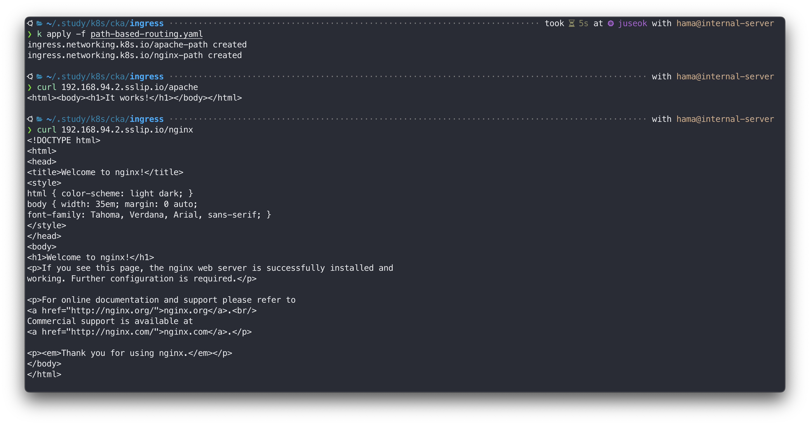

## 3. Basic Auth 설정
Ingress 리소스에 간단한 HTTP Authentication 기능을 추가할 수 있다.  
외부 사용자 접근에 대한 최소한의 보안 절차를 추가해보겠다.  

### 3-1. Basic Authentication
유저 ID, 비밀번호를 HTTP 헤더로 전달해 인증하는 방법이다.  
헤더에 다음과 같이 user와 password를 콜론으로 묶은 다음 base64로 인코딩해 전달한다.  
```bash
Authorization: Basic $(echo -n user:password | base64)
```
```bash
# 헤더 없이 요청
curl -v https://httpbin.org/basic-auth/foo/bar

HTTP/2 401
date: Tue, 01 Apr 2025 08:14:28 GMT
content-length: 0
server: gunicorn/19.9.0
www-authenticate: Basic realm="Fake Realm"
access-control-allow-origin: *
access-control-allow-credentials: true

Connection #0 to host httpbin.org left intact
```
```bash
# 헤더에 인증정보 포함해 요청
curl -v -H "Authorization: Basic $base64(foo:bar)" https://httpbin.org/basic-auth/foo/bar

{
  "authenticated": true,
  "user": "foo"
}
```

### 3-2. Basic Auth 설정
Ingress에 Basic Auth 설정을 하기 위해 사용자 정보를 담고 있는 basic authentication 파일을 생성한다. 이 파일을 생성하기위해 `htpasswd` 라는 툴을 이용할것이다.  

```bash
# htpasswd binary 설치
sudo apt install -y apache2-utils

# 아이디는 foo, 비밀번호는 bar인 auth 파일 생성
htpasswd -cb auth foo bar

# 생성한 auth 파일을 Secret으로 생성한다.
k create secret generic basic-auth --from-file=auth

# Secret 리소스 생성 확인
k get secret basic-auth -o yaml
```
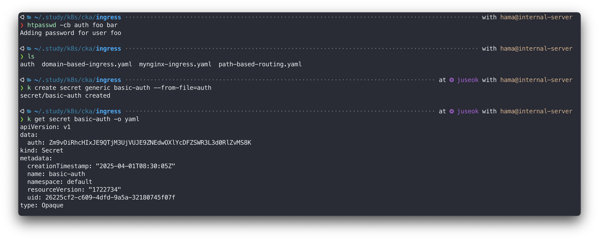

위에서 생성한 Secret을 Ingress에 설정해보겠다.  
Basic Auth도 annotation을 이용해 설정할 수 있다.  

```yaml
apiVersion: networking.k8s.io/v1
kind: Ingress
metadata:
  annotations:
    spec.ingressClassName: nginx
    nginx.ingress.kubernetes.io/auth-type: basic
    nginx.ingress.kubernetes.io/auth-secret: basic-auth
    nginx.ingress.kubernetes.io/auth-realm: 'Authentication Required - foo'
  name: apache-auth
spec:
  rules:
  - host: apache-auth.192.168.94.2.sslip.io
    http:
      paths:
      - path: /
        pathType: Prefix
        backend:
          service:
            name: apache
            port:
              number: 80
```
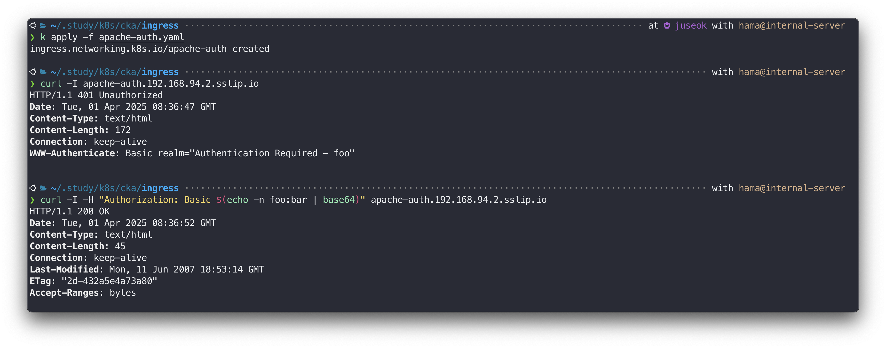

## 4. TLS 설정
Ingress 리소스의 annotations에 인증서를 등록하면 간단히 HTTPS 서비스를 제공할 수 있다.  

### 4-1. 인증서 생성
```bash
# 인증서 발급
openssl req -x509 \
  -nodes -days 365 \
  -newkey rsa:2048 \
  -keyout tls.key \
  -out tls.crt \
  -subj "/CN=apache-tls.192.168.94.2.sslip.io"
```
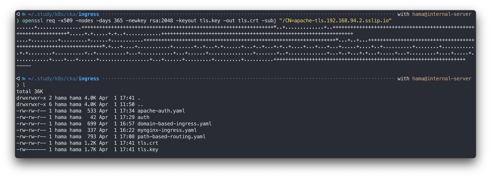

```bash
# 인증서로 Secret 생성
cat << EOF | k apply -f -
apiVersion: v1
kind: Secret
metadata:
  name: my-tls-certs
  namespace: default
data:
  tls.crt: $(cat tls.crt | base64 | tr -d '\n')
  tls.key: $(cat tls.key | base64 | tr -d '\n')
type: kubernetes.io/tls
EOF

# Secret으로 Ingress TLS 설정
cat << EOF > apache-tls.yaml
apiVersion: networking.k8s.io/v1
kind: Ingress
metadata:
  name: apache-tls
spec:
  tls:
  - hosts:
      - apache-tls.192.168.94.2.sslip.io
    secretName: my-tls-certs
  rules:
  - host: apache-tls.192.168.94.2.sslip.io
    http:
      paths:
      - path: /
        pathType: Prefix
        backend:
          service:
            name: apache
            port:
              number: 80
EOF
```
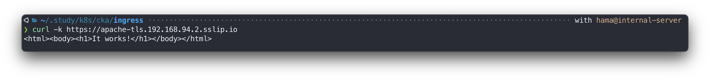

### 4-2. 인증서 발급 자동화
앞서 인증서를 직접 생성해 HTTPS 서버를 구축했는데, 이것을 자동화 하고 정식 CA(인증서 발급기관)를 통해 발급받는 방법이 있다. 
[cert-manager](https://cert-manager.io)를 활용하면 된다.  

cert-manager는 kubernetes의 X509 인증서 관리 컴포넌트이다. 공인된 인증서 발급을 도와주고 인증서가 지속적으로 유효하도록 **자동으로 인증서를 갱신한다.**  

**cert-manager 설치**  
helm으로 설치할 수 있다.  
```bash
# cert-manager 네임스페이스 생성
k create namespace cert-manager

# helm jetstack 리포지토리 추가
h repo add jetstack https://charts.jetstack.io --force-update

# helm 리포지토리 인덱스 업데이트
h repo update

# helm cert-manager 설치 (CRD 자동 설치 포함)
h install cert-manager jetstack/cert-manager \
  --namespace cert-manager \
  --version v1.17.1 \
  --set crds.enabled=true
```
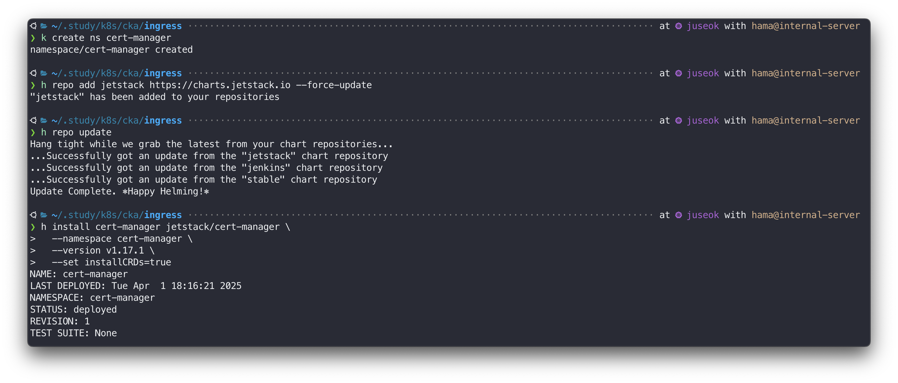

**Issuer 생성**
Issuer 리소스는 쿠버네티스 내장 리소스가 아닌 cert-manager에서 생성한 사용자 정의 리소스다.  
Ingress의 설정값을 참조해 Let's encrypt에 정식 인증서를 요청하고 응답받은 인증서를 Ingress에 연결하는 일련의 작업을 자동화해주는 리소스다.  

Issuer 타입
- ClusterIssuer : 클러스터 레벨에서 동작하는 발급자
- Issuer : 특정 네임스페이스에서 Ingress만을 관리하는 발급자

```yaml
apiVersion: cert-manager.io/v1
kind: ClusterIssuer
metadata:
  name: http-issuer
spec:
  acme:
    email: user@example.com    # email 제대로 입력하지 않으면 False 된다.
    server: https://acme-v02.api.letsencrypt.org/directory
    privateKeySecretRef:
      name: issuer-key
    solvers:
    - http01:
        ingress:
          class: nginx
```
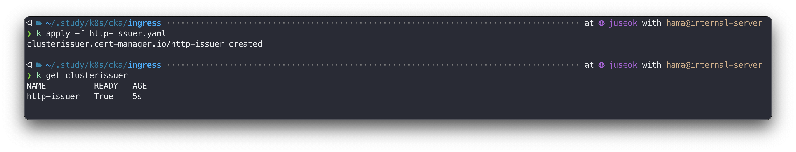

http01 solver를 이용한 도메인 인증을 성공하기 위해서는 반드시 let's encrypt 서버(외부)에서 접근 가능한 공인IP를 사용해야 한다. Let's encrypt 서버에서 도메인 소유권을 인증할 방법으로 서버에게 특정 토큰 값을 건네주고 요청 서버가 미리 지정된 URL에 전달받은 토큰을 제시할 수 있는지를 근거로 도메인 주소에 대한 소유권을 확인하기 때문이다.


필자는 미니쿠베로 진행했기 때문에 별도 포트포워딩을 통해 해결했다.  
직접 80,443 포트를 여는 iptables 규칙을 추가했더니 파드 생성시 ImagePull 에러가 발생했다.  
iptables에서 포트 80과 443에 대한 DNAT 규칙을 설정했는데, Docker가 외부 레지스트리(registry-1.docker.io)와 통신하는데 사용하는 HTTPS 연결(443 포트)에 영향이 있었다.  
특히 Docker는 이미지를 가져올 때 HTTPS를 사용하므로, 443 포트에 대한 리디렉션이 문제의 주요 원인이라고 한다.  
그래서 `socat`으로 **iptables를 건들지 않고 포트포워딩을 했다.**  
```bash
# socat 설치
sudo apt update && sudo apt install -y socat

# 외부(Let's encrypt 서버)에서 접근가능하도록 인바운드 80, 443 포트를 포트포워딩 한다.
sudo socat TCP-LISTEN:80,fork TCP:192.168.94.2:80 &
sudo socat TCP-LISTEN:443,fork TCP:192.168.94.2:443 &
```

**cert-manager가 관리하는 Ingress 생성**
이제 cert-manager를 이용해 TLS가 적용된 Ingress를 생성해보겠다.  
```yaml
apiVersion: networking.k8s.io/v1
kind: Ingress
metadata:
  annotations:
    spec.ingressClassName: nginx
    cert-manager.io/cluster-issuer: http-issuer
  name: apache-tls-issuer
spec:
  tls:
  - hosts:
      - apache-tls-issuer.<공인 IP>.sslip.io
    secretName: apache-tls
  rules:
  - host: apache-tls-issuer.<공인 IP>.sslip.io
    http:
      paths:
      - path: /
        pathType: Prefix
        backend:
          service:
            name: apache
            port:
              number: 80
```
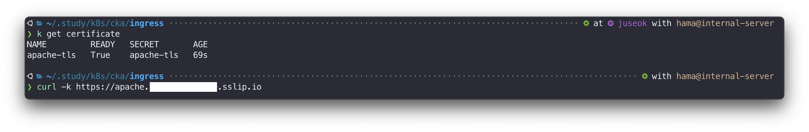

잘된다! 😊