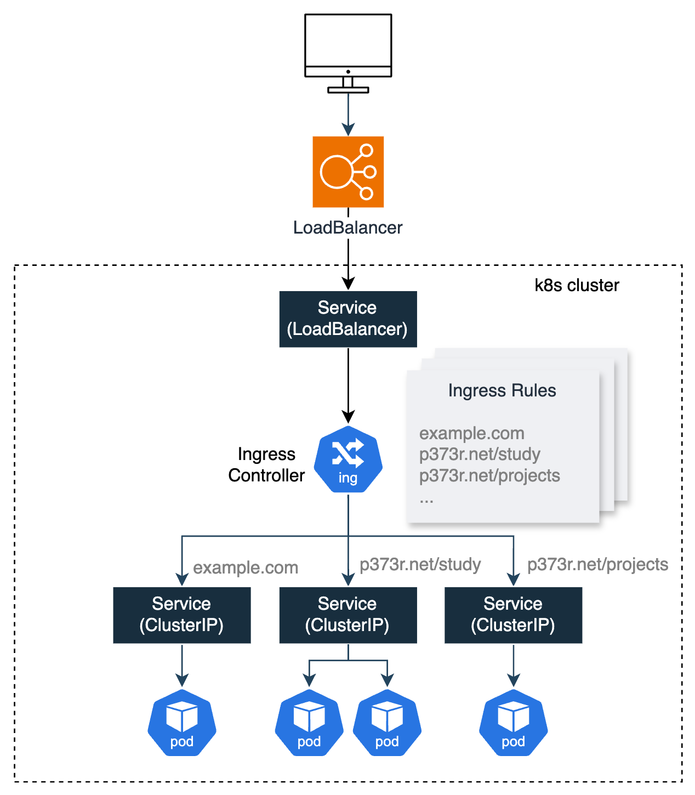

### 1. Ingress 란?
**Ingress**는 네트워크 Layer7에 대한 설정을 담당하는 리소스이다. (aws에서는 ALB에 해당.)  
http->https, 부하 분산, 도메인 기반 라우팅 등을 제공한다.  
클러스터 내부 서비스에 외부에서 접근 가능한 URL을 부여해 일반 사용자들이 쉽게 접근할 수 있는 엔드포인트를 제공한다.  


#### 1-1. Ingress Controller 란?
**Ingress Controller**는 정의된 트래픽 라우팅 규칙을 보고 라우팅을 수행한다.  
**Ingress**는 트래픽 처리에 대한 규칙에 가깝고 실제 라우팅을 수행하는것은 **Ingress Controller**가 담당한다.  
여러 타입의 Ingress Controller 가 있는데, 그 예시는 아래와 같다.  
- NGINX Ingress
- HAProxy
- AWS ALB Ingress
- Ambassador
- Kong
- traefik

#### 1-2. NGINX Ingress Controller
가장 많이 사용되는 Ingress 이다.  
```bash
# NGINX Ingress Controller를 위한 네임스페이스 생성
k create ns ctrl

# nginx-ingress chart 설치
h install nginx-ingress stable/nginx-ingress --version 1.40.3 -n ctrl
```


```bash
k get po -n ctrl
k get svc -n ctrl
```

로드 밸런서 타입의 서비스에 80포트와 443포트가 열린것을 확인할 수 있다.  
앞으로 Ingress에 들어오는 모든 트래픽은 ingress controller service로 들어오게 된다.  

### 2. 기본 사용법
#### 2-1. 도메인 주소 테스트
**Ingress**는 Layer7 통신이기 때문에 도메인 주소가 있어야 제대로 된 Ingress 테스트를 할 수 있다.  
https://sslip.io라는 서비스를 이용하면 따로 도메인을 구매하지 않아도 도메인 주소를 얻을 수 있다.  

**Ingress Controller IP 확인 방법**
```bash
INGRESS_IP=$(kubectl get svc -n ctrl nginx-ingress-controller -o jsonpath="{.status.loadBalancer.ingress[0].ip}")
echo $INGRESS_IP
```

#### 2-2. Ingress 생성
```bash
# ingress와 연결할 리소스 생성
k run mynginx --image nginx --expose --port 80
```


```yaml
apiVersion: networking.k8s.io/v1
kind: Ingress
metadata:
  annotations:
    kubernetes.io/ingress.class: nginx
  name: mynginx
spec:
  rules:
  - host: 10.0.1.1.sslip.io
    http:
      paths:
      - path: /
        backend:
          serviceName: mynginx
          servicePort: 80
```


### 3. Basic Auth 설정


### 4. TLS 설정

