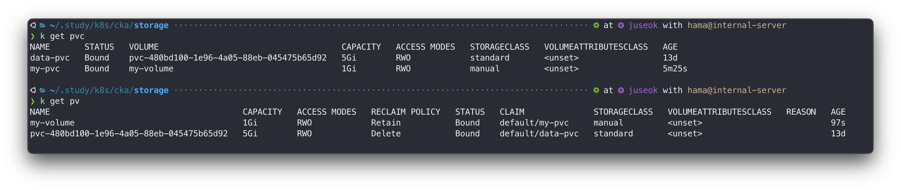
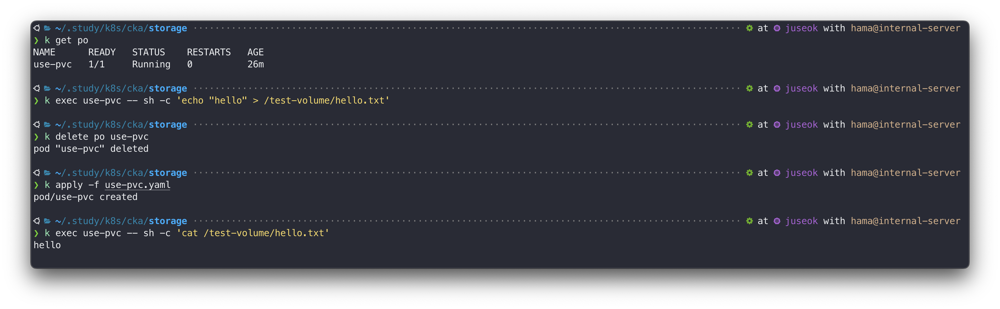
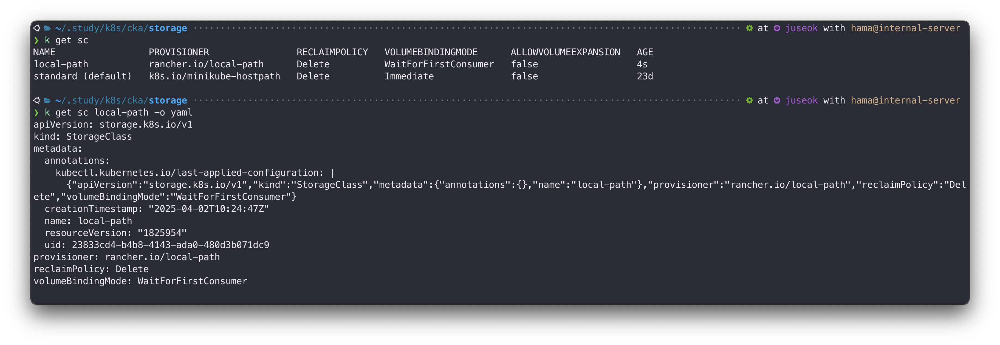
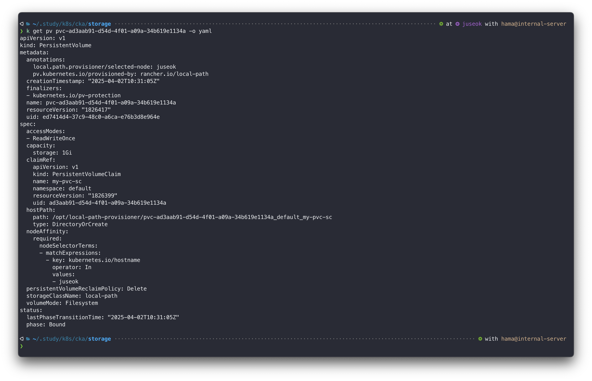

쿠버네티스에서는 단순히 호스트 서버의 볼륨을 연결하는 것 외에 다양한 형태로 데이터를 저장 및 참조하는 방법들을 제공한다.  
이번엔 데이터 영속성을 위한 데이터 저장소에 대해 살펴보겠다.  
- PersistentVolume
- PersistentVolumeClaim
- StorageClass

데이터를 저장하기 위해서는 데이터 저장소가 provisioning 되어 있어야하고, 그 저장소에 접근할 수 있어야한다.  
**PersistentVolume**은 provisioning에 대한 리소스이고,  
**PersistentVolumeClaim**은 일반 사용자가 데이터 저장소를 어떻게 활용할 것인지 정의하는 리소스다.  

## 1. PersistentVolume(PV)
PV는 데이터 저장소를 추상화시킨 리소스이다.  
쿠버네티스 클러스터 관리자가 provisioning 한 저장 자원을 말한다.  

### 1-1. hostPath PV
```yaml
apiVersion: v1
kind: PersistentVolume
metadata:
  name: my-volume
spec:
  storageClassName: manual
  capacity:
    storage: 1Gi
  accessModes:
    - ReadWriteOnce
  hostPath:
    path: /tmp
```
- `storageClassName` : 저장소 타입 정의, 나중에 PVC에서 특정 저장소 타입을 지정할때 사용
- `capacity` : 데이터 저장소의 크기 정의
- `accessModes` : ReadWriteOnce는 동시에 1개의 Pod만 허용을 의미, NFS의 경우 ReadWriteMany로 동시접근 가능
- `hostPath` : 호스트 서버에서 연결될 path 정의

### 1-2. NFS PV
```yaml
apiVersion: v1
kind: PersistentVolume
metadata:
  name: my-nfs
spec:
  storageClassName: nfs
  capacity:
    storage: 5Gi
  accessMode:
    - ReadWriteMany
  mountOptions:
    - hard
    - nfsvers=4.1
  nfs:
    path: /tmp
    server: <NFS-SERVER-IP>
```
- `mountOptions` : NFS 서버와 마운트하기 위한 옵션
- `nfs` : 마운트할 nfs 서버 정보


### 1-3. awsElasticBlockStore PV
aws ebs를 요청하는 예제
```yaml
apiVersion: v1
kind: PersistentVolume
metadata:
  name: aws-ebs
spec:
  capacity:
    storage: 1Gi
  accessModes:
    - ReadWriteOnce
  awsElasticBlockStore:
    volumeId: <volume-id>
    fsType: ext4
```
- `awsElasticBlockStore` : aws ebs 자원 정보, 해당 ebs에 pv가 연동된다.  

### 1-4. etc
- azureDisk : Azure 용
- emptyDir : Pod와 생명주기를 같이하는 휘발성 데이터 저장소
- downward API : 일반적인 볼륨과는 다르게 쿠버네티스 리소스 메타 정보를 마운트해 파일처럼 읽을 수 있게 제공하는것
- configMap : ConfigMap 리소스를 파일처럼 읽을 수 있게 제공하는것

## 2. PersistentVolumeClaim(PVC)
PVC는 쿠버네티스 사용자(개발자)가 PVC 를 통해 해당 리소스를 선점한다.  
프로세스는 아래와 같다.  
1. 클러스터 관리자가 PV를 생성한다.  
2. PV의 정의에 따라 구체적인 볼륨이 생성된다.  
3. 일반 사용자(개발자)가 PV를 선점하기 위해 PVC를 생성한다.  
4. PV와 연결되어 볼륨을 사용한다.  

pvc 리소스를 생성하면 기존에 만들어둔 pv 중 `storageClassName` 을 보고 연결해준다.  
```yaml
apiVersion: v1
kind: PersistentVolumeClaim
metadata:
  name: my-pvc
spec:
  storageClassName: manual
  accessModes:
    - ReadWriteOnce
  resources:
    requests:
      storage: 1Gi
```


이제 사용해보자.  
```yaml
# use-pvc.yaml
apiVersion: v1
kind: Pod
metadata:
  name: use-pvc
spec:
  containers:
  - name: nginx
    image: nginx
    volumeMounts:
    - mountPath: /test-volume
      name: vol
  volumes:
  - name: vol
    persistentVolumeClaim:
      claimName: my-pvc
```

파드를 삭제했다가 재생성했음에도 데이터가 남아있는것을 확인할 수 있다.  

## 3. StorageClass
### 3-1. 소개
**StorageClass** 리소스는 클러스터 관리자에 의해 사용자(개발자)들이 선택할 수 있는 스토리지 종류를 열거한것이다.  
사용자(개발자)는 클러스터 관리자가 제공하는 StorageClass를 이용해 동적으로 볼륨을 제공 받을 수 있다.  
원래 데이터 저장소는 클러스터 관리자가 미리 준비해놔야한다. 만약 볼륨이 존재하지 않는다면 Pod가 생성되지 않고 Pending 상태로 대기하게 된다.  
하지만, StorageClass를 이용하면 볼륨을 생성하기를 기다릴 필요없이 동적으로 데이터 저장소를 제공받을 수 있다.  

```bash
# local-path-provisioner 배포
k apply -f https://raw.githubusercontent.com/rancher/local-path-provisioner/v0.0.31/deploy/local-path-storage.yaml
```


StorageClass 리소스는 클러스터 레벨의 리소스로써 조회 시, 네임스페이스 지정을 할 필요가 없다.  
```yaml
apiVersion: v1
kind: PersistentVolumeClaim
metadata:
  name: my-pvc-sc
spec:
  storageClassName: local-path
  accessModes:
    - ReadWriteOnce
  resources:
    requests:
      storage: 1Gi
```
```bash
# pvc가 Pending 상태였다.
# 1. pvc를 사용하는 pod 생성
k apply -f use-pvc-sc.yaml

# 2. pvc 상태 확인 Bound 상태로 변경된다.
k get pvc

# 3. local-path에 의해 신규 volume이 생성된다.
k get pv

# 4. pv 상세정보를 확인해본다.
k get pv pvc-ad3aab91-d54d-4f01-a09a-34b619e1134a -o yaml
```


StorageClass를 사용하는 이유는 다음과 같다.
- PV를 StorageClass가 대신 특정 디렉터리 위치 아래로만 만들어주기 때문에 일반 사용자가 로컬 호스트 서버의 아무 위치나 디렉터리를 사용하지 못하게 제한할 수 있다.  
- local-path와 같이 간단하게 PV를 설정하는 경우는 별 차이가 없겠지만 NFS의 경우 PV를 생성하기 위해 복잡한 인프라 정보를 StorageClass에 요청만 하면 나머지는 알아서 StorageClass가 PV를 만들어주고 PVC에 연결해 준다.  

### 3-2. NFS StorageClass 설정


## 4. 활용
### 4-1. MinIO 설계