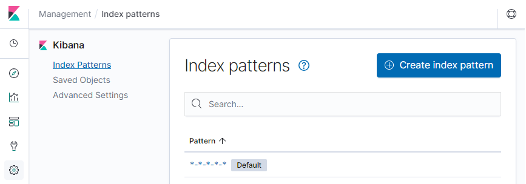

쿠버네티스는 기본적으로 내장하고 있는 로깅 및 모니터링 시스템이 없다. 
대신 그 기능을ㅊCloud Native 생태계에 맡겼다.  

## 1. 로깅 시스템 구축
### 1-1. 클러스터 레벨 로깅의 장점
`k logs <RESOURCE>` 명령어를 사용하면 컨테이너의 로그를 바로 확인할 수 있다. 그럼 굳이 왜 별도의 로깅시스템이 필요할까?  
쿠버네티스의 Pod는 최소단위로써 생성과 삭제가 가장 빈번한 리소스다. 삭제될때마다 로그또한 생명주기를 함께한다. 
그러므로 Pod가 새로 생성되기 이전의 로그는 확인할 수 없다. 클러스터 레벨의 로깅 시스템을 따로 구축하면 이전 로그든 현재로그든 언제든 확인할 수 있다는 장점이 있다.  

#### 시스템 컴포넌트 로그 통합
컨테이너뿐만 아니라, `kubelete` 과 같은 쿠버네티스 시스템 컴포넌트의 로그도 동일한 로깅 시스템을 이용해 확인할 수 있다.  

#### 범용 로깅 플랫폼
개발자마다 따로 로깅 기능을 구현하지 않고 통일된 화면을 통해 로그를 확인할 수 있다는 장점이 있다.  
  
이런 이유로 클러스터 레벨의 로깅 시스템을 따로 구축해서 사용한다.  
로그는 EFK 스택, 메트릭은 Grafana, Prometheus 로 확인해보겠다.  

### 1-2. 클러스터 레벨 로깅 원리
도커 컨테이너의 로그는 해당 명령어로 확인이 가능하다.
```bash
docker logs <CONTAINER_ID>
```

도커 컨테이너의 로그는 호스트 서버의 특정 디렉터리에 저장된다. (`/var/lib/docker/containers/<CONTAINER_ID>/<CONTAINER_ID>-json.log`)  

```bash
# 컨테이너 실행
docker run -d nginx

# 컨테이너 로그 확인
docker logs <CONTAINER_ID>

# 컨테이너 로그 호스트에서 직접 확인
sudo tail /var/lib/docker/containers/<CONTAINER_ID>/<CONTAINER_ID>-json.log
```

### 1-3. ElasticSearch
엘라스틱서치(엘라)는 텍스트 검색에 최적화된 오픈소스 검색엔진이다.  
EFK 스택에서는 엘라스틱서치를 로그 저장소로 이용한다.  
특징과 장단점을 나열하면,

**특징**
- index: document의 집합으로 ndex를 기준으로 데이터를 질의하고 저장한다. 데이터베이스의 table과 유사
- shard: 성능 향상을 위해 index를 나눈 것이다. 데이터베이스의 partition과 유사
- document: 1개의 행을 나타낸다.
- field: document 안에 들어있는 열을 의미한다.

**장점**
- 비정형 데이터를 다룰수 있다.
- 뛰어난 확장성과 가용성
- Full Text 검색이 빠르다.
- 계층적인 데이터도 쿼리 가능
- RESTful API 지원
- 준 실시간(Near real time) 쿼리

**단점**
- 업데이트 비용이 큼
- 트랜잭션 기능 부재
- JOIN 기능 부재

### 1-4. fluent-bit
일반적으로 EFK 스택이라고 할 때, F는 Fluentd를 가리킨다. 여기서는 fluent-bit을 사용할 예정인데, 둘의 차이점은 로그를 집계(aggregate)하는 기능의 유무뿐이다.  
오히려 컨테이너에서 실행될것을 염두하고 최적화되어 메모리 사용량도 적고 컨테이너 환경에서 최적의 성능을 내도록 만들어졌다. 

### 1-5. Kibana
키바나는 웹을 통해 dashboard를 제공하는 데이터 시각화 툴이다. 엘라에 보관되어 있는 데이터들을 조회해 다양한 시각화 컴포넌트로 표현한다.  
키바나에서 KQL이라는 질의 언어를 따로 제공해 키바나에서 엘라로 쿼리 할 수 있다.  
키바나를 통해 바 차트, 플롯, 파이 차트, 맵과 같은 시각화 컴포넌트들을 이용해 대용량 데이터에 대해 손쉽게 시각화 할 수 있다.  


### 1-6. EFK Stack
저장(**E**lastic Search), 수집(**F**luent-bit), 시각화(**K**ibana) 툴을 조합해 EFK Stack을 구성할 수 있다.  
이를 손쉽게 구성할 수 있는 helm 차트를 제공하고 있다. -> elastic-stack chart
```bash
# stable repository의 elastic-stack 차트 fetch
h fetch --untar stable/elastic-stack --version 2.0.1

# elastic-stack 설정 열기
vi elasitc-stack/values.yaml
```

elastic-stack 은 원래 ELK 로 불리고 L은 Logstash를 뜻한다. 우린 이를 fluent-bit으로 대체할 것이기 때문에 설정을 수정해야한다.  
```yaml
logstash:
  enabled: false

fluent-bit:
  enabled: true
```

elastic-stack 차트 안에는 또 다른 차트가 포함되어있는데, 이곳에 엘라 차트가 있다.  
```bash
vi elastic-stack/charts/elasticsearch/values.yaml
```

간단한 테스트용이므로 리소스 사용량을 아래와 같이 최소화한다.  
```yaml
client:
  replicas: 1

master:
  replicas: 2

data:
  replicas: 1
```

fluent-bit이 수집한 로그를 전달할 타겟 시스템을 수정한다.  
보통 로깅 구성을 fluent-bit에서 로그를 수집하고 fluentd로 모아서 한꺼번에 처리하기 때문에, `elastic-stack/charts/fluent-bit/values.yaml` 설정의 `backend:type:forward`를 `es`로 직접 수정해야한다. (집계를 fluentd를 거치지않고 es에 직접 할것이기 때문)  
```yaml
backend:
  type: es
  es:
    host: efk-elasticsearch-client

...
input:
  tail:
    memBufLimit: 5MB
    parser: docker
    path: /var/log/containers/*.log
    ignore_older: ""
  systemd:
    enabled: true
    filters:
      systemdUnit:
        - docker.service
        - k3.service
        # - node-problem-detector.service
```

사용자가 웹 브라우저를 통해 Kibana에 접속할 수 있게 Ingress를 설정한다.  
```yaml
ingress:
  enabled: true
  hosts:
  - kibana.10.0.1.1.sslip.io
  annotations:
    kubernetes.io/ingress.class: nginx
```

elastic-stack 차트를 생성한다. 이때 helm chart의 이름을 반드시 efk라고 지정해야 한다.  
백엔드 엘라스틱 서치의 호스트명으로 `efk-elasticsearch-client`라고 지정했기 때문이다.  

이때 웹 브라우저에서 kibana.10.0.1.1.sslip.io 주소를 입력하면 kibana 웹 페이지에 접속할 수 있다.  

1. Explore on my own 클릭
2. 좌측 패널 Discover 클릭
3. Index pattern의 kubernetes_cluster-* 입력
4. Time Filter field name에 @timestamp 선택
5. 다시 Discover 패널로 가면 Pod들의 로그들을 볼 수 있다.  

위 과정으로 생성된 index를 통해 Pod들의 로그가 쌓이는 것을 확인할 수 있다.  
더불어 다양한 메타데이터(label, namespac, ...)가 자동으로 저장되어정밀한 로그검색이 가능하다.  

## 2. 리소스 메트릭 모니터링 시스템 구축
안정적으로 서비스를 운영하기 위해 리소스 모니터링은 중요한 역할을 한다.  
기존엔 서버 각각 모니터링 툴(agent)를 설치해서 모니터링 시스템으로 전송(push)해야 했다.  

하지만, 쿠버네티스 환경에서는 특정 서버라는 경계가 모호해지고 애플리케이션 단위로 모니터링 대상이 세밀하다.  
쿠버네티스에서는 각 서버에서 로그를 push하는 방식을 사용하지 않고 모니터링 시스템이 수집해야하는 대상을 찾아(discover) 직접 메트릭을 수집(pull)하는 방식으로 동작한다.  

**기존 시스템의 push 방식 agent**
- Telegraf : InfluxDB 용 시스템 메트릭 수집 에이전트
- Datadog Agent : 인프라, 애플리케이션, 로그 등.. 상용 모니터링 솔루션용
- Elastic Beats : ELK 스택의 데이터 수집 컴포넌트
- Prometheus Node Exporter : 시스템 메트릭 수집용 Prometheus 에이전트

### 2-1. Prometheus
프로메테우스는 오픈소스 모니터링 및 알람 툴이다.  
service discovery로부터 수집 대상을 질의해 직접 메트릭을 수집하는 pull-based 모니터링 툴이다.  
다음과 같은 특징을 갖고 있다.  
- key/value 형태의 time series 데이터 구조를 지닌다.
- PromQL 이라는 유연한 질의 언어를 제공한다.
- 분산 스토리지를 사용하지 않는다.
- HTTP를 이용한 pull 방식으로 메트릭을 수집한다.
- 수집 대상은 서비스 탐색(service discovery)으로 찾는다.


- prometheus server : 메트릭을 수집하느 주체, 데이터 저장소, 쿼리 엔진등 중심이 되는 컴포넌트
- service discovery : 수집 대상을 prometheus 서버에게 알려주는 컴포넌트
- alertmanager : 선언된 규칙에 따라 알람을 특정 채널에 발생시키는 컴포넌트(이메일, 슬랙)
- exporter(target) : 실제 메트릭을 수집하는 수집기, prometheus로부터 HTTP 요청을 받아 수집 정보를 전달하는 컴포넌트
- push gateway : pull 방식의 데이터 전달이 불가능한 경우(네트워크 제한, 배치 잡(batch job)등), push gateway를 통해 대신 전달
- grafana : 데이터 시각화 툴

**동작 순서**
1. exporter가 메트릭 정보를 컨테이너로부터 추출한다.
2. 프로메테우스 서버가 메트릭 수집을 위해 exporter에게 요청하면 추출한 메트릭 정보를 전달한다.
3. 프로메테우스 서버는 수집한 메트릭 정보를 내부 저장소에 저장한다.
4. grafana 와 연동해 수집된 메트릭을 시각화한다.


### 2-2. Prometheus & Grafana 구축
프로메테우스도 마찬가지로 helm chart로 손쉽게 구성해볼 수 있다. 해당 차트안에 grafana도 포함되어있다.  
```bash
# 프로메테우스 차트 다운로드
h fetch --untar stable/prometheus-operator --version 8.16.1

# 프로메테우스 설정 수정
vi prometheus-operator/values.yaml
```

```yaml
grafana:
  ingress:
    enabled: true
    annotations:
      kubernetes.io/ingress.class: nginx
    hosts:
    - grafana.10.0.1.1.sslip.io
```

```bash
# 프로메테우스 차트 배포
h install mon ./prometheus-operator

# 파드 배포 상태 확인
watch kubectl get po
```

grafana 기본 계정
- username: admin
- password: prom-operator

원래 대시보드를 직접 구성해야하는데, 차트 구성에 대시보드까지 프로비저닝되어있다.  
