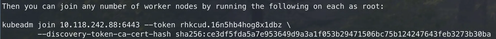
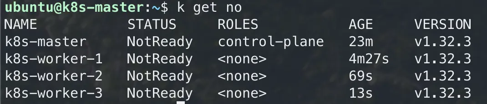
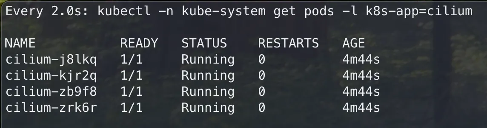
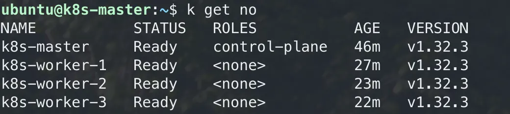

그동안 미니쿠베로 잘 버텼다..
이제 네트워크와 멀티 클러스터.. 정책 등등 해보고싶은게 많아져서 k8s가 궁금해졌다. 설치해보자.

## 노드 준비
### 1-1. 노드 생성
노드는 물리적으로 직접 준비하는 방법, VM을 띄우는 방법, CSP를 활용하는 방법이 있겠다.  
난 돈내기 싫으니까.. VM으로 해봤다.  

VM을 multipass라는 도구를 활용해 띄워봤다.  
multipass는 우분투를 만든회사 Canonical에서 제공하는 VM 환경 구성을 돕는 도구이고 명령어 딸깍에 손쉽게 VM 생성이 가능하다.  
```bash
{
# 마스터 노드
multipass launch noble --name k8s-master --memory 8G --disk 10G --cpus 4

# 워커노드
multipass launch noble --name k8s-worker-1 --memory 4G --disk 10G --cpus 2
multipass launch noble --name k8s-worker-2 --memory 4G --disk 10G --cpus 2
multipass launch noble --name k8s-worker-3 --memory 4G --disk 10G --cpus 2
}
```

### 1-2. 노드 접근
생성한 노드에 직접 접속해 k8s설치를 해야한다.  
노드에 접근하는 방법이다.
```bash
multipass shell k8s-master
```

## 2. containerd
쿠버네티스 초기에 컨테이너 런타임으로 도커를 활용했는데, 도커가 몸집이 커지고 기능이 추가되면서 호환성 이슈와 관리에 대한 오버헤드가 늘어나 결국 2020년 도커와 결별을 선언, 도커와의 호환을 위한 `dockershim`을 제거하고 컨테이너 런타임 `containerd`와 직접 소통하는 방향으로 노선을 변경했다.  
보다 상세한 관련 내용은 [공식 블로그](https://kubernetes.io/blog/2018/05/24/kubernetes-containerd-integration-goes-ga/)를 참조하길 바란다.  

쿠버네티스는 컨테이너 런타임과 직접 소통하니까 도커설치없이 `containerd` 만 있어도 동작한다는 뜻이다.  

### 2-1. 사전 요구사항 준비
```bash
{
sudo apt update
sudo apt install -y apt-transport-https ca-certificates curl gnupg gpg lsb-release containerd
}
```

### 2-2. containerd 설정
```bash
{
sudo mkdir -p /etc/containerd
containerd config default | sudo tee /etc/containerd/config.toml
sudo sed -i 's|SystemdCgroup = false|SystemdCgroup = true|g' /etc/containerd/config.toml
sudo systemctl restart containerd
sudo systemctl enable containerd
}
```
- `/etc/containerd/config.toml` : containerd의 기본 설정 파일로, 이 파일이 없으면 containerd는 기본 설정으로만 실행된다.
- `containerd config default` : containerd의 기본 설정 템플릿을 출력해 파일로 저장한다. 이렇게 하면 사용자가 추가 설정을 쉽게 수정할 수 있다.
- `SystemdCgroup = true` : 이 부분이 중요하다. 기본적으로 containerd는 자체 cgroup 드라이버를 사용하지만, 쿠버네티스 환경에서는 systemd cgroup 드라이버를 사용하는 것이 권장된다.  
  이렇게 설정하면, 
  - 시스템의 cgroup 관리자와 일관성 유지
  - 쿠버네티스와의 호환성 개선
  - 리소스 제한 기능이 더 안정적으로 작동
- `systemctl restart 및 enable` : 설정 변경사항을 적용하고 시스템 부팅 시 자동으로 시작되도록 설정한다.

특히 `SystemdCgroup = true` 설정은 쿠버네티스 클러스터에서 필수다. 이 설정이 없으면 노드와 쿠버네티스 컨트롤 플레인 간에 cgroup 관리 불일치가 발생해 파드 배포 문제나 리소스 제한 기능 오작동 같은 문제가 발생할 수 있다.  

## 3. 쿠버네티스 설치
### 3-1. 사전 요구사항(swap 메모리 비활성화)
```bash
{
sudo swapoff -a
sudo sed -i '/ swap / s/^\(.*\)$/#\1/g' /etc/fstab
}
```

### 3-2. 데비안 기반 배포버전 (kubernetes v1.32)
```bash
{
sudo apt-get update
curl -fsSL https://pkgs.k8s.io/core:/stable:/v1.32/deb/Release.key | sudo gpg --dearmor -o /etc/apt/keyrings/kubernetes-apt-keyring.gpg
echo 'deb [signed-by=/etc/apt/keyrings/kubernetes-apt-keyring.gpg] https://pkgs.k8s.io/core:/stable:/v1.32/deb/ /' | sudo tee /etc/apt/sources.list.d/kubernetes.list
}
```
```bash
{
sudo apt-get update
sudo apt-get install -y kubelet kubeadm kubectl
sudo apt-mark hold kubelet kubeadm kubectl
}
```
```bash
sudo systemctl enable --now kubelet
```
> [공식 문서](https://kubernetes.io/docs/setup/production-environment/tools/kubeadm/install-kubeadm/#k8s-install-0)

### 3-3. overlay 네트워크 활성화 & IP 포워딩
- `overlay` 모듈은 컨테이너 런타임(containerd 등)이 효율적인 파일 시스템 관리를 위해 필요하다
- `br_netfilter` 모듈과 관련 네트워크 설정은 쿠버네티스 네트워킹, 특히 서비스와 파드 간 통신이 올바르게 작동하도록 보장한다.
- `net.ipv4.ip_forward = 1` : 쿠버네티스는 클러스터 내 네트워킹을 위해 IP 포워딩이 활성화되어 있어야 한다.
```bash
{
sudo modprobe overlay
sudo modprobe br_netfilter
sudo tee /etc/modules-load.d/k8s.conf <<EOF
overlay
br_netfilter
EOF

sudo tee /etc/sysctl.d/k8s.conf <<EOF
net.bridge.bridge-nf-call-iptables = 1
net.bridge.bridge-nf-call-ip6tables = 1
net.ipv4.ip_forward = 1
EOF

sudo sysctl --system
}
```

### 3-4. 마스터 노드 초기화
`pod-network-cidr` 은 **10.0.0.0/16** 으로 지정했다. CNI로 Cilium을 사용할 것이기 때문이다.
```bash
sudo kubeadm init --pod-network-cidr=10.0.0.0/16 \
  --cri-socket=/run/containerd/containerd.sock
```

각 CNI 별 일반적인 기본 CIDR은:

- Flannel: **10.244.0.0/16**
- Calico: **192.168.0.0/16**
- Cilium: **10.0.0.0/16**
- Weave Net: **10.32.0.0/12**

초기화 완료 시 발급되는 토큰은 워커노드에서 마스터노드에 join 할 때 필요하다.


### 3-5. 일반 사용자 구성
아래 과정을 수행해야 `kubectl` 명령이 동작한다.  
```bash
{
mkdir -p $HOME/.kube
sudo cp -i /etc/kubernetes/admin.conf $HOME/.kube/config
sudo chown $(id -u):$(id -g) $HOME/.kube/config
}
```

### 3-6. 워커노드 설치
설치 과정은 마스터 노드와 거의 동일하기 때문에 겹치는 부분은 명령어를 한번에 수행되게 통합했다.  
```bash
{
sudo apt update
sudo apt install -y apt-transport-https ca-certificates curl gnupg gpg lsb-release containerd

sudo mkdir -p /etc/containerd
containerd config default | sudo tee /etc/containerd/config.toml
sudo sed -i 's|SystemdCgroup = false|SystemdCgroup = true|g' /etc/containerd/config.toml
sudo systemctl restart containerd
sudo systemctl enable containerd

sudo swapoff -a
sudo sed -i '/ swap / s/^\(.*\)$/#\1/g' /etc/fstab

sudo apt-get update
curl -fsSL https://pkgs.k8s.io/core:/stable:/v1.32/deb/Release.key | sudo gpg --dearmor -o /etc/apt/keyrings/kubernetes-apt-keyring.gpg
echo 'deb [signed-by=/etc/apt/keyrings/kubernetes-apt-keyring.gpg] https://pkgs.k8s.io/core:/stable:/v1.32/deb/ /' | sudo tee /etc/apt/sources.list.d/kubernetes.list
}
```

워커노드에는 kubectl 이 필요없다.  
```bash
{
sudo apt-get update
sudo apt-get install -y kubelet kubeadm
sudo apt-mark hold kubelet kubeadm
sudo systemctl enable --now kubelet

sudo modprobe overlay
sudo modprobe br_netfilter
sudo tee /etc/modules-load.d/k8s.conf <<EOF
overlay
br_netfilter
EOF

sudo tee /etc/sysctl.d/k8s.conf <<EOF
net.bridge.bridge-nf-call-iptables = 1
net.bridge.bridge-nf-call-ip6tables = 1
net.ipv4.ip_forward = 1
EOF

sudo sysctl --system
}
```

이부분이 다른점인데, 마스터 노드를 초기화했을때 마지막 부분에 토큰과 함께 출력된 명령문이 있을거다.  그걸 입력하면 된다. (sudo 권한으로)
```bash
sudo kubeadm join 10.118.242.88:6443 --token rhkcud.16n5hb4hog8x1dbz --discovery-token-ca-cert-hash sha256:ce3df5fda5a7e953649d9a3a1f053b29471506bc75b124247643feb3273b30ba
```

각 마스터에 해당 과정을 모두 수행한 뒤 마스터 노드에 접근해서 확인해보면 아래와 같이 노드가 클러스터에 연결된것을 확인 할 수 있다.  
  

여기서 **STATUS**가 `NotReady`라고 되어있는데 걱정하지 마라. 아직 CNI 설정을 안했기 때문이다.  
바로 다음 부분, CNI(Cilium)을 세팅하면 해결될것이다.  

## 4. Cilium 설치(마스터 노드에서)
### 4-1. helm 설치
helm chart 로 설치할것이기에 helm 설치가 우선이다.
아래 스크립트를 활용하면 최신버전이 설치되는데, 헬름버전이 “최신 버전”이 설치되서 생기는 문제가 있을 수 있다.  
```bash
{
curl https://raw.githubusercontent.com/helm/helm/master/scripts/get-helm-3 | bash -s -- --version v3.2.2
echo "alias h='helm'" >> ~/.bashrc && source ~/.bashrc
}
```

난 문제가 생겨서 stable 버전을 직접 지정해서 설치했다.  
```bash
{
wget https://get.helm.sh/helm-v3.17.0-linux-amd64.tar.gz
tar -zxvf helm-v3.17.0-linux-amd64.tar.gz
sudo mv linux-amd64/helm /usr/local/bin/helm
rm -rf linux-amd64 helm-v3.17.0-linux-amd64.tar.gz
}
```

### 4-2. cilium 설치
```bash
{
helm repo add cilium https://helm.cilium.io/
helm repo update
}
```
```bash
helm install cilium cilium/cilium --version 1.17.3 --namespace kube-system \
--set k8sServiceHost=10.118.242.88 \
--set k8sServicePort=6443 \
--set debug.enabled=true \
--set rollOutCiliumPods=true \
--set routingMode=native \
--set autoDirectNodeRoutes=true \
--set bpf.masquerade=true \
--set bpf.hostRouting=true \
--set endpointRoutes.enabled=true \
--set ipam.mode=kubernetes \
--set k8s.requireIPv4PodCIDR=true \
--set kubeProxyReplacement=true \
--set ipv4NativeRoutingCIDR=10.118.0.0/16 \
--set installNoConntrackIptablesRules=true \
--set hubble.ui.enabled=true \
--set hubble.relay.enabled=true \
--set prometheus.enabled=true \
--set operator.prometheus.enabled=true \
--set hubble.metrics.enableOpenMetrics=true \
--set hubble.metrics.enabled="{dns:query;ignoreAAAA,drop,tcp,flow,port-distribution,icmp,httpV2:exemplars=true;labelsContext=source_ip\,source_namespace\,source_workload\,destination_ip\,destination_namespace\,destination_workload\,traffic_direction}" \
--set operator.replicas=1
```

#### 기본 연결 설정

- `-set k8sServiceHost=10.118.242.88` - 쿠버네티스 API 서버 IP 주소
- `-set k8sServicePort=6443` - 쿠버네티스 API 서버 포트

#### 성능 및 라우팅 최적화

- `-set routingMode=native` - 네이티브 라우팅 모드 사용
- `-set autoDirectNodeRoutes=true` - 노드 간 직접 라우팅 자동 설정
- `-set bpf.masquerade=true` - BPF 기반 마스커레이딩 활성화
- `-set bpf.hostRouting=true` - BPF 기반 호스트 라우팅 활성화
- `-set endpointRoutes.enabled=true` - 엔드포인트 라우트 활성화
- `-set kubeProxyReplacement=true` - kube-proxy 대체
- `-set installNoConntrackIptablesRules=true` - 커넥션 트래킹 없는 iptables 규칙 설치

#### IP 주소 관리(IPAM)

- `-set ipam.mode=kubernetes` - 쿠버네티스 기본 IPAM 사용
- `-set k8s.requireIPv4PodCIDR=true` - 포드에 IPv4 CIDR 필요
- `-set ipv4NativeRoutingCIDR=10.118.0.0/16` - 네이티브 라우팅용 IPv4 CIDR 범위

#### 모니터링 및 관측성(Hubble)

- `-set hubble.ui.enabled=true` - Hubble UI 활성화
- `-set hubble.relay.enabled=true` - Hubble Relay 활성화
- `-set hubble.metrics.enableOpenMetrics=true` - OpenMetrics 형식 메트릭 활성화
- `-set hubble.metrics.enabled="{...}"` - 특정 메트릭 유형 지정
    - DNS, 드롭된 패킷, TCP, 플로우, 포트 분포, ICMP, HTTP 메트릭 수집

#### Prometheus 통합

- `-set prometheus.enabled=true` - Prometheus 통합 활성화
- `-set operator.prometheus.enabled=true` - 오퍼레이터 Prometheus 메트릭 활성화

#### 배포 및 운영 관련

- `-set rollOutCiliumPods=true` - 설치 후 Cilium 포드 자동 재시작
- `-set operator.replicas=1` - Cilium 오퍼레이터 복제본 수
- `-set debug.enabled=true` - 디버그 모드 활성화

### 4-3. 설치 확인
cilium 이 잘 설치되었는지 확인하는 명령어다.  
파드 상태가 `Init` → `Running` 이 되면 설치가 완료된것이다.  
```bash
watch kubectl -n kube-system get pods -l k8s-app=cilium
```


CNI(Cilium)이 설치 된 후 노드를 확인해보면 Status 가 처음 노드를 연결했을때, Not Ready 에서 Ready 로 변경된것을 확인할 수 있다.  


---
## 참고
- cilium 설치 실습 : https://themapisto.tistory.com/278