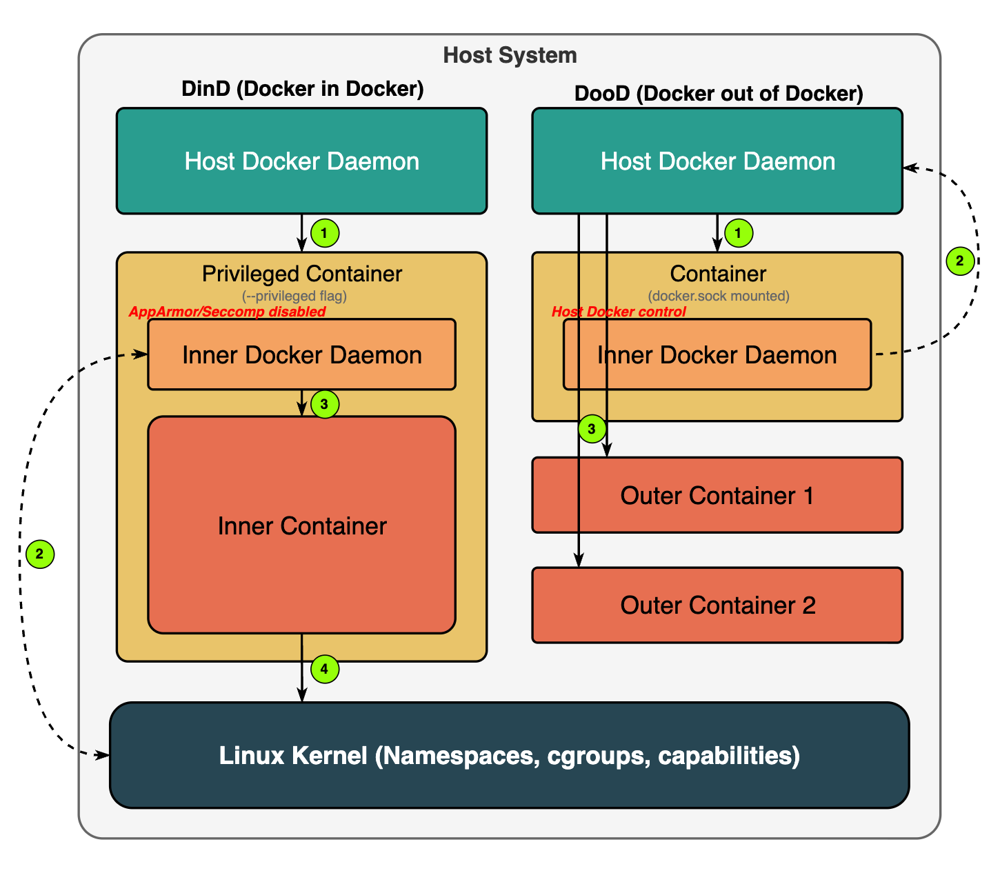

## 1. 보안적 특성
### 1-1. DinD
컨테이너 내부에서 별도의 Docker 데몬을 실행하는 방식이다.  
때문에 완전히 독립된 환경을 구성할 수 있다.  
그러나 구현을 위해 컨테이너에 `--privileged` 권한을 부여해야 하는데, **이것이 주요 보안 문제이다.**  
privileged 모드, 이하 특권모드는 컨테이너에 호스트의 리눅스 커널기능 접근 권한을 제공한다.  
컨테이너가 침해될 경우, 공격자는 <span style="color: #FF3333;"><b>호스트 시스템에 대한 통제권</b></span>을 획득할 수 있다.  

**DinD에서 `--privileged` 옵션이 필요한 이유**
1. Docker 데몬은 <u>**컨테이너를 생성**</u>하고 관리하기 위해 리눅스 커널 기능(namespace, cgroups, /dev 경로) 접근 권한이 필요하다.  
2. Docker 데몬은 <u>**컨테이너 이미지 관리**</u>를 위해 `/dev/loop*` 같은 디바이스나 기타 시스템 디바이스에 대한 접근 권한이 필요하다.  
3. Dockerfile을 통한 이미지 빌드 과정에서 임시 <u>**파일 시스템을 마운트**</u>하고 조작하는데 `/dev/loop*` 디바이스가 필요하다.  
4. Docker의 스토리지 드라이버(devicemapper[^1])는 loop 디바이스를 사용해 <u>**이미지와 컨테이너 레이어를 관리**</u>한다.  

상기 이유때문에 `--privileged` 옵션 없이 **dind** 구현이 불가능하다.  
그림으로 표현하면 아래와 같다.  




최근 Docker 버전에서는 -\-privileged 대신 특정 capabilities만 부여하는 방식으로 약간의 개선이 이루어졌지만, 여전히 Docker 데몬을 컨테이너 내부에서 실행하려면 상당한 수준의 시스템 권한이 필요하다.  
  

### 1-2. DooD
호스트의 Docker 소켓(`/var/run/docker.sock`)을 컨테이너에 마운트해 호스트이 Docker 데몬을 사용하는 방식이다.  
때문에 컨테이너 실행시 별도의 `--privileged` 옵션이 필요없다.  
하지만 Docker 소켓 접근은 실질적으로 호스트 시스템에 대한 루트 액세스와 동등하다고 볼 수 있다.  
컨테이너가 침해될 경우, 공격자는 <span style="color: #FF3333;"><b>호스트의 모든 Docker 리소스를 제어</b></span>할 수 있다.  

## 2. 보안 해결책
### 2-1. DinD
필요한 최소한의 기능만 허용하도록 `--privileged` 대신 특정 `capabilities`만 부여하는 방법을 고려한다. 
예를 들면,
```bash
docker run -d --name dind-minimal \
  --cap-add=SYS_ADMIN \
  --cap-add=NET_ADMIN \
  --cap-add=MKNOD \
  --cap-add=SYS_PTRACE \
  --cap-add=DAC_OVERRIDE \
  --security-opt apparmor=unconfined \
  --security-opt seccomp=unconfined \
  -v /sys/fs/cgroup:/sys/fs/cgroup:ro \
  -v /var/lib/docker-inner:/var/lib/docker \
  docker:dind
```
**필요한 최소 capabilities**
- `SYS_ADMIN` : 마운트 작업 및 다양한 시스템 관리 작업에 필요하고 Docker 데몬의 핵심 기능을 위해 필수
- `NET_ADMIN` : 네트워크 인터페이스와 방화벽 규칙을 구성하는 데 필요
- `MKNOD` : 블록 및 문자 디바이스 파일을 생성하는 데 필요
- `SYS_PTRACE` : 프로세스 추적 기능을 위해 필요
- `DAC_OVERRIDE` : 파일 권한 확인을 우회하는 데 필요

**추가 보안 설정**
- `--security-opt apparmor=unconfined` : AppArmor[^2] 제한을 제거하는 옵션
- `--security-opt seccomp=unconfined` : Seccomp[^3] 필터링을 비활성화하는 옵션

  **AppArmor**와 **Seccomp**를 비활성화하는 이유는 Docker 데몬의 작동에 필요한 특정 기능들이 이 보안 메커니즘에 의해 차단되기 때문이다.  
  - AppArmor : 마운트 작업 제한, 장치 접근 제한(/dev), 네트워크 네임스페이스 작업 제한
  - Seccomp : 시스템 콜[^4] 제한, 네임스페이스 관련 시스템 콜 제한, 커널 기능(cgroups, 네트워크 설정) 접근 제한


### 2-2. DooD
Docker 소켓 대신 제한된 권한을 가진 사용자로 Docker API를 노출하거나, rootless Docker를 사용하는 방법을 고려한다. 
예를 들면,  
```bash
docker run -d --name my-container \
  -v /etc/docker/certs/client-cert.pem:/certs/client-cert.pem:ro \
  -v /etc/docker/certs/client-key.pem:/certs/client-key.pem:ro \
  -v /etc/docker/certs/ca.pem:/certs/ca.pem:ro \
  -e DOCKER_HOST=tcp://docker-host:2376 \
  -e DOCKER_TLS_VERIFY=1 \
  -e DOCKER_CERT_PATH=/certs \
  my-image
```
여기서 `tcp://docker-host:2376`은 같은 서버내에서 접근한다면,  
(이 경우 컨테이너는 자신이 실행 중인 동일한 물리적/가상 서버의 Docker 데몬에 접근한다.)  
- <tcp://localhost:2376>
- <tcp://127.0.0.1:2376>

네트워크의 다른 서버에서 실행중인 Docker 데몬에 접근한다면,  
(이 경우 컨테이너는 다른 물리적/가상 서버의 Docker 데몬에 접근한다.)  
- 예시: <tcp://192.168.1.10:2376> (해당 서버의 실제 호스트명 또는 IP주소)


[^1]: DeviceMapper : 리눅스에서 사용되는 스토리지 관리 프레임워크로, Docker에서는 컨테이너 이미지와 컨테이너 인스턴스의 스토리지를 관리하기 위한 스토리지 드라이버  
[^2]: AppArmor : 리눅스 보안 모듈로, 프로그램이 접근할 수 있는 시스템 리소스와 수행할 수 있는 작업을 제한하는 강제적 접근 제어(MAC: Mandatory Access Control) 시스템
[^3]: Seccomp : 리눅스 커널의 보안 기능으로, 프로세스가 사용할 수 있는 시스템 콜(system call)을 제한하는 기능
[^4]: Docker 데몬은 컨테이너 관리를 위해 많은 시스템 콜을 사용하는데, 기본 Seccomp 프로필은 컨테이너에서 사용 가능한 시스템 콜을 제한한다.

## 3. 정리
### 두 방식의 근본적인 차이
✅ **DooD : 호스트의 도커 데몬 사용**

호스트에 이미 실행 중인 도커 데몬을 사용하는 것입니다.
도커 데몬은 이미 호스트 시스템에서 권한을 가지고 실행 중입니다.
컨테이너는 단지 도커 소켓(예: /var/run/docker.sock)을 통해 이 데몬에 명령을 전달하는 역할만 합니다.
따라서 컨테이너 자체는 특별한 권한이 필요없습니다. 필요한 모든 권한은 이미 호스트에서 실행 중인 도커 데몬이 가지고 있기 때문입니다.

✅ **DinD : 컨테이너 내부에서 도커 데몬 실행**

컨테이너 내부에서 새로운 도커 데몬을 실행하는 것이다.
도커 데몬은 컨테이너 생성, 네트워크 설정, 볼륨 마운트 등을 위해 커널 수준의 작업을 수행해야 한다.
일반 컨테이너는 이러한 커널 수준 작업을 수행할 권한이 없다.
따라서 컨테이너에게 --privileged 옵션으로 추가 권한을 부여해야한다.

💫 즉, DooD는 "새로운 도커 데몬을 실행"하는 것이 아니라 "기존 도커 데몬에 접근"하는 것이기 때문에 특권 모드가 필요하지않다. 반면 DinD는 컨테이너 내부에서 새로운 도커 데몬을 실행해야 하므로, 이 데몬이 필요로 하는 시스템 권한을 컨테이너에 부여해야한다.  
이것이 바로 두 접근 방식의 핵심적인 차이점이다.  

## 4. 결론
👉 <u>**둘다 보안적 문제점이 있지만, dind로 리눅스 커널 권한을 내주느니 dood로 docker 소켓의 권한을 내주는게 낫다고 한다. 그런 이유로 dind 보다 dood를 추천하는것이다.**</u>